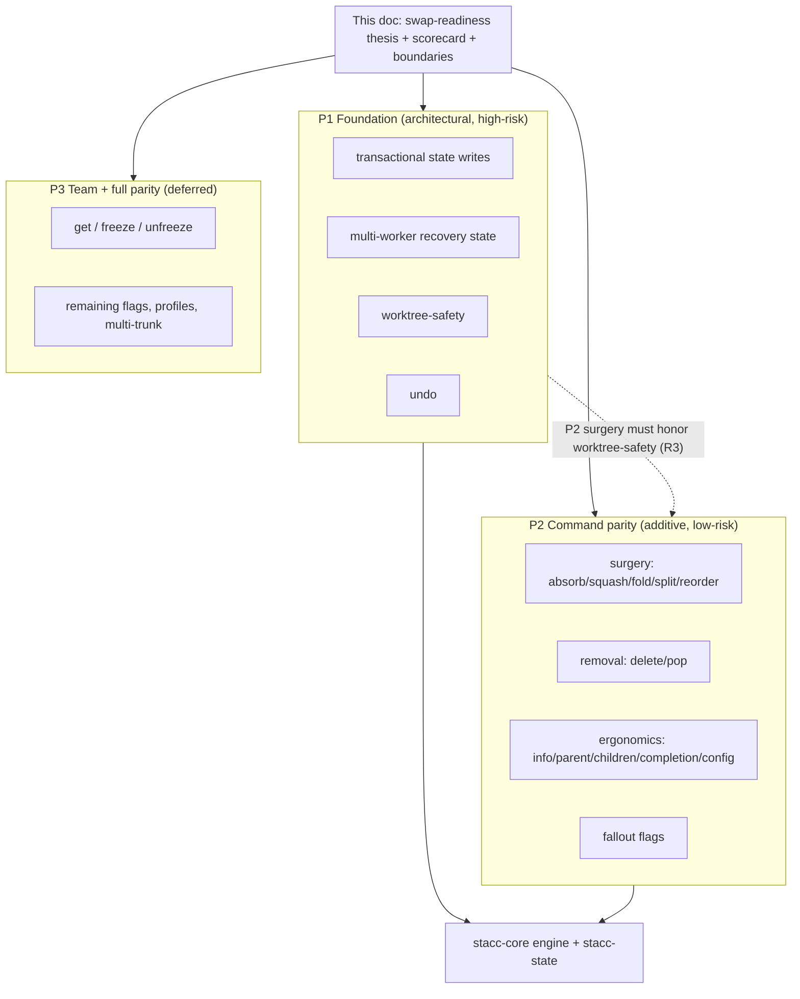

# Graphite swap readiness

## Summary

Define what it takes for stacc to replace graphite as the daily driver for a
solo + agent workflow on GitHub: a command-by-command gap analysis, a readiness
scorecard, and a breakdown of the remaining work into three independently
plannable projects. P1 makes the stack state safe for parallel agents and adds
`undo`; P2 closes the daily-driver command gaps (stack surgery, branch removal,
ergonomics); P3 (deferred) adds team collaboration and full flag parity. The CLI
stays the primary agent interface; an MCP server is explicitly deprioritized.

## Problem Frame

The June 3 `close-graphite-gaps` batch (see
`docs/brainstorms/2026-06-03-close-graphite-gaps-requirements.md` and
`docs/plans/2026-06-03-001-feat-graphite-command-parity-plan.md`) took stacc from
7 commands to a full daily-driver core: `create`, `modify`, `restack`,
`continue`/`abort`, navigation, `move`, `rename`, visual `log`, `pr`, and
`merge`. Read against graphite's current command surface, the happy-path loop is
now complete. What remains is not the loop; it is three different kinds of gap
that the loop's success exposed.

First, the mid-stack editing toolkit graphite users lean on (`absorb`, `squash`,
`fold`, `split`, `reorder`) and branch removal (`delete`, `pop`) are absent;
today stacc has only `untrack`. Second, there is no `undo`: recovery is limited
to conflict `abort`, so an agent that makes a wrong but successful mutation has no
one-command rollback. Third, and most consequential for an agent-first tool: the
stack state is single-writer. `refs/stacc/data` uses compare-and-swap, but the
save path re-reads the parent ref while reusing a stale in-memory tree
(`crates/stacc-state/src/store.rs`), so two concurrent processes silently lose
each other's updates, and the conflict-continuation record lives in single-writer
`.git/`. Parallel agents, increasingly the primary use, cannot safely share a
repo. graphite itself only reached partial multi-worktree safety in 1.8.4.

The cost shape: stacc proves the model and runs a single-agent loop well, but a
confident "I never reach for graphite" requires the surgery toolkit, a safety
net, and concurrency that the current architecture was not built for.

## Key Decisions

- **CLI-first; MCP deprioritized.** Current best practice for agent tooling
  converges on a well-designed, non-interactive, JSON-emitting CLI, which is
  exactly what stacc already is. Anthropic's "code execution with MCP" shows the
  expensive failure mode of MCP is round-tripping tool results through the model;
  stacc's outputs are small, structured, and parsed locally, so it already gets
  that efficiency. MCP earns its place for high-volume, persistent-connection,
  multi-integration product surfaces, not an episodic git-stacking tool whose
  state lives in git. If an MCP server is ever built, it is a thin wrapper over
  the shared `stacc-core` engine, never a reimplementation. (Sources below.)

- **Parallel-agent safety is a foundation, not a feature.** It is cross-cutting:
  it touches `stacc-state`, the conflict-continuation record, and every mutating
  command. It anchors P1 rather than slotting in as one command, and is the real
  agent-native differentiator versus graphite.

- **Contention model: isolation-first, with the merge seam left open.** The
  common case (each agent owns a separate stack in its own worktree) is the v1
  target: namespace and isolate state per stack and enforce worktree-safety, so
  independent parallel agents never clobber each other. The harder case (multiple
  agents collaborating on one shared stack, editing overlapping branches) is not
  built now, but the read-modify-write path is structured so a logical merge can
  drop in later without a rewrite. Isolation covers the realistic workload;
  reserving the seam avoids a future re-architecture.

- **`undo` lives in P1, not P2.** It is a state-history mechanism, not a
  stack-editing verb, and it shares machinery with making the state ref robust.
  Its substrate already exists: every `save` chains onto the previous state as a
  commit parent, so `refs/stacc/data` carries a full version history that `undo`
  can walk rather than a new journal being invented.

- **Three projects split along architectural risk.** P1 (foundation,
  high-risk, architectural) and P2 (additive, low-risk, independent command
  builds) are nearly decoupled and can run in parallel as separate plans. P3 is
  deferred. The shared thesis, scorecard, and boundaries live in this one
  umbrella doc; each project gets its own `ce-plan`.

- **Inverted-interactivity is a hard constraint on the surgery commands.**
  graphite's `absorb`, `split`, and `reorder` are interactive-first (pickers,
  editor-driven reorder). stacc must ship a non-interactive, scriptable form of
  each (a structured order spec, hunk selection without a TTY, `--dry-run`
  preview), with interactive pickers as a TTY-only convenience. Porting the
  command is not enough; it must honor the stacc thesis.

- **Scope is bounded by identity, not just by time.** graphite's web-product
  surface (dashboard, merge queue, AI generation of branch names / commit
  messages / PR text) is rejected, not deferred. stacc is a CLI/agent tool, and
  by original design the agent (not stacc) authors PR prose.

## Gap Analysis

Every graphite command mapped to stacc's current surface
(`crates/stacc/src/cli.rs`, read directly). Status: **Have** (shipped),
**Partial** (command shipped, flags missing), **Missing**, **Proxied** (passed
through to `git`), **Deferred** (P3), **Out** (outside stacc's identity).

| graphite | stacc status | Project |
|---|---|---|
| `init` | Have | shipped |
| `track` | Have | shipped |
| `untrack` | Have | shipped |
| `auth` | Have (profiles missing) | P3 |
| `create` | Partial (`--all/--onto/--insert/--patch`) | P2 |
| `modify` | Partial (`--into/--all/--patch/--edit`) | P2 |
| `submit` | Partial (`--stack/--update-only/--draft`) | P2/P3 |
| `sync` | Have | shipped |
| `restack` | Partial (`--downstack/--upstack/--only`) | P2 |
| `merge` | Have | shipped |
| `checkout` | Partial (`--stack/--trunk/--all`) | P2 |
| `up` `down` `top` `bottom` | Have | shipped |
| `log` (+`short`/`long`) | Have | shipped |
| `pr` | Have | shipped |
| `continue` `abort` | Have | shipped |
| `move` | Partial (`--only`) | P2 |
| `rename` | Have | shipped |
| `add` `rebase` `reset` `restore` `cherry-pick` | Proxied | shipped |
| `absorb` | Missing | P2 |
| `squash` | Missing | P2 |
| `fold` | Missing | P2 |
| `split` | Missing | P2 |
| `reorder` | Missing | P2 |
| `delete` | Missing | P2 |
| `pop` | Missing | P2 |
| `info` | Missing | P2 |
| `parent` `children` | Missing | P2 |
| `completion` `fish` | Missing | P2 |
| `config` | Partial (files only, no command) | P2 |
| `undo` | Missing | P1 |
| (parallel / worktree safety) | Missing (graphite partial since 1.8.4) | P1 |
| `get` | Missing | P3 |
| `freeze` `unfreeze` | Missing | P3 |
| `revert` | Missing (experimental) | P3 |
| multi-trunk, auth profiles | Missing | P3 |
| `dash` (web), merge queue, `--ai` | n/a | Out |
| `demo` `guide` `docs` `changelog` `feedback` | n/a | Out |

## Readiness Scorecard

The "how far are we" answer, by capability area.

| Capability | Status | What's left |
|---|---|---|
| Setup / auth | Complete | profiles (P3) |
| Daily edit loop (`create`/`modify`/`restack`) | Complete | minor flags (P2) |
| Submit / sync / merge | Complete | `submit` scope flags (P2) |
| Navigation | Complete | `parent`/`children` convenience (P2) |
| Display (`log`/`status`/`pr`) | Complete | `info` (P2) |
| Conflict recovery | Complete | `undo` (P1) |
| Stack surgery | None of 5 | `absorb`/`squash`/`fold`/`split`/`reorder` (P2) |
| Branch removal | `untrack` only | `delete`/`pop` (P2) |
| Safety net | `abort` only | `undo` (P1) |
| Human ergonomics | Partial | `completion`, `config`, `info` (P2) |
| Parallel-agent safety | None (single-writer) | P1 |
| Team collaboration | None | `get`/`freeze` (P3) |
| Web / AI / merge queue | n/a | Out of identity |

**Bottom line:** stacc fully covers the single-agent daily loop today. To clear
the daily-driver swap bar (you + one agent), P2 is the larger surface but
low-risk; P1 is smaller in command count but is the architectural unlock for the
parallel-agent use you named as primary. P3 is real but sits behind the bar.

## Actors

- A1. **Coding agent**, the primary driver: runs commands with `--format json`
  and `--no-interactive`, reads structured output to recover unattended.
- A2. **Parallel agents**, multiple concurrent workers (often each in its own git
  worktree) sharing one repo and one stack state. New with P1; the reason
  single-writer state is no longer sufficient.
- A3. **Human operator**, at a terminal; benefits from pickers, the visual graph,
  completion, and `info`, but can always drop to explicit flags.
- A4. **GitHub**, the forge: hosts PRs, reports mergeability, performs squash
  merges, owns branch-rename semantics.

## Requirements

Grouped by project. R-IDs are continuous across groups. Every requirement
inherits the cross-cutting invariant (R21) unless noted.

### P1, Parallel-agent foundation

- R1. **Isolation-first transactional state writes.** Default model: isolated
  stacks per worktree, so agents working independent stacks do not contend on
  each other's branches at all. Concurrent processes mutating `refs/stacc/data`
  must not lose updates: on a compare-and-swap miss the writer re-loads current
  state and re-applies its logical change before retrying, rather than
  re-committing a stale tree; irreconcilable contention fails with a structured
  error instead of silently clobbering. The read-modify-write path is structured
  so a logical merge for the shared-stack case can be added later without a
  rewrite.
- R2. **Multi-worker recovery state.** The in-progress operation /
  conflict-continuation record must not assume a single writer in `.git/`. It is
  scoped so one worker's conflict recovery cannot read or clear another's
  (per-worktree or per-worker isolation, or relocation into the state ref).
- R3. **Worktree-safety.** A mutating operation (`restack`, `modify`, `move`,
  `sync`, `merge`, and the P2 surgery commands) must refuse to rewrite a branch
  checked out in another worktree, skipping it with a structured error rather
  than corrupting it. (graphite 1.8.4 parity.)
- R4. **`undo`.** Revert the most recent stacc mutation in one command,
  restoring the prior stack state and the affected branch tips. Non-interactive
  and JSON-complete.
- R5. **Undo history.** `undo` builds on the existing state-ref commit chain
  (each `save` is already a child commit), restoring branch tips alongside the
  state version. Retention bound and how far back `undo` can walk are defined,
  and the history is read through stacc, not ad-hoc tooling.

### P2, Daily-driver command parity

Stack surgery (each reuses the restack engine and ships a non-interactive form):

- R6. **`absorb`** distributes staged hunks to the first downstack commit each
  applies to cleanly, then restacks upstack; `--dry-run` previews the mapping;
  ambiguous hunks are left unabsorbed and reported, never prompted under
  `--no-interactive`.
- R7. **`squash`** squashes all commits in the current branch into one and
  restacks upstack.
- R8. **`fold`** folds a branch's changes into its parent, reparents and restacks
  descendants; optional remote-PR close.
- R9. **`split`** splits the current branch into multiple branches; supports at
  least by-commit and by-file, with by-file runnable non-interactively.
- R10. **`reorder`** reorders branches between trunk and current and restacks
  descendants, accepting a structured order specification so it works without an
  editor.

Branch removal:

- R11. **`delete`** deletes a branch and its stacc metadata, restacking children
  onto its parent; refuses an unmerged/unclosed branch without `--force`; can
  close the associated PR on request.
- R12. **`pop`** deletes the current branch but retains its changes in the
  working tree, reparenting children.

Ergonomics:

- R13. **`info`** shows per-branch detail (PR body, diff, patch, diffstat) in
  pretty and JSON.
- R14. **`parent` / `children`** print the parent and children of the current
  branch deterministically.
- R15. **`completion`** emits shell tab-completion for bash, zsh, and fish.
- R16. **`config`** exposes a non-interactive get/set surface over the existing
  config files, with an interactive menu as a TTY-only convenience.

Flag-level parity (the subset that falls out of the daily driver):

- R17. Close the daily-driver flag gaps on shipped commands: `create`
  (`--all/--onto/--insert/--patch`), `modify` (`--into/--all/--patch/--edit`),
  `restack` (`--downstack/--upstack/--only`), `move` (`--only`), `submit`
  (`--stack/--update-only/--draft`). Each keeps the non-interactive + JSON
  contract.

### P3, Team and full flag parity (deferred)

- R18. **`get`** fetches a teammate's stack locally from a branch or PR number,
  syncing downstack.
- R19. **`freeze` / `unfreeze`** mark a branch frozen so restacks skip it,
  letting an agent stack on someone else's PRs without modifying them.
- R20. Remaining flag-level parity, auth profiles, multi-trunk, and `revert`, as
  demand warrants.

### Cross-cutting

- R21. Every new command honors `--format json|pretty`, `--color`, and
  `--no-interactive`, and emits a structured error (never a silent prompt) when a
  required input is missing under `--no-interactive` or off a TTY. This is the
  stacc thesis and applies to all of P1, P2, and P3.

## Project Map

P1 and P2 are decoupled enough to build in parallel. The one ordering
constraint: the P2 surgery commands are mutating operations, so they must respect
P1's worktree-safety (R3) once it lands; if P2 ships first, R3 retrofits onto
them.

## Key Flows

Only the two flows whose behavior is new and risky are specified here. Per-command
semantics (surgery edge cases, merge readiness, rename) are settled in each
project's `ce-plan`.

- F1. **Concurrent stack mutation (the P1 core).**
  - **Trigger:** Two agents (A2) mutate the same stack at once.
  - **Steps:** Each loads state, computes its change, and attempts a CAS commit on
    `refs/stacc/data`. The first wins. The loser detects the CAS miss, re-loads
    the now-updated state, re-applies its logical change onto it, and retries;
    after a bounded number of misses it fails with a structured contention error
    rather than overwriting.
  - **Covered by:** R1, R2.

- F2. **Undo a wrong mutation.**
  - **Trigger:** An agent (A1) runs a successful but wrong stacc mutation.
  - **Steps:** `undo` reads the prior state version from the ref's commit chain,
    restores that state and the affected branch tips, and reports what it
    reverted. Re-running `undo` is bounded by the retention window.
  - **Covered by:** R4, R5.

## Scope Boundaries

### Deferred for later

- P3 in full: `get`, `freeze`/`unfreeze`, auth profiles, multi-trunk, `revert`,
  and the long tail of flag parity.
- MCP server. Optional and low-priority; only ever as a thin wrapper over
  `stacc-core`, if demand appears.
- Additional forges (GitLab, Bitbucket): already v2 in `plans/stacc.md`, and not
  part of graphite parity (graphite is GitHub-centric too).

### Outside this product's identity

- Web dashboard / `app.graphite.com`, merge queue, web-based PR review. stacc is
  CLI-only.
- AI generation of branch names, commit messages, or PR title/body (`--ai`). The
  agent authors PR prose; stacc supplies context, by original design.

## Dependencies / Assumptions

- P1 builds on the existing CAS in `crates/stacc-state/src/store.rs` (verified:
  `update_ref` with `expected_old`, 5 retries) but must add read-modify-write
  transactionality on top; the current retry reuses a stale tree.
- P1 `undo` assumes prior state versions are recoverable from the state ref's
  commit chain (verified: `save` commits each tree onto the previous as a
  parent). Restoring branch tips alongside state may need recorded tip hashes per
  version.
- P1/P2 assume the `stacc-core` engine and the typed `Operation` continuation
  from the `close-graphite-gaps` plan are in place. Verified present:
  `crates/stacc-core/src/ops.rs` and `recovery.rs` exist, and the commands appear
  in `crates/stacc/src/cli.rs`.
- Worktree-safety (R3) relies on enumerating checked-out branches via
  `git worktree list`.
- P2 surgery reuses the restack engine; the repo's squash-merge-only model holds.

## Outstanding Questions

### Resolve before planning

- None. The parallel-agent contention model is decided: isolation-first with the
  merge seam left open (see Key Decisions and R1).

### Deferred to planning

- Non-interactive interface design for `absorb` (hunk-to-commit mapping output),
  `split` (by-file pathspec semantics), and `reorder` (order-spec format).
- `undo` retention bound and exactly which artifacts beyond state it restores.
- `delete` default behavior for an associated open PR (close vs leave).
- `config` get/set surface shape.

## Sources / Research

- Graphite CLI docs (command reference, cheatsheet, configure-cli):
  `https://graphite.com/docs/command-reference`,
  `https://graphite.com/docs/cheatsheet`,
  `https://graphite.com/docs/configure-cli`.
- MCP-vs-CLI (basis for the CLI-first decision): Anthropic, "Code execution with
  MCP" (`https://www.anthropic.com/engineering/code-execution-with-mcp`);
  DeployHQ, "CLIs or MCP for Coding Agents"
  (`https://www.deployhq.com/blog/clis-or-mcp-for-coding-agents-practical-comparison`);
  Firecrawl, "MCP vs CLI" (`https://www.firecrawl.dev/blog/mcp-vs-cli`). Consensus:
  a well-designed JSON CLI is the right primary agent interface; MCP for
  high-volume, persistent, multi-integration product surfaces.
- Prior artifacts:
  `docs/brainstorms/2026-06-03-close-graphite-gaps-requirements.md`,
  `docs/plans/2026-06-03-001-feat-graphite-command-parity-plan.md`,
  `plans/stacc.md`, `plans/algorithms.md`.
- Codebase: `crates/stacc/src/cli.rs` (current command surface),
  `crates/stacc-state/src/store.rs` (state ref, CAS, commit chain),
  `crates/stacc-core/src/ops.rs` and `recovery.rs` (engine, continuation).
