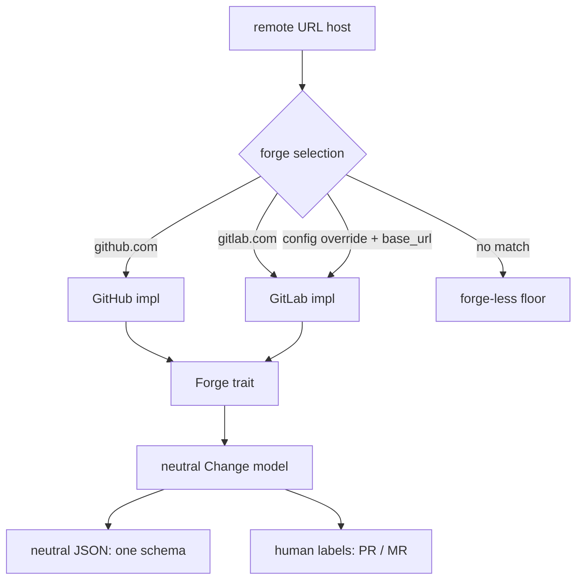
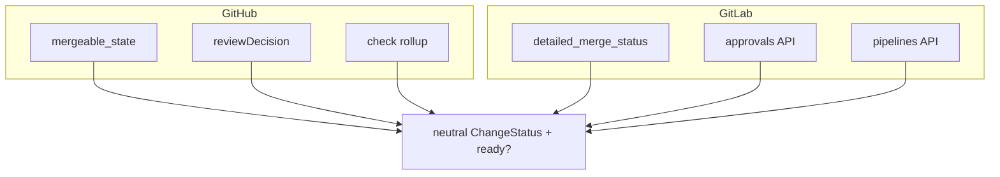

# GitLab as a first-class forge, the forge-equal boundary (slice 2)

## Summary

Slice 2 makes GitLab a first-class forge in stacc at full parity with GitHub:
open merge requests, squash-merge them, enrich `log` and `info`, and detect
merged MRs. It lands behind a single forge boundary extracted from today's
GitHub client, speaking a forge-neutral change model in both internals and JSON
so an agent drives any forge with one schema while humans still read "PR" or
"MR". gitlab.com is the build target; self-managed GitLab is designed in as a
later config flip.

## Problem Frame

Every forge call today lives in a concrete `GitHub` struct
(`crates/stacc-github/src/lib.rs`) with PR-shaped methods and GitHub-only
vocabulary (`PullRequest`, `PrState`, `owner` / `repo`). Host selection is
hardcoded: `parse_remote` matches only `github.com` and returns `None` for any
other host. There is no forge trait.

Slice 1 made the forge-less local floor first-class (forge-less `sync`, the
merge heuristic plus `stacc merged`, and `local` mode). That floor is the
universal substrate every forge sits on, but `submit`, `merge`, and
forge-authoritative merge detection are still GitHub-only.

The concrete pull toward slice 2 is a real GitLab repo to dogfood; the persona
behind it is the GitLab or locked-down developer who hand-rolls `git rebase`
today because reaching a usable forge API is not an option.

Parity is where the GitHub shape leaks. The richness the current code leans on,
`mergeable_state` (the `ready()` gate), the batched GraphQL `reviewDecision`
plus `statusCheckRollup` query, `branch_protected`, and the `merged` versus
`merged_at` quirk, is exactly the part GitLab models differently. Reaching
parity is not re-pointing the same calls at a new host; it is mapping two
genuinely different API shapes onto one contract.

## Key Decisions

- **Single forge boundary, one trait, capability split deferred.** A forge trait
  is extracted out of the existing `GitHub` struct, and GitHub and GitLab both
  implement it fully. GitLab degrades nothing against GitHub (labels, assignees,
  approvals, draft MRs, templates, and pipelines all map), so git-spice's
  opt-in capability interfaces are deferred until a capability-degrading forge
  (Bitbucket, Gerrit) actually lands. Rust lets the trait be split later without
  rewriting the two implementations.

- **Forge-neutral change model in internals and JSON; forge-specific labels.**
  Internal types move from `PullRequest` / `PrState` to a neutral `Change` /
  `ChangeState`, and JSON output uses neutral field names so an agent consumes
  one schema on any forge. Human-readable text stays forge-appropriate ("PR" for
  GitHub, "MR" for GitLab). This is the concrete expression of the agent-first
  differentiator and pushes neutrality further than git-spice, a human-first
  TUI, took it. The JSON rename is a one-time breaking change to consumers keyed
  on the old PR-shaped fields, accepted in this slice while GitHub is the only
  forge and the consumer set is smallest.

- **PAT plus `glab` auth; OAuth device flow deferred.** GitLab auth mirrors the
  GitHub token ladder: an env token, the OS keychain (`stacc auth login` stores
  a PAT), then a `glab auth token` reuse fallback gated to gitlab.com, like the
  `gh` one. PAT plus `glab` covers the whole submit/merge/detect loop with zero
  app registration, honoring the no-forge-app wedge the locked-down persona
  depends on. GitLab OAuth device flow would reintroduce app-registration
  surface and is deferred.

- **Host-based forge selection with a config override; gitlab.com target,
  self-managed designed in.** The GitHub-only host match in `parse_remote`
  generalizes to host-based selection (`gitlab.com` selects GitLab). A
  `.stacc.toml` override names the forge for hosts that host-matching cannot
  identify; for a self-managed instance it carries both the forge kind and the
  base URL, since a corporate GitLab host matches nothing by name. The forge
  carries a `base_url` from day one (the `GitHub` client already does, via
  `GITHUB_API_URL` and the enterprise GraphQL handling), so self-managed GitLab
  is a config value later, not a refactor. gitlab.com is the only host slice 2
  must work against.

- **Authoritative detection for GitLab; the local heuristic stays the floor.**
  Full parity includes forge-authoritative merge detection for GitLab, the
  GitLab analogue of the existing GitHub path. The slice-1 net-diff heuristic
  remains the forge-less route. The three reconciliation paths (GitHub
  authoritative, GitLab authoritative, forge-less heuristic) compose cleanly
  because slice 1 already separated detect from dispose (`stacc merged`).

## Actors

- A1. Developer, interactive. Drives stacc by hand on a GitLab repo.
- A2. AI coding agent, non-interactive. Consumes the neutral JSON and must not
  branch on which forge it is talking to.
- A3. Forge. GitHub or GitLab, reached over its own API and auth; absent in the
  forge-less case, where the slice-1 floor takes over.

## Requirements

**Forge boundary and selection**

- R1. A forge boundary (a trait extracted from the current `GitHub` struct)
  defines the contract every forge implements: open a change, read its state,
  merge it, enrich it, and detect merges. GitHub and GitLab both implement it
  fully.
- R2. Forge selection is by remote-URL host (for example `gitlab.com` selects
  GitLab), generalizing the GitHub-only host match in `parse_remote`.
- R3. A `.stacc.toml` config key overrides forge selection for hosts that
  host-matching cannot identify. For a self-managed instance the override
  carries both the forge kind and the base URL.
- R4. The forge carries a `base_url` from the outset, so a non-default GitLab
  host is a configuration value rather than a code change. gitlab.com is the
  only host slice 2 must work against.

**Neutral change model**

- R5. The internal change vocabulary is forge-neutral (a `Change` with a neutral
  `ChangeState`), replacing the GitHub-specific `PullRequest` / `PrState` types.
- R6. JSON output uses forge-neutral field names, so an agent consumes one
  schema regardless of forge. Renaming away from the PR-shaped JSON is a
  one-time breaking change to existing consumers, accepted in this slice.
- R7. Human-readable output stays forge-appropriate: "PR" for GitHub, "MR" for
  GitLab.
- R8. The neutral status model reconciles two different merge-readiness shapes
  into one predicate: GitHub's `mergeable_state` plus `reviewDecision` plus
  check rollup, and GitLab's `detailed_merge_status` plus approvals plus
  pipelines. The current `ready()` string test (`== "clean"`) is replaced by a
  neutral enum.

**GitLab parity surface**

- R9. `submit` opens merge requests for the stack on GitLab, with the same stack
  semantics as GitHub PRs (each change's base is its parent branch).
- R10. `merge` squash-merges a GitLab MR through the API, honoring GitLab's merge
  settings (squash, readiness).
- R11. `log` and `info` enrich stack entries with GitLab MR state (open, merged,
  closed, draft, plus review/approval and pipeline status) through the neutral
  model.
- R12. Forge-authoritative merge detection works for GitLab: `sync` reconciles
  merged MRs from GitLab's API. The slice-1 forge-less heuristic remains
  available for the no-forge case.

**Auth**

- R13. GitLab auth resolves a token through a ladder mirroring GitHub's: an env
  token, the OS keychain (`stacc auth login` stores a PAT), then a
  `glab auth token` reuse fallback gated to gitlab.com. Tokens are stored per
  forge.
- R14. No GitLab OAuth application or forge app is required to complete the
  submit/merge/detect loop.

**Migration and compatibility**

- R15. GitHub behavior at the human surface is unchanged: GitHub users still see
  "PR" and the same command output. Only the JSON field names neutralize.

## Visualizations

The forge boundary as a source-of-truth fan-out: the remote host (or a config
override) selects a forge, both forge implementations satisfy one trait, and the
neutral change model feeds one JSON schema plus forge-specific human labels.

The neutral status reconciliation, the slice's main design risk: two different
forge readiness models flatten into one neutral status and predicate.

## Acceptance Examples

- AE1. **Covers R2, R9.** Given a repo whose remote host is gitlab.com and a
  tracked stack, When `submit` runs, Then one MR per branch is opened with its
  base set to the parent branch, reported as "MR" in text and under the neutral
  change schema in JSON.
- AE2. **Covers R6, R7.** Given the same `submit` run on a GitHub repo and a
  GitLab repo, When the JSON outputs are compared, Then the field names are
  identical (neutral) and only the human-readable label differs (PR versus MR).
- AE3. **Covers R3, R4.** Given a self-managed GitLab host not identifiable by
  name, When `.stacc.toml` names the forge kind and base URL, Then stacc selects
  GitLab against that base URL with no code change.
- AE4. **Covers R12.** Given a GitLab MR merged through the web UI, When `sync`
  runs with the GitLab forge reachable, Then the merge is detected
  authoritatively and the branch's children restack; and When the same repo is
  in forge-less mode, Then the slice-1 heuristic flags it and `stacc merged`
  disposes.
- AE5. **Covers R8.** Given a GitLab MR that is not yet approved or whose
  pipeline is pending, When stacc reads readiness, Then the neutral status
  reports not-ready, the same predicate GitHub's non-clean `mergeable_state`
  produces.
- AE6. **Covers R14.** Given only a GitLab PAT and no OAuth app, When the full
  submit/merge/detect loop runs, Then it completes with no forge-app
  registration.

## Success Criteria

- The dogfood loop runs end to end on a gitlab.com repo: track, submit MRs,
  merge, and reconcile, with no GitHub assumptions surfaced.
- An agent driving stacc consumes one JSON schema across GitHub and GitLab and
  never branches on forge.
- The full submit/merge/detect loop completes with only a PAT, no forge app or
  OAuth registration.
- GitHub users' human-facing experience is unchanged.
- A planning agent can break slice 2 into implementation units without inventing
  forge semantics or the neutral status mapping.

## Scope Boundaries

**Deferred for later (ticketed in Linear, team STA)**

- Self-managed GitLab base-URL support beyond the designed-in config hook.
- GitLab OAuth device flow (auth parity beyond PAT plus `glab`).
- Bitbucket forge, and the opt-in capability interfaces its degradations
  require.
- Gerrit forge (a changeset model, a genuinely different shape).
- The forge-order decision: which non-GitHub forge follows GitLab, and whether
  Gerrit is in or out.

**Outside this product's identity (carried from slice 1)**

- Push access to the shared repo is required to stack and submit; a developer
  who cannot push gets local stack management only.
- Repos that dismiss approvals when a base branch moves are fundamentally
  incompatible with restacking; the remedy is repo reconfiguration, not a stacc
  feature.

## Dependencies / Assumptions

- Slice 1 (the forge-less floor, `local` mode, and `stacc merged`) lands first;
  slice 2 builds on it, and the forge-less path is the fallback when no forge is
  selected.
- The crate layering supports the boundary: `stacc-core` is forge-agnostic
  (pure git topology) and `stacc-github` already isolates every GitHub API call
  behind one crate, so extracting a trait and adding a GitLab implementation
  crate is additive. Exact crate placement (a dedicated `stacc-forge` trait
  crate versus the trait living in core) is a planning decision.
- The `GitHub` client already carries a `base_url` and handles a GitHub
  Enterprise base (`GITHUB_API_URL`, the `/api/v3` to `/api/graphql` mapping),
  which is the precedent self-managed GitLab reuses.
- git-spice's `../git-spice/internal/forge/forge.go` is the working reference
  for the boundary shape (Forge plus Repository interfaces, a registry, a
  neutral Change model, per-forge auth, and the opt-in capability interfaces
  stacc is deferring). An external contributor added GitLab behind that
  abstraction with no business-logic change, which validates feasibility.
- The neutral status model is the main design risk: GitHub and GitLab express
  merge-readiness, review, and CI through different APIs, and flattening them
  into one faithful predicate without losing signal an agent needs is the part
  most likely to require iteration.

## Outstanding Questions

**Resolve before planning**

- How neutral the `ChangeStatus` goes: a single ready / not-ready predicate, or
  a richer neutral state an agent can reason over, and how GitLab's approvals
  plus pipelines map onto it without losing signal.
- Whether stacc mirrors git-spice's Change / Repository interface split or
  diverges to a slimmer trait, given the deferred capability interfaces.

**Deferred to planning**

- The exact trait method set and crate placement (a `stacc-forge` trait crate
  versus the trait in `stacc-core`; a new GitLab implementation crate).
- The exact `.stacc.toml` config key for the forge override and the self-managed
  (forge-kind plus base-URL) shape.
- The exact neutral JSON field renames and whether a compatibility or alias
  window softens the breaking change.
- GitLab API specifics: MR creation and merge endpoints, `detailed_merge_status`
  values, the approvals and pipelines endpoints, and required token scopes.

## Sources / Research

- stacc GitHub client and the PR-shaped surface to neutralize, including
  `parse_remote`, `ready()`, and the GraphQL checks query:
  `crates/stacc-github/src/lib.rs`.
- stacc config surface and the closed `Key` namespace a forge override extends:
  `crates/stacc-config/src/lib.rs`.
- The forge boundary, `--offline`, and host handling in the command layer:
  `crates/stacc/src/commands/operations.rs`, `crates/stacc/src/cli.rs`.
- Slice 1 requirements (the forge-less floor this builds on):
  `docs/brainstorms/2026-06-11-seamless-local-multi-forge-requirements.md`.
- git-spice forge abstraction (Forge and Repository interfaces, the registry,
  per-forge auth, and the opt-in capability interfaces):
  `../git-spice/internal/forge/forge.go`.
