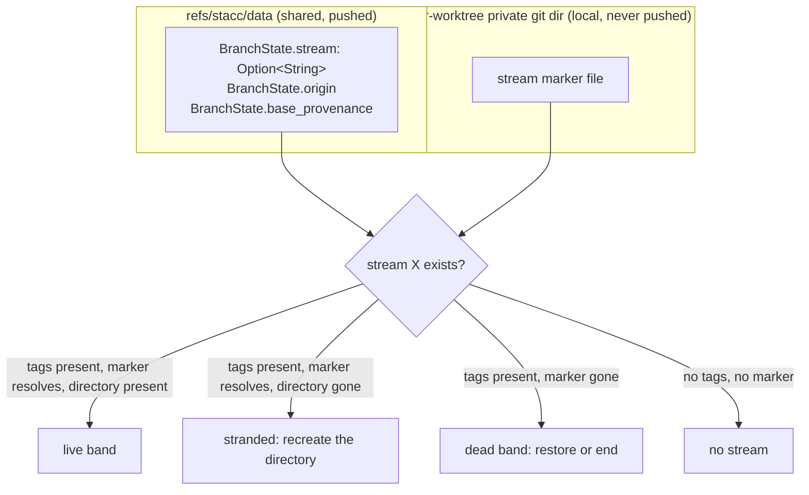

# feat: [STA-145] stacc streams (worktree-aware stacking)

## Summary

stacc gains **streams**: a named group of branches bound to one git worktree, created and
destroyed by stacc itself. Six new commands (`stream new / list / end / rename / restore /
eject`) own the worktree lifecycle, `stacc log` renders each stream as its own band, and the
bulk passes (`sync`, `restack`, `undo`) operate on the caller's stream rather than the whole
repo so parallel agent sessions stop rewriting each other's work.

---

## Problem Frame

Every background agent session in this codebase already gets its own git worktree, because the
harness defaults to per-session isolation. stacc does not know that. `refs/stacc/data` is one
ref per repo and git refs are shared across worktrees, so `stacc log` in any worktree shows
every tracked branch in the repo as one flat trunk-rooted graph, with nothing saying which
session is working on what. Four concurrent sessions produce four independent trunk-based roots
and a graph that fans across five columns, with no way to read which column is yours.

The other half of the pain is teardown. A session's branches, PRs, and worktree directory
outlive the session, and there is no single gesture that ends all three. They are cleaned up by
hand or not at all, so the repo accumulates worktree directories, stale local branches, and open
PRs nobody is going to merge.

Underneath both is a correctness problem that only appears with more than one worktree. A
worktree holds exactly one checked-out branch, and stacc refuses to rewrite a branch checked out
elsewhere. So N live sessions means N branches no bulk `sync` can restack, one per session, and
each is that session's current working branch, the one most likely to need restacking after a
trunk advance. Today those skips exit through a silent-success path, so the branches stacked
above them are reported in no list at all.

---

## Key Decisions

- **A stream is a tag, not a branch.** Grouping lives in one optional field on branch state.
  The alternatives (a synthetic empty anchor branch at trunk, or using the first real branch as
  the anchor) were rejected because the first forces permanent special cases in `submit`,
  `merge`, `sync`, and `log`, and the second destroys the group the moment that branch merges.

- **There is no stream record.** A stream exists if any branch carries its tag or any worktree
  marker names it. A third store could disagree with the first two and would need its own
  reaping rule. The cost is that a dead stream is recovered by archaeology over state versions
  rather than by reading a tombstone.

- **A worktree path is never stored, anywhere.** A live path is derived from the git worktree
  list plus the marker. A dead stream's path is not read at all; `stream restore` computes
  `.stacc/worktrees/<name>` from the name, because it only ever creates stacc-owned worktrees
  and stacc only ever creates them there. A local sidecar surviving `stream end` was rejected
  as a third store with a fresh drift class, and a path in the pushed state ref was rejected as
  a straight reversal of the no-machine-local-paths rule. The cost is that a stream adopted from
  another tool's directory comes back at the convention path rather than where it died.

- **Membership is closed under descent, as a hard invariant.** A branch's stream is its base's
  stream. No cross-stream edge is representable, which makes `reorder` and `fold` stream-neutral
  by construction and leaves `move` as the only stream-affecting reordering command.

- **`stream end` is a full destroy that never half-destroys.** It removes the worktree
  directory, the tags, the PRs, and the branches; every gate runs before any of it, so a refused
  teardown leaves the repo byte-identical.

- **Gates block, they never force, and each has its own override.** Every gate refuses and hands
  back a remedy rather than warning and proceeding. Always-confirm was rejected specifically
  because it trains agents to pass `--force` reflexively, which defeats the gate. For the same
  reason no flag clears more than one gate: `--force` discards uncommitted changes and nothing
  else, so a reflexive `--force` cannot reach a reviewed PR or an inherited branch.

- **Every branch is tracked unless explicitly excluded.** A `reference-transaction` git hook
  installed by `init` tracks branches as they are created, and an adopt-on-run backstop in every
  state-writing command catches what the hook misses. The backstop is the correctness mechanism;
  the hook buys precision and immediacy.

- **Personal config moves to git config under `stacc.*`.** `.git/config` is uncommitted by
  construction and resolves from any subdirectory, including a linked worktree.

- **Named `stream`, not `worktree`.** `stacc worktree rm` would read as a synonym for `git
  worktree remove`, which deletes a directory, while this closes PRs and deletes branches.

- **No harness hooks.** `stacc agent install` ships stream instructions as skill content and
  nothing else. Claude Code's `SessionEnd` cannot block, sends stdout to the debug log only, and
  fires on `/clear`, so a teardown hook has three observable outcomes: silently destroy,
  silently do nothing, or look like a failure.

---

## The Model

Four terms carry the design. They are used precisely throughout this document.

| Term | Definition |
|---|---|
| **Stream** | A named group of branches bound to one linked worktree. Identified by its name. Exists if any branch carries its tag or any worktree marker names it. |
| **Slice** | What a bulk command operates on: every branch tagged with the current worktree's stream, plus any untagged branch checked out in that worktree. In the main checkout and in any un-adopted linked worktree, the slice is the untagged branches. |
| **Band** | One stream's region of `stacc log` output. Its own rendering canvas, which is a forest of that stream's trunk-based roots rather than a tree. |
| **Dead band** | A stream name present in branch tags whose marker no longer resolves. Rendered distinctly, ended by hand. |
| **Stranded stream** | Tags and marker both present, directory gone (an `rm -rf` rather than a `git worktree remove`, which leaves the entry prunable). Not dead: nothing was untracked and no ref was dropped, so it is repaired rather than torn down. |

A stream may hold several independent trunk-based roots. That is expected, not a corner case,
and both the renderer and the slice definition have to handle it.



---

## Actors

- A1. **Agent session.** Runs one stream per worktree, drives every command with
  `--no-interactive --json`, names its stream after the driving issue id, and reads refusals
  rather than prompts.
- A2. **Human developer.** Works in the main checkout or in a stream worktree, gets prompts
  where an agent gets refusals.
- A3. **The harness.** Creates worktrees before stacc runs. stacc adopts what it finds and never
  parses another tool's config.
- A4. **The forge (GitHub).** Holds PRs and remote branches. Closing a PR is one-way; there is
  no reopen.

---

## Requirements

### Stream identity and state

- R1. A branch's stream membership is one optional field on branch state, carried in the shared
  state ref, so membership travels with the branch.
- R2. Which worktree hosts a stream is recorded in a marker file in that worktree's private git
  dir, never in the pushed state ref, because machine-local paths must not reach a teammate's
  clone. No worktree path is stored anywhere: a live path is derived from the git worktree list
  plus the marker, and a dead stream's path is computed from the name rather than read.
- R3. A stream's existence is derived from branch tags plus worktree markers. There is no stream
  record and no worktree table.
- R4. A stream name is explicit and required. Interactive runs prompt with the worktree
  directory basename prefilled; `--no-interactive` runs with no name return a `usage` error.
- R5. A stream name is valid when it passes git ref-name rules with one extra guard: a leading
  `-` is rejected, because such a name cannot be passed as an argument.
- R6. A new stream name must be unique against live streams and dead bands. Colliding with a
  dead band errors, names the dead stream, and points at `stream end <name>`.
- R7. A name is free for reuse the moment its stream ends, so a second session on the same issue
  is never forced into a suffixed name.
- R8. One worktree hosts at most one stream. Re-running `stream new <same-name>` in its own
  worktree is an idempotent no-op; a different name is an error naming the existing stream.
- R9. The main checkout is never a stream. `stream new` there creates a new worktree rather than
  claiming the main one.
- R10. State written by v0.4.1 reads forward unchanged: an absent stream field means no stream,
  so there is no migration.

### Membership and closure

- R11. A branch's stream is its base's stream, transitively. No branch may have a base in a
  different stream.
- R12. A command may leave a branch's stream tag unchanged from anywhere. If it would change the
  tag, the new tag must equal the current worktree's stream, else the command refuses.
- R13. Deriving an untagged tag is refused even from an untagged worktree, because leaving a
  stream belongs to `stream eject` alone.
- R14. A trunk-based root's tag is set once, at creation, from the worktree it was created in,
  and is never re-derived.
- R15. `move --onto X` is legal only from X's stream's worktree; `move --onto <trunk>` keeps the
  tag and is legal from anywhere; `move` onto an untagged base is refused.
- R16. `reorder` and `fold` need no stream rule, since closure makes the chains they operate on
  single-stream.
- R17. Automatic reparenting in `sync` and `merge` never changes a tag, so a merged branch's
  children become roots keeping their stream.
- R18. `stacc stream eject <branch>` untags a branch and its whole subtree, refuses unless the
  branch is already trunk-based, and is runnable from anywhere.
- R19. A command that writes a stream tag derives it inside the state-store mutation closure
  from freshly loaded state, never from a value captured before the write.

### Worktree ownership and layout

- R20. `stacc stream new <name> [branch]` creates the worktree when run from the main checkout
  or given an explicit create flag, and adopts when already inside a linked worktree.
- R21. Either path ends with exactly one tracked, trunk-based branch checked out, so everything
  downstream sees one shape.
- R22. stacc creates stream worktrees at `.stacc/worktrees/<stream>` and writes `.stacc/.gitignore`
  containing `*`, so the tree is invisible to `git status` and to editor search without touching
  any user-owned file.
- R23. stacc adopts worktrees at any path, including `.claude/worktrees/`, and never creates
  under a namespace another tool owns.
- R24. There is no config knob for the worktree root.
- R25. Adoption renames the harness's scaffold branch into the stream's tracked trunk-based
  root, so no ref the harness considers live is ever deleted.
- R26. Adoption refuses on a dirty worktree, and refuses when the scaffold branch carries commits
  beyond trunk, naming those commits.
- R27. The branch argument is optional; when omitted, the branch name is derived from the stream
  name and the configured prefix.
- R28. stacc locks the worktrees it creates with a reason naming the stream, so `git worktree
  prune` cannot reap a live stream and teardown can tell its own lock from a foreign one.
- R29. The path of a worktree that still exists is always derived from the git worktree list,
  never reconstructed from the path convention, because adopted worktrees legitimately live at
  arbitrary paths. The convention is consulted in exactly one place, `stream restore`'s target
  for a worktree that no longer exists, where there is nothing to derive from and stacc creates
  only its own worktrees anyway.
- R30. `stacc-git` gains worktree add, remove, lock, unlock, read-lock-reason, and pid-liveness
  primitives; today its worktree support is read-only enumeration.
- R31. stacc documents the harness setting that disables per-session worktree isolation, so the
  create path is reachable, and writes that setting only under an explicit flag.
- R32. stacc documents that its own created worktrees are cut from `origin/<trunk>`, and never
  reads another tool's config.

### Automatic branch tracking

- R33. `stacc init` installs a `reference-transaction` hook that tracks branches as they are
  created.
- R34. The hook runs at the `committed` state only, because at `prepared` the new ref is
  unresolvable and its reflog does not yet exist. Tracking can therefore never break a git
  command.
- R35. The hook acts only on `refs/heads/*` lines whose old value is all zeroes, which excludes
  rebase and bisect traffic.
- R36. The hook recognises a delete-plus-create pair as a rename and moves the branch's state
  rather than tracking the new name beside a stale old one.
- R37. stacc exports a guard variable on every git subprocess it spawns, and the hook exits on
  sight of it, so stacc's own branch creation does not race the base it is about to write.
- R38. The hook derives the base from the branch's own reflog `Created from` entry, falling back
  to ancestry inference for a bare sha, a tag, an untracked source, or an unreadable reflog.
- R39. A recorded base carries provenance: `explicit` (set by `move` or `track --base`) and
  validated `reflog` are pinned; `inferred` is soft and may be re-derived by `sync` or `restack`
  once tied candidates diverge.
- R40. A branch created in a stream's worktree on top of a foreign stream's branch is tracked
  untagged, since the hook cannot refuse.
- R41. Every command that already loads and writes state adopts untracked branches as a
  backstop, using the same inference rule as the hook.
- R42. Navigation commands and pure readers do not write state, but report incomplete tracking,
  so an agent cannot observe stale state indefinitely without a signal.
- R43. A backstop adoption is its own state version, written after any preflight gates the
  command has and before the command's own work.
- R44. The hook installs into the directory git actually consults; when that resolves outside
  the repo, interactive `init` asks first and `--json` init requires an explicit flag naming the
  machine-wide consequence.
- R45. The installed hook file is a logic-free shim that fast-exits in non-stacc repos, is
  packed-ref safe, resolves the common dir inside a worktree, and is rewritten unconditionally
  on every `init` so stale shims upgrade.
- R46. Hook installation runs outside `init`'s already-initialized early return, so re-running
  `init` on an existing repo installs or refreshes the hook. That path is a convergence pass,
  not a no-op: it skips only the state-ref repo config, and also writes the branch prefix per
  R121a.
- R47. Declining the hook at `init` is the opt-out. The backstop is not opt-outable.
- R48. `stacc untrack` records a branch as excluded, and the backstop honours that exclusion, so
  `untrack` means "and stay out".
- R49. State records whether a branch was created by stacc or adopted, and which worktree it was
  first seen in, because git records nothing about where a branch was born.

### Teardown

- R50. `stacc stream end <name>` destroys the stream's branches, their PRs, their remote
  branches, the stream tags, the marker, and the worktree directory.
- R51. Gates run in a fixed order and every gate precedes every write: dirty check, lock check,
  classification (no writes), block list, review gate, then the adoption write, then the
  destroy.
- R52. A dirty worktree refuses the whole teardown. Ignored files do not count as dirty;
  untracked non-ignored files do. `--force` discards.
- R53. A worktree lock held by a live process refuses the whole teardown and names the session;
  a lock whose pid is dead is reclaimed and teardown proceeds; an unparseable lock reason is
  assumed live and refuses.
- R54. Two conditions block: a branch descended from stream work but checked out in another
  worktree, and a detached HEAD carrying commits no branch references.
- R55. Branches with no PR, and PRs that are draft, merged, or already closed, are destroyed
  silently. Anything carrying review activity (an approval, requested changes, or a human review
  comment) blocks unless `--destroy-reviewed`.
- R56. Branches whose origin is outside this stream (they predate it or were first seen in
  another worktree) get their own gate: a human confirms at a prompt naming them, an agent is
  refused and re-runs with `--destroy-outside-origin`.
- R56a. Each gate has exactly one override and no override clears a second gate: `--force` for
  the dirty worktree, `--destroy-reviewed` for review activity, `--destroy-outside-origin` for
  outside origin. The two block conditions in R54 have no override at all. Every flag is
  verb-object and names the consequence accepted rather than the check suppressed, so a refusal
  can name the single flag that resolves it per R101.
- R57. Branches born in this stream's worktree do not trip the origin gate, so the ordinary
  agent habit of `git checkout -b` inside a stream is not friction.
- R58. Untracked strays that stacc can place are adopted into the stream and then destroyed with
  it; the adoption lands as its own state version after every gate.
- R59. A stray stacc cannot link to the stream is left untouched and unreported, because naming
  it would imply knowledge stacc does not have.
- R60. `stream end` deletes the remote branch by default, configurable by a git config key, with
  `--keep-remote` and `--delete-remote` flags. Nothing else implies deletion, so resolution is
  flags, then `stacc.stream.deleteRemote`, then delete, and there is no flag-precedence rule.
- R61. A non-boolean value in that config key downgrades to keeping the remote and warns naming
  the key. Absent config deletes, broken config keeps.
- R62. Teardown does forge work first: PRs are closed before their remote branches are deleted,
  because deleting a head branch auto-closes its PR and the receipt would otherwise be wrong.
- R63. An already-closed PR, an already-absent ref, and a missing worktree directory are
  successes, so re-running `stream end` is the recovery path after an interrupted teardown.
- R64. Teardown writes exactly one state version regardless of branch count, and that version
  doubles as the operation id in the receipt.
- R65. Each destroyed branch gets a disposal record with a new `stream_end` evidence value,
  trunk as its base and no children, so its keep-alive ref is not the first thing pruned.
- R66. `stream end --dry-run` runs every preflight, emits the plan, writes nothing, and exits
  zero.
- R67. Ending a stream from inside its own worktree is refused, since stacc would be removing
  the directory it is running in.

### Restore and undo

- R68. `stacc undo` rewinds only the caller's slice, overwriting those branch entries and
  leaving every other stream's entries at their live values.
- R69. `--steps N` means N distinct states of the caller's slice, derived by comparing each
  version's branch and tip blobs, since version commits carry no provenance.
- R70. `undo` steps over versions whose only difference is a backstop adoption, and re-adoption
  reuses the last recorded base rather than re-inferring it.
- R71. Repo settings and disposal receipts rewind wholesale to the target version's values.
- R72. `undo` refuses a teardown version and names `stacc stream restore <name>`.
- R73. `stacc stream restore <name>` restores tracking, local refs from the dropped-tip
  keep-alive refs, and a stacc-created worktree at `.stacc/worktrees/<name>`, locked and
  markered like any stream worktree. A stream that was adopted from another tool's directory
  therefore returns at the convention path, which the receipt reports.
- R74. Restore never calls the forge. It reports the PRs that stay closed and the remote
  branches that stay deleted, and states that the next `submit` opens fresh PRs.
- R75. Restore finds a dead stream by walking the state ref backwards for the version its
  teardown removed, bounded by the version retention window, and refuses rather than partially
  restoring when the teardown is out of window.
- R76. Restore checks every branch it would restore against live tags and refuses when a name
  has been reused, because archaeology cannot distinguish a rename from an end plus a create.
- R130. Restore refuses when the stream name is live again, as its own refusal kind distinct
  from R76's branch-level lineage conflict, because the stream-level collision fires even when
  no branch name overlaps and the two remedies differ. The remedy names the live stream and
  requires ending or renaming it first. R7's immediate reuse of a freed name stands, so the
  cost is explicit: starting a second session on an issue id forecloses recovering the first
  without destroying the second.
- R131. Restore refuses when its target directory exists and is non-empty, naming the path,
  because `git worktree add` would fail there anyway and a partially created worktree violates
  R75's all-or-nothing rule.
- R132. A stranded stream, tags and marker present with the directory gone, is repaired by
  `stream restore`, which recreates the directory at the still-derivable path and skips the
  archaeology entirely, so the version retention window does not apply. Treating it as a dead
  band was rejected: `stream end` would close PRs and drop tracking that are wholly intact,
  destroying the cheap recovery on the way to the expensive one.

### Scoping of bulk operations

- R77. A worktree's slice is every branch tagged with that worktree's stream, plus any untagged
  branch checked out in that worktree. In the main checkout and in any un-adopted linked
  worktree the slice is the untagged branches.
- R78. All of `sync` is slice-scoped: PR adoption, merged detection, record drop, reparenting,
  and the restack pass.
- R79. `restack --stack` is slice-scoped. Its other modes are already in-stream, and the focused
  operations need no change.
- R80. `--all`, spelled identically on `sync` and `restack`, widens scope and never widens
  permission: the per-branch worktree gate still holds.
- R81. A merged branch's state record is never dropped while its ref is live and checked out in
  another worktree. This couples to that one cleanup-skip reason only, so single-worktree
  behaviour is unchanged.
- R82. A deferred drop is reported under its own key, held distinct from the existing
  cleanup-skip key, because one key cannot mean both "record dropped" and "record kept".
- R83. Worktree skips reach stdout under `--json`, each naming the descendants left stale by that
  skip.
- R84. Peer streams' branches are not listed per-branch on every run, since that rebuilds the
  noise the scoping removed.
- R85. Trunk advance stays global, since trunk is shared.

### `stacc log` rendering

- R86. When any stream exists, bands replace the trunk-rooted graph at the top level: trunk
  prints once and each stream is an independent canvas whose connector to trunk is a frame, not
  an edge.
- R87. A repo with no streams renders exactly as it does today, byte for byte. `stacc stream
  new` is the single visible moment the layout changes.
- R88. Bands never collapse, including when only one stream exists.
- R89. Forward orientation stays the default, with the band header above its band. Bands work in
  both orientations.
- R90. Only the band holding the current branch expands to the full metadata block; every other
  band renders one row per branch.
- R91. The branch row carries the PR number and state, so the metadata block keeps age, sha and
  subject, CI rollup, and restack status only.
- R92. The band header carries the stream name, its path, and a foreign-lock warning, and does
  not carry a HEAD field, which measured 95 to 152 columns against the 80-column fallback.
- R93. A glyph marks the branch checked out in this worktree, and a second glyph marks a branch
  checked out in another stream's worktree, which is exactly the branch a bulk pass cannot
  rewrite.
- R94. The lock warning is liveness-gated, so it appears exactly when teardown would refuse.
- R95. Dead bands sort last and replace the path with a worktree-gone marker plus the remedy
  command inline. No cross-worktree glyph appears inside a dead band. A stranded stream gets its
  own header variant carrying `stream restore` as a repair, not the dead band's teardown
  remedy, since the two states are one `rm -rf` apart and their remedies are opposite.
- R96. Independent roots inside a band are separated by a blank line, without which two
  trunk-based roots share a column and read as one chain.
- R97. The forward and reverse renderers take a root list instead of always rooting at trunk,
  since a band's canvas is a forest.
- R98. A path renders repo-relative when it sits under the repo root and verbatim otherwise.
- R99. The short form stays offline and its rows carry no PR state; the collapsed band row in
  the full form is a full-form row minus the metadata block.

### JSON contract

- R100. Each stream command emits one hyphenated `op` value (`stream-new`, `stream-list`,
  `stream-end`, `stream-rename`, `stream-restore`, `stream-eject`).
- R101. A refusal is an error envelope carrying `op`, a single `stream_refused` type, a `kind`
  sub-code with a per-kind payload, `retryable`, and the remedy including the flag name where a
  flag resolves it.
- R102. A malformed stream name routes to the existing `usage` type, since it is bad input
  rather than a policy gate.
- R103. The stream case of the existing worktree-conflict error folds into `stream_refused`, so
  streams dispatch is one path; the focused operations keep emitting it unchanged.
- R104. A refusal means zero work happened. A failure after the gates is a different shape:
  in-band, carrying the manifest with per-resource outcomes, and a nonzero exit.
- R105. `schema_version` stays 3, because the envelope shape is unchanged and a version is a
  parser contract.
- R106. `sync`, `restack`, and `undo` each carry a scope object naming the mode, the stream, and
  whether untagged branches are included.
- R107. A manifest is expressed in one sense throughout, observed end-state, with a per-resource
  action plus result; `result` is omitted in a plan and present in a receipt.
- R108. Restore reports each resource as restored, not restored, or intentionally unrestored,
  rather than inverting the destruction manifest.
- R109. Readers and navigation emit a pending-adoption key, labelled advisory, each entry
  carrying the inferred base and its provenance.
- R110. Writers emit a newly-tracked key, held apart from sync's existing PR-adoption key.
- R111. Every envelope may carry a notices array, present only when non-empty, which is where a
  dead-pid lock reclamation is reported.
- R112. Every `stacc log` node carries its stream, absent when untagged, so an orchestrator can
  answer which branches are in a stream.
- R113. Base provenance is always emitted when known, because it is a three-valued enum whose
  absence would conflate distinct meanings.
- R114. `stream list` is metadata only and offline: name, provenance, state, branch count,
  current flag, and remaining retention headroom. `path` is emitted for a live or stranded
  stream, derived; a dead entry carries `restore_path` instead, the convention path restore
  would use, so an agent never reconstructs the convention itself. The two keys never appear
  together, and because the JSON envelope strips nulls, absence is the only spelling of
  unknown.
- R115. Every array is ordered deterministically by branch name, so receipt diffs are stable.
- R116. Exit codes stay binary; the error type remains the branch point.

### Configuration

- R117. A single `stacc.branchPrefix` key holds a literal prefix string, concatenated, with no
  template syntax.
- R118. The prefix applies only to branch names stacc invents. A name a caller types is used
  verbatim, so `stacc create` is unchanged and double-prefixing is structurally impossible.
- R119. Unset means the stream name verbatim, which is a valid branch name and still auto-links
  in the issue tracker, since linking matches the identifier anywhere in the name.
- R120. A derived name that collides with an existing branch refuses, names that branch, and
  points at the explicit branch argument.
- R121. `stacc init` resolves the prefix once and writes it: prompting pre-filled where there is
  a tty, writing the slugified git `user.name` silently otherwise, and writing nothing when
  `user.name` is unset.
- R121a. `init` writes the prefix on the already-initialized path too, when and only when the
  key is absent, so a repo inited before this feature converges rather than depending on the
  arbitrary date it was set up. `stream new` needs no read-time derivation: an absent key is
  well-defined by R119. The write is safe to make unasked because the key is personal git
  config, local and unpushed per R122, and R126 reports the resolved value.
- R122. Personal config lives in git config under `stacc.*`, and the precedence chain becomes
  flags, then git config, then the repo TOML file, then detection.
- R123. The repo TOML file keeps a narrowed role as the committed team-convention file and now
  loses to any personal setting, so a team convention is a default and never a mandate.
- R124. The user-global TOML config file is retired outright, which is a breaking change on a
  shipped version and needs a release note plus a hint in `stacc config` help.
- R125. `stream end`'s remote-deletion key lives in git config as `stacc.stream.deleteRemote`.
- R126. `stacc init`'s JSON envelope gains the resolved branch prefix.

### Agent context

- R127. `stacc agent install`'s skill content gains the stream commands, the slice model, the
  new log fields, and the refusal kinds with their remedies.
- R128. The skill content also documents the two error types that exist in code today but appear
  nowhere in the agent contract: contention and worktree conflict.
- R129. `stacc agent install` gains no hook machinery and never writes a harness settings file.

---

## Key Flows

- F1. Start a stream from the main checkout
  - **Trigger:** `stacc stream new sta-145` in the main checkout.
  - **Actors:** A1, A2
  - **Steps:** Validate the name against live streams and dead bands; derive the branch name
    from the prefix; `git worktree add -b <branch> .stacc/worktrees/sta-145 origin/<trunk>`;
    lock the worktree with a stacc reason; track the branch as a trunk-based root tagged
    `sta-145`; write the marker file.
  - **Outcome:** A locked worktree holding exactly one tracked trunk-based branch.
  - **Covers R20, R21, R22, R27, R28, R33.**

- F2. Adopt a harness-created worktree
  - **Trigger:** `stacc stream new sta-145` inside a linked worktree the harness created.
  - **Actors:** A1, A3
  - **Steps:** Refuse if the worktree is dirty; refuse if the scaffold branch carries commits
    beyond trunk, naming them; rename the scaffold branch into the stream's root; track it as
    trunk-based and tagged; write the marker file. Nothing is created and nothing is deleted.
  - **Outcome:** The same shape F1 produces, at whatever path the harness chose.
  - **Covers R20, R21, R25, R26, R29.**

- F3. A branch is created by plain git inside a stream
  - **Trigger:** `git checkout -b fix` in a stream worktree.
  - **Actors:** A1, A3
  - **Steps:** The hook fires at `committed`, sees a `refs/heads/*` creation, finds no stacc
    guard variable, reads the branch reflog for its start point, records the base with its
    provenance, derives the stream tag by descent, and records the branch's origin as this
    worktree.
  - **Outcome:** The branch is tracked, tagged, and destroyable by `stream end` without tripping
    the origin gate.
  - **Covers R33, R34, R35, R38, R39, R49, R57.**

- F4. End a stream
  - **Trigger:** `stacc stream end sta-145 --no-interactive --json` from the main checkout.
  - **Actors:** A1, A4
  - **Steps:** Dirty check; lock check; classify strays without writing; block list; review gate;
    origin gate; write the adoption state version; close PRs; delete remote branches; delete
    local refs with disposal records; unlock and remove the worktree directory; write one state
    version.
  - **Outcome:** A receipt manifest listing each branch, its local ref, remote ref, and PR
    outcome, plus the state version id that makes a retry idempotent.
  - **Covers R50, R51, R58, R60, R62, R63, R64, R65, R107.**

- F5. Restore an ended stream
  - **Trigger:** `stacc stream restore sta-145`.
  - **Actors:** A2
  - **Steps:** Refuse if the stream name is live again, or if `.stacc/worktrees/sta-145` exists
    and is non-empty; walk the state ref backwards for the version the teardown removed; refuse
    if it is outside the retention window; check each branch against live tags and refuse on a
    reused name; re-tag the branches; resurrect refs from the keep-alive refs; create the
    worktree at `.stacc/worktrees/sta-145`, locked and markered.
  - **Outcome:** Local work is back; the PRs stay closed and the remote branches stay deleted,
    both reported, as is a path that differs from where an adopted stream died.
  - **Covers R73, R74, R75, R76, R108, R130, R131.**

- F5b. Repair a stranded stream
  - **Trigger:** `stacc stream restore sta-145` after the worktree directory was deleted with
    `rm -rf` rather than `stream end`.
  - **Actors:** A2
  - **Steps:** See tags and marker both intact, so skip the archaeology entirely; prune the
    stale git worktree entry; recreate the directory at the path the marker still yields; check
    out the stream's root branch.
  - **Outcome:** The band goes from stranded back to live with no state version consumed and no
    dependence on the retention window.
  - **Covers R95, R114, R132.**

- F6. Sync from inside a stream
  - **Trigger:** `stacc sync --no-interactive --json` in a stream worktree.
  - **Actors:** A1
  - **Steps:** Compute the slice; adopt PRs, detect merges, drop records, reparent, and restack
    within it; defer any drop whose ref is live and checked out elsewhere; report worktree skips
    with the descendants they stranded.
  - **Outcome:** Peer streams are untouched, and everything the pass could not do is named in
    the envelope.
  - **Covers R77, R78, R81, R82, R83, R106.**

---

## Rendering Target

The chosen `stacc log` shape, verified against a port of the real lane algorithm rather than
hand-drawn:

```text
├─ ▸ stream: pickups   .stacc/worktrees/pickups
│    ◉ jillian/sta-141-render (current)          #141 open
│    │ 9 hours ago
│    │ 0a6da4e - feat(stacc): [STA-1xx] do the thing
│    │ CI pass
│    │
│    ○ jillian/sta-140-parsing                   #140 open
│      9 hours ago
│      0a6da4e - feat(stacc): [STA-1xx] do the thing
│      CI pass
│
├─ ▸ stream: sen-auth   .claude/worktrees/sen-auth   ⚠ foreign lock
│    ○ jillian/sta-151-tokens                    #151 draft
│    ◈ jillian/sta-150-auth                      #150 approved
│
│    ○ jillian/sta-155-schema                    #155 open
│
├─ ▸ stream: old-spike  (worktree gone)  end it: stacc stream end old-spike
│    ○ jillian/sta-120-spike                     #120 open  needs restack
│
├─ ▸ (main checkout)
│    ○ jillian/sta-160-docs                      #160 open
│
main

◉ checked out here    ◈ checked out in that stream's worktree
```

The blank line inside the `sen-auth` band separates two independent trunk-based roots. Without
it they share a column and read as one chain, which is the one defect bands introduce.

---

## Acceptance Examples

- AE1. One override clears one gate
  - **Covers R55, R56a, R60.**
  - **Given** `stacc.stream.deleteRemote` is unset, the worktree is dirty, and one branch's PR
    carries an approval.
  - **When** `stacc stream end sta-145 --force --keep-remote` runs.
  - **Then** the teardown still refuses, naming the approved branch and `--destroy-reviewed`,
    because `--force` clears the dirty gate only. Nothing is written, and the `--keep-remote`
    flag is moot on a refusal rather than overridden.

- AE2. Broken config downgrades
  - **Covers R61.**
  - **Given** `stacc.stream.deleteRemote` holds a non-boolean value.
  - **When** teardown reaches remote deletion.
  - **Then** remotes are kept and a warning names the key.

- AE3. Cross-stream `move` refuses
  - **Covers R12, R15.**
  - **Given** worktree A hosts stream `sta-140` with HEAD `jillian/sta-141-render`.
  - **When** `stacc move --onto jillian/sta-150-auth` runs in A, where that base is tagged
    `sen-auth`.
  - **Then** the command refuses, because the derived tag would not equal A's stream.

- AE4. Intra-stream `move` from the main checkout
  - **Covers R12.**
  - **Given** both branches are tagged `sen-auth`.
  - **When** `stacc move` runs from the main checkout.
  - **Then** it succeeds, because the tag does not change.

- AE5. Foreign lock, dead pid
  - **Covers R53, R111.**
  - **Given** a worktree locked by a crashed session whose pid is dead.
  - **When** `stacc stream end` runs.
  - **Then** stacc reclaims the lock, proceeds with the full teardown, and reports the
    reclamation in the notices array.

- AE6. Detached HEAD with unreferenced commits
  - **Covers R54.**
  - **Given** the stream's worktree has a detached HEAD carrying commits no branch references.
  - **When** teardown runs with a clean working tree.
  - **Then** it refuses and prints the commit, because the dirty preflight does not see
    committed work on no branch.

- AE7. A refused teardown leaves nothing behind
  - **Covers R51, R104.**
  - **Given** the worktree is dirty and the stream contains untracked strays.
  - **When** `stacc stream end --json` runs.
  - **Then** the error envelope reports `dirty_worktree`, and no state version was written,
    including no adoption version.

- AE8. Peer stream's merged branch
  - **Covers R81, R82.**
  - **Given** stream B holds a merged branch checked out in B's worktree.
  - **When** `stacc sync --all` runs from stream A.
  - **Then** A keeps B's record rather than dropping it, and reports the branch under the
    deferred-drop key.

- AE9. `undo` after a peer's write
  - **Covers R68, R69.**
  - **Given** stream B wrote the most recent state version.
  - **When** `stacc undo` runs in stream A.
  - **Then** it rewinds A's slice one distinct state, skipping B's version rather than
    no-opping.

- AE10. Restore after a name reuse
  - **Covers R76.**
  - **Given** stream `sta-145` was renamed to `sta-146`, and branches now carry the new tag.
  - **When** `stacc stream restore sta-145` runs.
  - **Then** it refuses with a lineage-conflict kind rather than resurrecting old tags over live
    ones.

- AE11. Restore out of window
  - **Covers R75.**
  - **Given** the teardown version has been evicted by the retention cap.
  - **When** restore runs.
  - **Then** it refuses and says so, rather than restoring the part it can still see.

- AE12. No streams, no change
  - **Covers R87, R80.**
  - **Given** a repo where no stream has ever been created.
  - **When** `stacc log` and `stacc restack --stack` run.
  - **Then** output and behaviour are identical to today, since the untagged slice is
    everything.

---

## Scope Boundaries

### In scope

- The six stream commands, the tag and its derivation rules, and the worktree lifecycle.
- Slice scoping for `sync`, `restack --stack`, and `undo`, plus the reporting keys that make
  skipped work visible.
- Automatic branch tracking (hook plus backstop) and the base-provenance field it needs.
- Band rendering in `stacc log`, and the additive `--json` fields for every command touched.
- The `stacc.branchPrefix` convention and the remote-deletion key.
- The agent skill-content updates, including the two undocumented error types.

### Deferred for later

- Coupling the record drop to every cleanup-skip reason rather than only the checked-out-elsewhere
  one. Defensible on its own merits but it changes shipped single-worktree behaviour.
- Per-slice retention windows for the state-version chain. Correct diagnosis of a real problem,
  wrong layer for this map.
- Renaming shipped JSON keys whose meaning narrows under scoping.

### Outside this effort

- **Implementation planning.** Crate breakdown, state model migration steps, ticket split, and
  build sequencing beyond the prerequisite ordering recorded below.
- **The bare-clone worktree layout,** rejected three times. The final rejection is that its
  source layout checks trunk out as a peer worktree, so it does not avoid the trunk-desync bug
  that reopened it; what bare removes is the privilege of the root checkout, not the existence
  of a trunk checkout.
- **A `SessionStart` / `SessionEnd` harness hook,** and any writing of harness settings files.
- **The remote state-ref divergence bug.** Real, reproduced, and off the streams path, because
  linked worktrees share one local ref store and coordinate through the local compare-and-swap.
- **Repo hygiene chores** carried over from the prior investigation: gitignoring harness worktree
  directories, symlinked dependency directories, and per-repo isolation settings.

---

## Dependencies and Sequencing

Two kinds of prerequisite, kept apart so a schedule squeeze hits the right one. A **design
prerequisite** is work the streams design depends on. A **build prerequisite** is work the
design does not depend on but shipping streams as a ten-plus branch stack does.

### Wave 0: build prerequisites, landed as one two-branch stack

| Ticket | Why |
|---|---|
| STA-143 | A push failure is reported as a phantom content conflict with `retryable:false`, and the agent contract tells agents to trust the envelope over stderr. A racing remote write is what parallel worktrees make likely. |
| STA-142 | Measured, not predicted: ten PRs landed in five supervised rounds, each round re-running CI on every remaining branch. |

The size matters. STA-142's own report says merge landed two PRs and stalled on the third, so
wave 0 is bootstrapped at the size that works today. The tool cannot ship the stack that fixes
the tool.

### Wave 1: design prerequisites, no edges between them

| Ticket | Why |
|---|---|
| STA-62 | Per-worktree recovery isolation is correct by construction but has no test. A regression means one stream's `stacc continue` resuming another's rebase. |
| STA-164 | Repo config is read from the process CWD. The fix must resolve from the parent of the git common dir, not the worktree top level, or it ships broken for streams. Shrinks to the team file once personal config moves to git config. |
| STA-158 | A branch whose ref is gone and which carries a PR cannot be cleared by any command. This is exactly the shape a partially completed teardown lands in, and generic recovery is what keeps `stream end` from needing its own resume path. |
| STA-137 | `merge` advances the trunk ref while trunk is checked out elsewhere. Root cause is the one branch-ref move that skips the worktree guard. Every merge or sync run from a stream hits it. |
| STA-166 | Restack's worktree skips never reach `--json`, and branches stranded above a skip land in no list at all. Streams' skip reporting layers directly on this code path. |
| STA-167 | Moves personal config into git config under `stacc.*` and retires the user-global TOML. Sits past the destination as a decision but is a prerequisite for the two keys streams introduces. |

### Wave 2: the one hard edge

STA-139, scoped to the inference layer only (nearest-tracked-ancestor inference, whole-chain
adoption from a tip, a branch argument on `track`, and a dry run), then STA-157. STA-157's
refusal hint points at chain adoption, so shipping it first ships a dead recovery hint.

### Wave 3: streams

Automatic branch tracking lands ahead of the stream commands, since sticky roots, the repair
pass, and the origin gate all assume it. STA-138 folds in here, because it edits the same skill
content file streams edits anyway.

### Independent

STA-140 (per-branch PR title and body: a working `gh` fallback exists), STA-141 (per-check CI
detail: composes with bands rather than colliding, and the expand-only-the-current-band rule
bounds its cost), STA-160 (remote state-ref divergence), and STA-136 (`stacc log` under-reports
PR state against `gh`, which matters because bands put PR state on every branch row).

---

## Sources and Research

- **Concurrency findings:** `docs/research/2026-08-06-sta-150-parallel-stream-concurrency.md`.
  The state-ref compare-and-swap holds and no production write path bypasses it, so the design
  note listing state-ref locking as future work is stale and should be corrected when wave 1
  lands. Contention is already correctly discriminated in the error envelope but appears nowhere
  in the agent contract. Dropped-tip retention is a shared 50-ref cap, so effective per-stream
  recovery depth is 50 divided by the number of streams.
- **Rendering prototype:** `crates/stacc/prototypes/log-stream-bands.py` with findings in
  `crates/stacc/prototypes/NOTES.md`. It ports the real lane algorithm out of the renderer, so
  every variant was checked against actual output. Three properties of the original sketch did
  not survive: the orientation, the header's HEAD field, and a short-form row carrying live PR
  state, which no output form can produce.
- **Prior brainstorm handoff:** `docs/brainstorms/2026-08-05-stacc-streams-handoff.md`, which
  carries the six original locked decisions and the codebase grounding each was verified
  against. Several are amended by this document; where they differ, this document is current.
- **Layout verification.** A nested worktree under a directory holding a `.gitignore` of `*`
  leaves `git status` clean, is skipped by single-`-f` `git clean`, and does not leak the ignore
  into the stream, since gitignore lookup stops at a working tree's top level and a linked
  worktree is its own top level.
- **Hook behaviour,** verified on git 2.50.1: `reference-transaction` exit status is ignored
  except at `prepared`, where the new ref is unresolvable; a two-commit rebase fires 31 ref
  transactions while `git checkout -b` fires three; the branch reflog records the start point as
  typed on every creation path including `git worktree add -b`; and git has no config-based hook
  chaining, so one hooks directory holds one file per hook name.
- **Adversarial review.** Three cross-provider peer models reviewed the disk-layout, automatic
  tracking, and JSON-envelope decisions. They reversed the conditional base-provenance field, the
  tense-overloaded manifest, the schema version bump, and the axis the destroy gate fires on,
  and found the membership hole where no JSON path answered which branches are in a stream.

---

## Assumptions

- `--force` was already accreting gates before it was noticed. This document shipped it
  covering the dirty worktree, the review gate, and remote deletion, three unrelated
  consequences, which is the reflex-trained catch-all the always-confirm decision was rejected
  to avoid. The one-flag-per-gate rule assumes flag count is the cheaper cost, so a forced
  teardown may legitimately need three flags on one command line.
- Restoring a deleted head branch from a closed PR through the forge UI is likely but not
  guaranteed, and reopening after a restore was not verified. Nothing here depends on it.
- The version retention cap is the binding constraint on `stream restore`. A busy parallel repo
  can bury a teardown out of reach, and refusing honestly is the accepted outcome.
- A stream's own slice has an empty worktree-skip set by construction, but the untagged slice
  does not, since an un-adopted linked worktree shares it with the main checkout. The skip
  reporting path is therefore load-bearing rather than a rarely-hit safety net, and this
  document cannot claim that `sync` never skips.
- The shipped default branch prefix will be wrong for this repo, since its branches use a
  personal handle that differs from the configured git `user.name`. Branch-convention detection
  was measured and cut as over-engineering; the value is one command to correct.
- A stream abandoned but not torn down is restacked by nobody until someone runs the widened
  pass. It surfaces as a dead band carrying its own remedy.
- Restore is local-only in a stronger sense than the storage rule implies. Only `refs/stacc/data`
  is pushed (`crates/stacc-state/src/store.rs:256-259`); the dropped-tip keep-alive refs under
  `refs/stacc/dropped/` are never pushed, so the commits restore depends on do not exist in a
  fresh clone under any storage choice. Portability was therefore not a discriminator between
  the path-storage options, and the deciding grounds were store count and drift.
- The `.stacc/worktrees/<name>` convention becomes load-bearing rather than cosmetic once
  restore computes from it: changing the root would strand every stream ended before the change.
  R24's no-knob rule is what keeps that constant, and it is now a compatibility constraint, not
  only a scope decision.

---

## Outstanding Questions

### Resolve before planning

None. Q1 was retired by STA-171, Q2 and Q3 by STA-172: the first as R121a, the second as R56a
plus the flag names in R55 and R56.

### Deferred to planning

- Whether the origin field records a worktree path, a stream name, or an opaque id. It must
  distinguish "born in this stream's worktree" from everything else; the encoding is an
  implementation choice.
- The cheap guard for the disposal-receipt rewind: re-adding a receipt present live but absent
  in the target version, since a receipt records something that physically happened. Measured as
  narrow (one call site, merged drops only, beyond the fifty-ref cap) and accepted, with the
  guard available if it bites.
- Exactly which commands count as writers for the backstop, against readers that only report
  pending adoptions.
