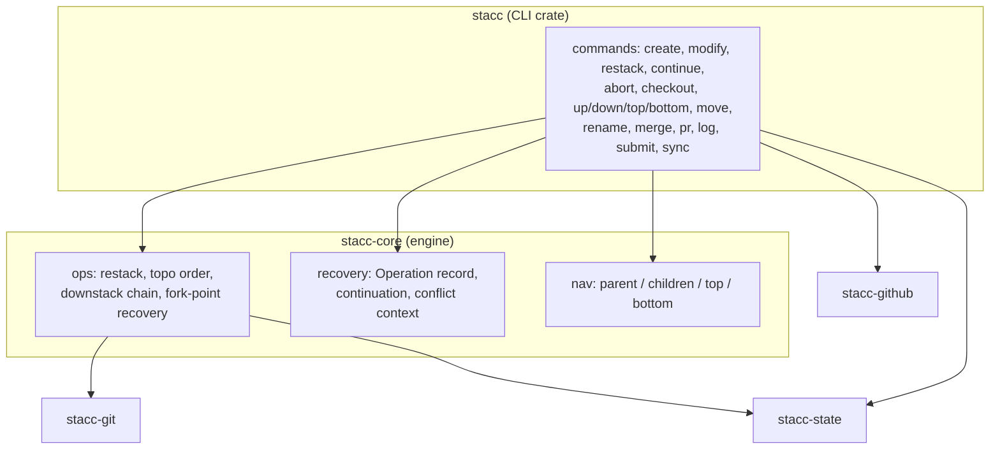
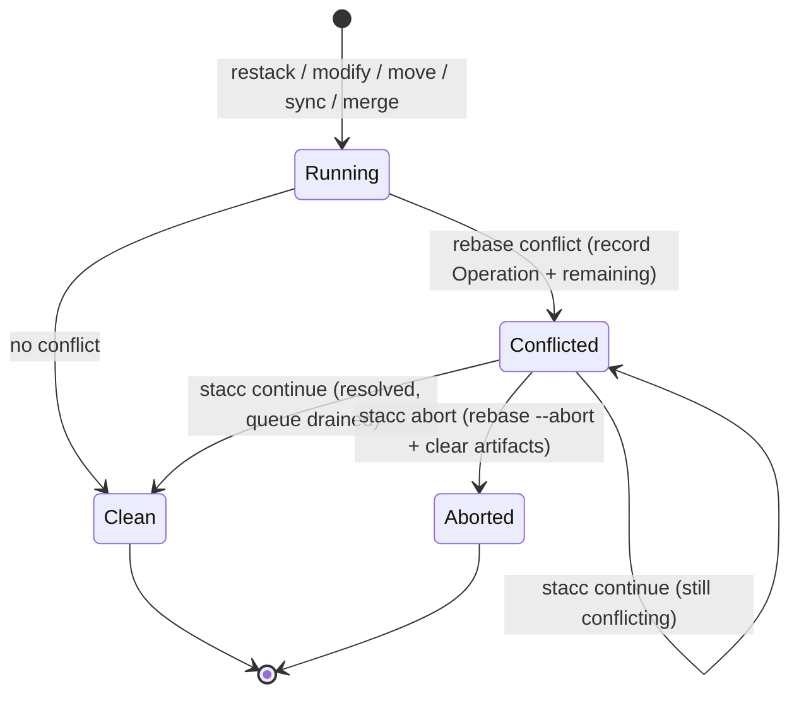
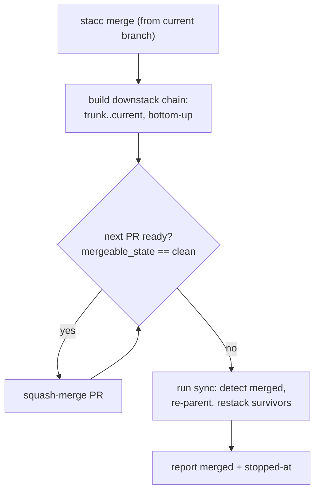

# feat: Close the graphite command gaps (dual-audience command surface)

## Summary

Grow stacc from its 7 shipped commands to the full stacked-diff surface from the
origin brainstorm: a core edit loop (`create`, `modify`, standalone `restack`),
unified conflict recovery (`continue`, `abort`), navigation (`checkout`, `up`,
`down`, `top`, `bottom`), manipulation (`move`, `rename`), a visual `log`
(+ `log --short`), a `pr` command, and a loop-closing `merge`. The foundation is
lifting the existing restack engine out of the CLI crate into `stacc-core` and
generalizing conflict recovery to work across any operation, then building the
sixteen commands on top.

---

## Problem Frame

stacc proves the stacked-diff model end-to-end but is not yet livable. The
restack engine, fork-point recovery, and conflict-context capture already exist
(see origin: `docs/brainstorms/2026-06-03-close-graphite-gaps-requirements.md`)
but are buried inside `crates/stacc/src/commands.rs` and reachable only through
the heavyweight `sync`. There is no one-step way to start a stacked branch, no
amend-and-restack, no navigation, no rename that keeps the stack intact, and no
CLI merge. Two audiences feel this: an agent falls back to raw `git` and loses
the stack-aware guarantees; a human gets none of graphite's daily-driver
ergonomics. This plan closes both, holding the agent-first invariant (every
command scriptable, JSON-complete, never blocking on a prompt) while adding a
TTY-only convenience layer for humans.

---

## High-Level Technical Design

Three shapes drive the design: where the shared engine lives and who depends on
it, the unified conflict-recovery lifecycle, and the merge flow.

**Crate layering, commands depend on one engine.** Today orchestration lives in
the CLI crate. After U1/U2 the engine lives in `stacc-core` and every
conflict-or-graph-touching command consumes it.



**Unified conflict-recovery lifecycle.** Any operation that rebases can stop on a
conflict. The operation records its identity plus remaining work; `continue`
resumes it idempotently, `abort` rolls it back.



**Merge flow.** `merge` walks the current branch's downstack bottom-up, merging
each ready PR until one is not ready, then reconciles via `sync`.



---

## Key Technical Decisions

- **Lift the stack-operations engine into `stacc-core`.** `restack`, `topo_order`,
  `downstack_chain`, `resolve_base`, and the fork-point recovery currently in
  `crates/stacc/src/commands.rs` move into `stacc-core`. `submit` and `sync`
  become thin callers. This is the origin's stated dependency and is what lets
  `restack`/`modify`/`move`/`merge` share one implementation (and a future MCP
  entry point reuse it without the CLI crate).

- **Unified recovery via a typed `Operation` continuation record.** Today
  `sync` writes `.git/stacc-continue.json` holding only a branch list. Generalize
  it to a typed record carrying the operation identity, its remaining work, and a
  **rollback anchor** for operations that rewrite history before rebasing
  (`modify`'s pre-amend tip hash, `move`'s pre-re-parent base). `continue` resumes
  the op idempotently; `abort` both `rebase --abort`s *and* restores the anchor,
  so pre-operation state is genuinely recovered (a bare `rebase --abort` would
  leave a `modify` amend or a `move` re-parent in place). Keep the artifact in
  `.git/` (local, single-writer). `recovery` returns a `stacc-core` error type
  that the CLI maps onto `Error::Conflict`; the conflict-context base-PR
  enrichment (the only `stacc-github` call) stays in the CLI crate so `stacc-core`
  depends on only `stacc-git` + `stacc-state`.

- **Flat top-level command surface; new builtins stop proxying to git.** Each new
  command is a `clap` subcommand in `crates/stacc/src/cli.rs` with a dispatch arm
  in `crates/stacc/src/lib.rs` and an entry in `BUILTINS`, mirroring the user's
  named commands and git-spice (no grouped `stacc branch create`). Names that today
  fall through to git via `external_subcommand` (`checkout`, `merge`, `continue`,
  `abort`, `move`, `rename`) become stacc-owned once in `BUILTINS` and no longer
  reach git. This is a deliberate change to the agent-facing contract: raw
  `git checkout <sha>` and friends must be invoked as `git` directly, not through
  stacc. See System-Wide Impact.

- **Interactive pickers gated behind TTY + not `--no-interactive`.** Add one
  interactive-select crate (e.g. `dialoguer` or `inquire`; final choice at
  implementation time) used only by bare `checkout`. Gate every prompt on
  `std::io::IsTerminal` AND `!no_interactive` AND `format != json`; otherwise
  exit with a structured error. No other command prompts.

- **`modify` amends the branch's tip commit by default, appends with `--commit`.**
  Mirrors graphite `modify`. It refuses to amend when the current branch has no
  commit of its own above its base (amending then would rewrite the parent's
  commit), pointing the user at `--commit`. After amend/append, automatically
  restack the branch's upstack via the engine.

- **`create` commits staged changes when present, else creates an empty tracked
  branch.** Non-interactive; sets base to the current branch and tracks it.

- **`rename` uses GitHub's branch-rename API.** `POST /repos/{owner}/{repo}/branches/{branch}/rename`
  renames the remote ref and auto-retargets the `base` of child PRs. GitHub
  closes any PR whose head is renamed (PR head is immutable), so the renamed
  branch's own PR is dropped from state and recreated on next `submit`. Because
  that closes a possibly-reviewed PR, `rename` requires `--force` when the branch
  has its own open PR; without it, exit with a structured error. Branches with no
  remote/PR rename purely locally.

- **`merge` readiness keys on `mergeable_state == "clean"`, re-checked every
  iteration.** One GitHub-computed field that folds in required reviews and checks
  when branch protection is configured. Squash-merge only. Because each squash
  changes trunk and leaves the next PR based on the just-merged head, `merge`
  re-points the next PR's base to trunk and re-fetches readiness after each merge,
  with a bounded poll treating a transient `null`/`unknown` `mergeable_state` as
  "not yet" rather than "not ready." After the loop, run `sync` to reconcile.
  Because "clean" only implies review/checks when branch protection exists (and CI
  is deferred), `merge` surfaces each PR's `mergeable_state` in JSON and warns
  loudly when trunk has no branch protection. See Risks.

- **`continue`/`abort` are the recovery surface; `sync --continue` routes to the
  shared path.** Generalize the hardcoded conflict-error message
  (`crates/stacc/src/error.rs`, currently "re-run `stacc sync`") to name
  `stacc continue`.

---

## Requirements

Requirements and acceptance examples are carried from the origin document with
their original IDs for traceability (see origin:
`docs/brainstorms/2026-06-03-close-graphite-gaps-requirements.md`).

### Core edit loop

- R1. `create` creates a stacked branch on top of current, commits staged
  changes (or creates an empty branch when none are staged), sets base to
  current, and tracks it.
- R2. `modify` amends the current branch's commit (or appends one with
  `--commit`), then restacks everything upstack.
- R3. `restack` is a standalone command reusing the engine; default scope is the
  current branch + its upstack, with an option to restack the whole stack.

### Conflict recovery

- R4. `continue` resumes whichever stacc operation is in flight after the user
  resolves a conflict.
- R5. `abort` cancels the in-flight operation, restores pre-operation state, and
  clears continuation + conflict-context artifacts.
- R6. Any conflicting operation records its identity and remaining work so
  `continue`/`abort` act on the correct operation; the conflict-context contract
  is shared across operations.

### Navigation

- R7. `checkout` switches to a tracked branch; explicit argument is deterministic,
  bare invocation offers a TTY picker and fails structured under
  `--no-interactive` / no TTY.
- R8. `up`, `down`, `top`, `bottom` move through the current stack
  deterministically; `up`/`down` accept a step count.

### Stack manipulation

- R9. `move` re-parents the current branch (and its upstack) onto a different
  base, updates the recorded base, and restacks.
- R10. `rename` renames a tracked branch and keeps the stack consistent (state
  key, children's base, remote ref + child-PR retarget), with the `--force` rule
  for own-open-PR; detects and repairs a branch renamed outside stacc.

### Lifecycle and forge

- R11. `merge` merges the current branch's downstack bottom-up while each PR is
  ready, stops at the first not-ready PR, then runs `sync`.
- R12. `pr` outputs the current branch's PR URL (opens in a browser on a TTY;
  structured under `--format json`).

### Display

- R13. `log` renders a graphite-style visual stack graph with the current branch
  marked, PR state, and a needs-restack indicator.
- R14. `log --short` renders a compact one-line-per-branch list.
- R15. `--format json` output is unchanged by the visual upgrade across all
  commands.

### Cross-cutting

- R16. Every new command supports `--format json|pretty`, `--color`,
  `--no-interactive`, and emits a structured error (never a silent prompt) when a
  required input is missing under `--no-interactive` or off a TTY.
- R17. Built-in short aliases ship for high-traffic commands (e.g. `co`, `u`,
  `d`) alongside the existing user-defined alias system.

Origin acceptance examples AE1–AE5 are enforced through unit test scenarios
(tagged `Covers AEn`) in the units below.

---

## Output Structure

`stacc-core` goes from an empty stub to the engine home:

```
crates/stacc-core/src/
├── lib.rs        # re-exports + RecoveryError
├── ops.rs        # restack, topo_order, downstack_chain, resolve_base, fork-point,
│                 # upstack_order, parent/children/top/bottom (graph helpers)
└── recovery.rs   # Operation enum (+ rollback anchor), continuation read/write/clear
```

Navigation helpers live in `ops.rs` (one consumer set, no separate module). The
conflict-context base-PR enrichment stays in the CLI crate (it is the only
`stacc-github` caller), so `stacc-core` depends on only `stacc-git` +
`stacc-state`. The per-unit `Files` lists remain authoritative; the implementer
may adjust this layout.

---

## Implementation Units

Units are grouped into four phases. Each phase is independently shippable and
maps cleanly to a Linear ticket / PR in the existing `jillian/sta-<n>-<slug>`
workflow. Library-layer logic carries the tests (inline `#[cfg(test)]` modules
with tempfile git repos and httpmock, matching the existing crate convention);
CLI command functions stay thin orchestration.

### Phase A, Foundation

### U1. Lift the stack-operations engine into `stacc-core`

- **Goal:** Move the restack engine and its helpers from the CLI crate into
  `stacc-core` with no behavior change; make `submit`/`sync` thin callers.
- **Requirements:** R3 (enables), and the origin dependency on `stacc-core`.
- **Dependencies:** none.
- **Files:** `crates/stacc-core/src/lib.rs`, `crates/stacc-core/src/ops.rs`
  (new), `crates/stacc/src/commands.rs` (slim down), `crates/stacc-core/Cargo.toml`
  (depend on `stacc-git`, `stacc-state`), `crates/stacc/Cargo.toml` (depend on
  `stacc-core`).
- **Approach:** Relocate `restack`, `topo_order`, `downstack_chain`,
  `resolve_base`, and the recorded-base-vs-fork-point logic into `ops.rs` as
  functions taking `&Git`, `&StateStore`, `&mut State`. Add a small new
  `upstack_order(current)` helper (current branch + its upstack, bottom-up),  `topo_order` orders the *whole* stack and is the wrong scope for `modify`/`move`,
  so this lands in U1 to unblock U7 in Phase B. Conflict-context and continuation
  move in U2. Preserve current behavior **including known quirks** (the ancestor
  short-circuit that skips a branch already atop its base; the fork-point
  fallback); corrections are deferred to consuming units (e.g. U7's empty-branch
  guard). `restack` writes its continuation inline on conflict today; U1 leaves a
  temporary shim writing the existing branch-list format so behavior is unchanged
  until U2 swaps in the typed `Operation`. Preserve the `Error::Conflict { branch }`
  exit contract.
- **Execution note:** Add characterization tests for the engine against tempfile
  repos before/while moving it, there is no command-level coverage today. Pin
  current behavior (quirks included); do not "fix" the ancestor short-circuit here.
- **Patterns to follow:** existing `restack`/`topo_order`/`downstack_chain` in
  `crates/stacc/src/commands.rs`; tempfile test setup in
  `crates/stacc-git/src/lib.rs` and `crates/stacc-state/src/store.rs`.
- **Test scenarios:**
  - Restack a 3-branch chain where each base advanced; each branch ends as a
    descendant of its base, recorded base hashes updated.
  - `topo_order` returns bases before dependents for a branched stack.
  - `downstack_chain` returns bottom-up order from current to trunk and errors on
    a cycle.
  - Fork-point recovery: a branch whose recorded base hash is no longer an
    ancestor restacks via `merge-base --fork-point`.
  - Idempotency: re-running restack on an already-stacked branch is a no-op.
  - `upstack_order(current)` returns current + its upstack bottom-up, excluding
    the downstack and unrelated sibling stacks.
  - Conflict path still writes the existing `.git/stacc-continue.json` branch-list
    format (shim), characterization assertion that U1 changed nothing here.
- **Verification:** `cargo test --workspace` green; `submit`/`sync` behavior
  unchanged; engine functions live in `stacc-core` and the CLI crate depends on
  it.

### U2. Unified conflict-recovery substrate

- **Goal:** Replace the branch-list continuation with a typed `Operation` record
  carrying op identity + remaining work, and centralize conflict-context.
- **Requirements:** R6.
- **Dependencies:** U1.
- **Files:** `crates/stacc-core/src/recovery.rs` (new),
  `crates/stacc-core/src/lib.rs`, `crates/stacc/src/commands.rs` (use shared
  recovery), `crates/stacc/src/error.rs`.
- **Approach:** Define an `Operation` enum (`Sync`, `Restack`, `Modify`, `Move`)
  carrying the remaining branch queue plus a rollback anchor where history is
  rewritten before rebasing (`Modify` → pre-amend tip hash; `Move` →
  pre-re-parent base). No `Merge` variant: `merge` does no rebase of its own, so a
  conflict during its post-merge reconcile surfaces as the `Sync` operation.
  `recovery` returns its own `RecoveryError`; the CLI maps it onto
  `Error::Conflict`. Provide `write_continuation(op)`, `read_continuation()`,
  `clear_artifacts()`. The conflict-context *writer* (which fetches the base PR
  from GitHub) stays in the CLI crate so `stacc-core` does not depend on
  `stacc-github`; `recovery` owns only the continuation record. Migrate `sync`'s
  read/write to the new shape (back-compat not required: in-flight syncs are rare
  and local).
- **Patterns to follow:** existing `write_continuation`/`read_continuation`/
  `write_conflict_context`/`clear_conflict_artifacts` in
  `crates/stacc/src/commands.rs`.
- **Test scenarios:**
  - Round-trip each `Operation` variant through serialize/deserialize, including
    the `Modify`/`Move` rollback anchor.
  - `read_continuation` on a missing file returns the "nothing in progress" error.
  - `clear_artifacts` removes both files and is a no-op when absent.
  - A corrupt continuation file yields a structured error, not a panic.
- **Verification:** `cargo test --workspace` green; `sync` conflict→continue
  still works end-to-end via the new substrate.

### Phase B, Core edit loop + recovery

### U3. Branch-lifecycle git helpers

- **Goal:** Add the `git` porcelain helpers `create`/`modify`/`rename`/`checkout`
  need.
- **Requirements:** R1, R2, R7, R10 (enables).
- **Dependencies:** none (parallel with U1/U2).
- **Files:** `crates/stacc-git/src/lib.rs`.
- **Approach:** Add `checkout(branch)` (`git checkout <branch>`),
  `checkout_new_branch(name)` (`git checkout -b`), `rename_branch(old, new)`
  (`git branch -m`), `commit(message)` (`git commit -m`),
  `commit_amend(message: Option<&str>)` (`git commit --amend [-m | --no-edit]`),
  and `has_staged_changes()` (`git diff --cached --quiet`, exit-code mapped like
  `is_ancestor`). Reuse the existing `command`/`run` helpers, they already set
  `GIT_EDITOR=true` / `GIT_TERMINAL_PROMPT=0`.
- **Patterns to follow:** exit-code mapping in `is_ancestor`/`fork_point`;
  command construction in `crates/stacc-git/src/lib.rs`.
- **Test scenarios:**
  - `checkout_new_branch` creates and switches; `current_branch` reflects it.
  - `commit` records staged changes; `has_staged_changes` is true before, false
    after.
  - `commit_amend(None)` keeps the message and changes the tip hash;
    `commit_amend(Some(msg))` replaces the subject.
  - `rename_branch` renames the current branch; old name no longer resolves.
  - `has_staged_changes` is false on a clean tree, true after `git add`.
- **Verification:** `cargo test -p stacc-git` green.

### U4. `stacc restack` command

- **Goal:** Expose the engine as a standalone command.
- **Requirements:** R3.
- **Dependencies:** U1.
- **Files:** `crates/stacc/src/cli.rs` (add `Restack` + `RestackArgs`),
  `crates/stacc/src/commands.rs` (`restack` command fn), `crates/stacc/src/lib.rs`
  (dispatch arm + `BUILTINS`).
- **Approach:** Default scope = current branch + upstack; `--stack` restacks the
  whole stack. Build the order from the engine's graph helpers, call the engine,
  and on conflict write an `Operation::Restack` continuation (U2) and return
  `Error::Conflict`.
- **Patterns to follow:** `sync`'s call into `restack` + report shape in
  `crates/stacc/src/commands.rs`.
- **Test scenarios:**
  - Engine-level: restack current+upstack only leaves downstack untouched.
  - Engine-level: `--stack` scope restacks every tracked branch bottom-up.
  - Conflict path writes an `Operation::Restack` continuation and surfaces
    `Error::Conflict`.
  - JSON output lists restacked branches.
- **Verification:** `cargo test --workspace` green; `stacc restack` repairs a
  drifted stack; `stacc restack --format json` emits structured output.

### U5. `stacc continue` + `stacc abort`

- **Goal:** Top-level recovery commands over any operation.
- **Requirements:** R4, R5; Covers AE5.
- **Dependencies:** U2, U4.
- **Files:** `crates/stacc/src/cli.rs` (add `Continue`, `Abort`),
  `crates/stacc/src/commands.rs`, `crates/stacc/src/lib.rs` (dispatch +
  `BUILTINS`), `crates/stacc/src/error.rs` (generalize conflict message).
- **Approach:** `continue` reads the `Operation` (U2), finishes the in-progress
  rebase (`rebase_continue`), records the resumed branch's base hash, then drains
  the remaining queue through the engine. `abort` runs `rebase_abort`, then
  restores the operation's rollback anchor when present, resetting a `Modify`
  branch to its pre-amend tip / a `Move` branch to its pre-re-parent base, and
  clears artifacts, so pre-operation state is truly restored (a bare
  `rebase --abort` would leave the amend / re-parent in place). Route
  `sync --continue` to the shared `continue` path. Generalize the
  `Error::Conflict` message to name `stacc continue`.
- **Patterns to follow:** existing `sync_continue` in
  `crates/stacc/src/commands.rs`; `rebase_abort`/`rebase_in_progress` in
  `crates/stacc-git/src/lib.rs`.
- **Test scenarios:**
  - Engine-level: a recorded conflicted restack resumes via the continue path and
    finishes remaining branches.
  - `Covers AE5.` After an operation stops on conflict, abort restores the
    pre-operation working tree and removes both artifacts.
  - Abort of a conflicted `modify` restores the pre-amend tip commit (not just the
    rebase); abort of a conflicted `move` restores the pre-move recorded base.
  - `continue` with no operation in progress errors structured.
  - `abort` with no rebase/operation in progress errors structured.
  - Re-conflict on continue re-records the remaining queue and exits
    `Error::Conflict`.
- **Verification:** `cargo test --workspace` green; conflict→`continue` and
  conflict→`abort` both work for a `restack`; `sync --continue` still works.

### U6. `stacc create`

- **Goal:** One-step stacked-branch creation.
- **Requirements:** R1.
- **Dependencies:** U3.
- **Files:** `crates/stacc/src/cli.rs` (add `Create` + `CreateArgs`),
  `crates/stacc/src/commands.rs`, `crates/stacc/src/lib.rs`.
- **Approach:** Require an initialized repo; take a branch name. Base = the current
  branch (which is trunk when starting the first branch of a stack, the normal
  path, allowed). The only refusal is a detached HEAD (no current branch name to
  record as base). Create+switch the branch, commit staged changes if
  `has_staged_changes()` (else leave an empty branch), record `BranchState` with
  that base, save state. Optional `--message`.
- **Patterns to follow:** `track` (state insert) in
  `crates/stacc/src/commands.rs`.
- **Test scenarios:**
  - Engine/state-level: create with staged changes commits them and tracks the
    branch with base = parent.
  - Create with nothing staged produces an empty tracked branch.
  - Create when uninitialized errors structured ("run `stacc init`").
  - State records the new branch keyed by name with correct base.
- **Verification:** `cargo test --workspace` green; `stacc create feat-x` after
  staging yields a tracked branch with one commit and base set to the prior
  branch.

### U7. `stacc modify`

- **Goal:** Amend/append into the current branch, then restack upstack.
- **Requirements:** R2; Covers AE4.
- **Dependencies:** U1, U3.
- **Files:** `crates/stacc/src/cli.rs` (add `Modify` + `ModifyArgs`),
  `crates/stacc/src/commands.rs`, `crates/stacc/src/lib.rs`.
- **Approach:** Default amends the branch's tip commit (`commit_amend(None)`);
  `--commit [-m]` appends a new commit. Refuse on trunk. Refuse to amend when the
  branch has no commit of its own above its base (`rev_parse(branch) == base_tip`)
 , amending there would rewrite the parent's commit; point the user at `--commit`.
  Record the pre-amend tip as the rollback anchor, then restack the branch's
  upstack via the engine's `upstack_order` (U1); on conflict write an
  `Operation::Modify` continuation carrying that anchor (U2).
- **Patterns to follow:** engine call from U1/U4; `upstack_order(current)` from
  the engine (U1).
- **Test scenarios:**
  - Engine/state-level: amend changes the branch tip and restacks a single child
    onto the new tip.
  - `--commit` appends a commit (parent count increases) and restacks upstack.
  - `Covers AE4.` A modify whose upstack restack conflicts on the second branch
    records an `Operation::Modify` continuation and resumes via `continue` to
    finish the remaining upstack.
  - `modify` on trunk errors structured.
  - `modify` on a branch with no commit of its own above its base errors
    structured and suggests `--commit` (does not rewrite the parent's commit).
- **Verification:** `cargo test --workspace` green; amend + auto-restack leaves
  every upstack branch a descendant of its base.

### Phase C, Navigation + display

### U8. Stack-navigation helpers + `up`/`down`/`top`/`bottom`

- **Goal:** Graph navigation over the tracked state.
- **Requirements:** R8.
- **Dependencies:** U1.
- **Files:** `crates/stacc-core/src/ops.rs` (extend with
  `parent`/`children`/`top`/`bottom`), `crates/stacc/src/cli.rs` (add `Up`, `Down`,
  `Top`, `Bottom` with step counts where relevant),
  `crates/stacc/src/commands.rs`, `crates/stacc/src/lib.rs`.
- **Approach:** `ops.rs` gains parent (recorded base), children (branches whose
  base == name), the stack's top (tip reachable upward) and bottom (first
  non-trunk ancestor). `up`/`down` take an optional step count.
  Multiple children on `up`: on a TTY prompt to choose (reuse U9's gated picker);
  under non-interactive, error structured listing the choices. Commands switch
  HEAD via `git checkout`.
- **Patterns to follow:** children computation in `status`
  (`crates/stacc/src/commands.rs`); ordering in `topo_order`.
- **Test scenarios:**
  - `parent`/`children`/`top`/`bottom` on a linear 3-branch stack.
  - `children` returns multiple entries for a branched stack.
  - `up`/`down` with a step count traverse N levels and clamp at the ends.
  - `down` from the bottom branch lands on trunk; `up` from the tip is a no-op or
    structured "already at top".
  - Non-interactive `up` with multiple children errors structured listing the
    children.
- **Verification:** `cargo test --workspace` green; navigation moves HEAD as
  expected on linear and branched stacks.

### U9. Interactivity layer + `stacc checkout`

- **Goal:** TTY-gated interactive selection plus the `checkout` command.
- **Requirements:** R7, R16; Covers AE2.
- **Dependencies:** U8.
- **Files:** `crates/stacc/Cargo.toml` (add the interactive-select crate),
  `crates/stacc/src/cli.rs` (add `Checkout` + `CheckoutArgs`),
  `crates/stacc/src/commands.rs`, a small `interactive`/TTY helper module in the
  CLI crate, `crates/stacc/src/lib.rs`.
- **Approach:** Add a `prompt_select(items)` helper guarded by
  `std::io::IsTerminal` AND `!global.no_interactive` AND `format != json`.
  Explicit `stacc checkout <branch>` switches directly. Bare `stacc checkout`
  shows the picker on a TTY, else errors structured. Keep the picker isolated so
  it cannot be reached from any non-interactive path.
- **Patterns to follow:** `GlobalArgs.no_interactive` in
  `crates/stacc/src/cli.rs`; structured `Error::Usage` in
  `crates/stacc/src/error.rs`.
- **Test scenarios:**
  - `checkout <branch>` switches to the branch (state/git-level).
  - `Covers AE2.` Bare `checkout` under `--no-interactive` exits with a structured
    error and no prompt.
  - `Covers AE2.` Bare `checkout` with `--format json` and no TTY exits
    structured.
  - The TTY gate predicate (`is_terminal && !no_interactive && !json`) unit-tested
    in isolation across the truth table.
- **Verification:** `cargo test --workspace` green; bare `checkout` shows a menu
  in a real terminal and errors cleanly when piped.

### U10. Visual `log` + `log --short`

- **Goal:** Graphite-style stack graph and a compact list; JSON unchanged.
- **Requirements:** R13, R14, R15.
- **Dependencies:** U1 (for needs-restack detection), U8 (ordering).
- **Files:** `crates/stacc/src/cli.rs` (add `--short` to `Log`),
  `crates/stacc/src/commands.rs`.
- **Approach:** Pretty mode renders a vertical graph: glyph per branch, current
  branch marked, PR number/state, and a needs-restack marker computed via
  `is_ancestor(base_tip, branch)`. `--short` renders one line per branch. The
  `--format json` path is unchanged (assert this).
- **Patterns to follow:** existing `log`/`print_stack`/`stack_json` in
  `crates/stacc/src/commands.rs`.
- **Test scenarios:**
  - Pretty graph marks the current branch and shows PR state for branches with a
    recorded PR.
  - A branch whose base advanced shows the needs-restack indicator; an up-to-date
    branch does not.
  - `--short` emits one line per branch.
  - JSON output is byte-identical to the pre-change JSON for the same state
    (enforces R15).
- **Verification:** `cargo test --workspace` green; `stacc log` renders the graph;
  `stacc log --format json` unchanged.

### Phase D, Manipulation + lifecycle

### U11. `stacc move`

- **Goal:** Re-parent the current branch (and its upstack) onto a new base.
- **Requirements:** R9.
- **Dependencies:** U1, U8.
- **Files:** `crates/stacc/src/cli.rs` (add `Move` + `MoveArgs`),
  `crates/stacc/src/commands.rs`, `crates/stacc/src/lib.rs`.
- **Approach:** Take `--onto <branch>`. Reject a move that would create a cycle
  (target is in the moved branch's own upstack) with a structured error. Record
  the pre-move recorded base as the rollback anchor, update the recorded base,
  then restack the branch + upstack onto the new base; on conflict write an
  `Operation::Move` continuation carrying that anchor (U2).
- **Patterns to follow:** cycle detection in `downstack_chain`; engine restack
  from U1.
- **Test scenarios:**
  - State/engine-level: move re-parents the branch and restacks onto the new base.
  - Moving a branch with its own upstack moves the subtree (children's recorded
    bases preserved relative to the moved branch).
  - Moving onto a branch in the moved branch's upstack errors structured (cycle).
  - Conflict during move records `Operation::Move` and resumes via `continue`.
- **Verification:** `cargo test --workspace` green; move + restack leaves the
  branch a descendant of the new base.

### U12. `stacc rename`

- **Goal:** Rename a tracked branch, keeping local state, children, and the remote
  consistent.
- **Requirements:** R10.
- **Dependencies:** U3.
- **Files:** `crates/stacc/src/cli.rs` (add `Rename` + `RenameArgs` with
  `--force`), `crates/stacc/src/commands.rs`, `crates/stacc-github/src/lib.rs`
  (add `rename_branch` API call), `crates/stacc/src/lib.rs`.
- **Approach:** Reject renaming trunk and renaming to an existing branch name.
  Local: `git branch -m`, move the state key, re-point children's recorded
  `base.name`. Remote: if the branch exists on the remote, call GitHub's
  branch-rename API (child PRs auto-retarget). If the branch has its own open PR,
  require `--force` (GitHub will close that PR); without `--force`, exit with a
  structured error naming the PR number + URL that would close. On `--force`,
  surface the closing PR in JSON, drop its recorded PR number so the next `submit`
  recreates it, and warn. Externally-renamed branches are detected only as far as
  is reliable: a state key with no matching local branch is flagged as orphaned
  (in `log`/`status` and by `rename`) for the user to re-`track`, stacc does not
  guess the new name (no reflog access today; a `git` reflog helper is a deferred
  follow-up). On a protected-branch / permission failure from the API, fall back to
  local + state rename and warn.
- **Patterns to follow:** `update_pull_request` request plumbing in
  `crates/stacc-github/src/lib.rs`; `parse_remote` for owner/repo.
- **Test scenarios:**
  - `Covers AE3.` State-level: rename moves the key and re-points every child's
    recorded base name.
  - Rename to an existing name errors structured; renaming trunk errors structured.
  - Rename of a branch with an open PR without `--force` errors structured, naming
    the PR number/URL that would close.
  - With `--force`, the closing PR is surfaced (JSON) and its recorded PR number
    dropped so the next submit recreates it.
  - httpmock: the branch-rename API is called with the new name when a remote
    branch exists.
  - A state key with no matching local branch is flagged as orphaned (detected,
    not silently repaired to a guessed name).
- **Verification:** `cargo test --workspace` green; rename keeps `log` consistent;
  `--force` path drops the PR record.

### U13. GitHub merge support

- **Goal:** Add the squash-merge call and the readiness signal to the client.
- **Requirements:** R11 (enables).
- **Dependencies:** none (parallel; client-only).
- **Files:** `crates/stacc-github/src/lib.rs`, `crates/stacc-github/src/error.rs`
  (add `NotMergeable`).
- **Approach:** Add `mergeable_state: Option<String>` to `RawPullRequest` with
  `#[serde(default)]` (existing fixtures omit it; without the default they fail to
  deserialize), and surface it on `PullRequest` via `ready()` = `mergeable_state
  == Some("clean")` (absent/`null` ⇒ not ready). Add `merge_pull_request(owner,
  repo, number)` → `PUT /repos/{o}/{r}/pulls/{number}/merge` with
  `{"merge_method":"squash"}`, deserializing into a dedicated `{ merged: bool }`
  response struct (not `RawPullRequest`, which requires `number`/`html_url`). Add a
  `GitHubError::NotMergeable` variant and map 405/409 (not mergeable / head moved)
  onto it.
- **Patterns to follow:** `get_pull_request`/`send`/`get` and the httpmock tests
  in `crates/stacc-github/src/lib.rs`; `serde(default)` on `merged` in
  `RawPullRequest`.
- **Test scenarios:**
  - `mergeable_state == "clean"` ⇒ `ready()` true; `"blocked"`/`"behind"`/`null`
    ⇒ false; field absent ⇒ false and existing fixtures still deserialize.
  - httpmock: `merge_pull_request` issues a PUT with `merge_method: squash` and
    parses a `{merged:true}` response.
  - httpmock: a 405 response maps to `GitHubError::NotMergeable`.
- **Verification:** `cargo test -p stacc-github` green.

### U14. `stacc merge`

- **Goal:** Merge the ready downstack to current, then sync.
- **Requirements:** R11; Covers AE1.
- **Dependencies:** U1, U13.
- **Files:** `crates/stacc/src/cli.rs` (add `Merge`),
  `crates/stacc/src/commands.rs`, `crates/stacc/src/lib.rs`.
- **Approach:** Build the downstack chain once (trunk→current, bottom-up; reuse
  `downstack_chain`) and never re-derive it mid-loop (merged branches leave state,
  which would make `downstack_chain` error). Walk it: for each branch with a
  recorded PR, fetch readiness fresh (bounded re-poll while `mergeable_state` is
  `null`/`unknown`, treating that as "not yet"); merge (squash) while ready; after
  each merge re-point the next PR's base to trunk so GitHub recomputes its
  readiness; stop at the first stably-not-ready PR. Before acting, check trunk's
  branch protection; if absent, emit a loud structured warning ("clean" then means
  only "no conflicts", and CI is deferred) and surface each PR's `mergeable_state`
  in JSON. Then run `sync` to reconcile. No-op with a clear message when nothing is
  ready.
- **Patterns to follow:** `downstack_chain` and the `sync` merge-detection path
  in `crates/stacc/src/commands.rs`.
- **Test scenarios:**
  - `Covers AE1.` httpmock stack of three: bottom + middle ready, top not ready ⇒
    bottom and middle squash-merge, top stays open, `sync` runs after.
  - `Covers AE1.` Middle PR reports `mergeable_state: null` on first poll then
    `clean` ⇒ `merge` waits and merges it (does not stop short).
  - Nothing ready ⇒ no merges, structured "nothing to merge" report.
  - Bottom not ready ⇒ stops immediately, merges nothing.
  - Trunk has no branch protection ⇒ a structured warning is emitted and
    `mergeable_state` appears in JSON output.
  - JSON output lists merged branch numbers and the stop point.
- **Verification:** `cargo test --workspace` green; `merge` clears a ready stack
  bottom-up and reconciles via `sync`.

### U15. `stacc pr` + built-in aliases

- **Goal:** PR URL command and built-in short aliases.
- **Requirements:** R12, R17.
- **Dependencies:** none.
- **Files:** `crates/stacc/src/cli.rs` (add `Pr`), `crates/stacc/src/commands.rs`,
  `crates/stacc/src/lib.rs` (a `const` default-alias slice seeded before file
  aliases).
- **Approach:** `pr` resolves the current branch's recorded PR; pretty mode prints
  the URL (open in a browser on a TTY); JSON emits `{number, url}`; structured
  error when no PR is recorded. Built-in aliases: a private `const &[(&str, &str)]`
  in `crates/stacc/src/lib.rs` (`co`→`checkout`, `u`→`up`, `d`→`down`, etc.) seeded
  into the alias table at lowest precedence so user/repo config overrides, no
  `stacc-config` change. Built-ins are aliases (not in `BUILTINS`) so they expand
  to real commands.
- **Patterns to follow:** `status`'s PR lookup in `crates/stacc/src/commands.rs`;
  `aliases_from_file` + `expand_aliases` precedence in
  `crates/stacc-config/src/lib.rs` and `crates/stacc/src/lib.rs`.
- **Test scenarios:**
  - `pr` with a recorded PR emits `{number, url}` in JSON.
  - `pr` with no recorded PR errors structured.
  - Alias expansion: `co` expands to `checkout`, `u` to `up`; a user-defined
    alias of the same name overrides the built-in.
  - A built-in alias does not shadow a real command name in `BUILTINS`.
- **Verification:** `cargo test --workspace` green; `stacc co`/`stacc u` work;
  `stacc pr --format json` emits the URL.

---

## Scope Boundaries

### Deferred for later

- Other graphite commands not in this batch: `delete`, `untrack`, `fold`,
  `squash`, `split`, `edit`, `info`. Eventual parity, not now.
- Richer `submit` scope variants (upstack-only, whole-stack) and flags like
  `--draft` beyond what already ships.

### Outside this batch's identity

- MCP server, TUI, parallel-agent / worktree locking, and additional forges
  (GitLab, Bitbucket) remain v2 per `plans/stacc.md`.

### Deferred to Follow-Up Work

- CI (STA-18), this batch lands without CI; rely on local `cargo test
  --workspace` + `cargo clippy --workspace --all-targets`.
- OAuth `DEFAULT_OAUTH_CLIENT_ID` registration (STA-17 follow-up), unrelated to
  this batch.
- Moving the continuation record from `.git/` into the state ref (would be needed
  for parallel-agent support; out of scope here).

---

## System-Wide Impact

- **New builtins shadow the git pass-through for their names.** stacc proxies
  unknown subcommands to `git` (`crates/stacc/src/lib.rs` `proxy_to_git` via clap's
  `external_subcommand`). Adding `checkout`, `merge`, `continue`, `abort`, `move`,
  and `rename` to `BUILTINS` means those names stop reaching git through stacc, so
  `stacc checkout <sha>` now hits stacc's branch-only checkout rather than passing
  through. Anyone relying on those as raw-git escape hatches must call `git`
  directly. Note this in the README / `AGENTS.md` command section when the commands
  land. `init`, `track`, `log`, `status`, `submit`, `sync`, `auth` are already
  builtins and unaffected.
- **The conflict-recovery artifact shape changes** with the typed `Operation`
  continuation (U2). It is local (`.git/`) and single-writer; no migration is
  needed, but a `sync --continue` left in flight across the upgrade is not
  resumable (rare, local, recoverable by re-running `sync`).

---

## Risks & Dependencies

- **Engine extraction (U1) could regress `submit`/`sync`**, which have no
  command-level tests today. Mitigation: U1 adds engine-level characterization
  tests against tempfile repos before/while moving the logic.
- **`mergeable_state` is computed asynchronously** and can be `null`/`unknown`
  right after a push or after merging the PR below it. `merge` (U14) bounded-polls
  on `null`/`unknown` and re-points each next PR's base to trunk before
  re-checking, so a legitimately-ready PR is not skipped. Intended to run after CI
  settles.
- **`abort` must undo more than the rebase.** `modify` and `move` rewrite history
  (amend / re-parent) before rebasing, so `abort` restores the recorded rollback
  anchor in addition to `rebase --abort` (U2/U5). A bare `rebase --abort` would
  leave the amend/re-parent in place.
- **`merge` readiness is only meaningful with branch protection.** Without it,
  `"clean"` means "no conflicts," not "approved + green." Documented as a known
  limitation.
- **Branch-rename API is async and permission-sensitive** (admin for protected /
  ruleset branches; we never rename trunk). U12 falls back to local + state rename
  on a permission failure and warns; the rename "might take extra time in the
  background."
- **New interactive-select dependency** (U9) adds supply-chain surface; isolate it
  to the picker path.
- **Dependencies:** GitHub REST branch-rename (`POST /repos/{o}/{r}/branches/{b}/rename`)
  and merge (`PUT /repos/{o}/{r}/pulls/{n}/merge`) endpoints; an interactive-select
  crate; `std::io::IsTerminal` (Rust 1.70+).

---

## Sources & Research

- Origin requirements: `docs/brainstorms/2026-06-03-close-graphite-gaps-requirements.md`.
- Core algorithms + git-spice references: `plans/algorithms.md` (restack,
  conflict resume, state ref).
- Existing engine + command patterns: `crates/stacc/src/commands.rs` (`restack`,
  `topo_order`, `downstack_chain`, `sync_continue`, conflict artifacts).
- Git wrapper surface: `crates/stacc-git/src/lib.rs` (`rebase_onto`,
  `rebase_continue`, `rebase_abort`, `rebase_in_progress`, `fork_point`).
- State model: `crates/stacc-state/src/model.rs`, `crates/stacc-state/src/store.rs`.
- GitHub client: `crates/stacc-github/src/lib.rs` (`create`/`update`/`get`
  pull request; `parse_remote`).
- CLI dispatch + alias expansion: `crates/stacc/src/lib.rs` (`BUILTINS`,
  `expand_aliases`, `proxy_to_git`).
- GitHub branch-rename behavior (verified): renaming retargets the **base** of
  open PRs and redirects URLs, but **closes** any PR whose **head** is renamed,  `https://docs.github.com/en/repositories/configuring-branches-and-merges-in-your-repository/managing-branches-in-your-repository/renaming-a-branch`.
- GitHub branch-rename REST endpoint: `https://docs.github.com/en/rest/branches/branches`.
