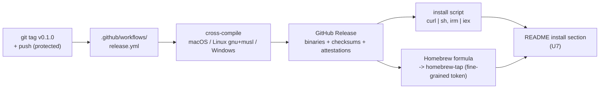
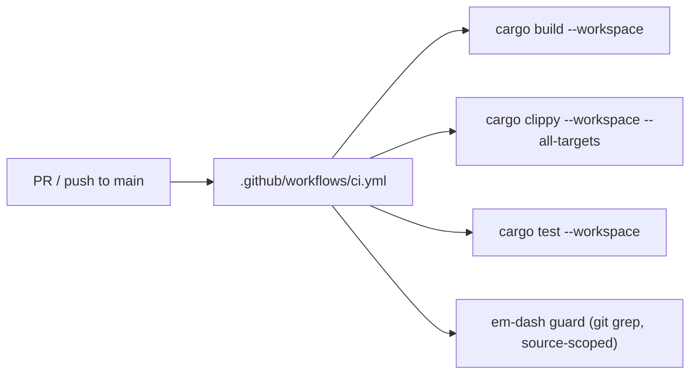

# feat: README refresh + distribution (cargo-dist) + CI

## Summary

Make stacc installable and document it well. Two threads: stand up real
distribution and CI (prebuilt release binaries + a curl install script + Homebrew
via cargo-dist, plus a PR build/clippy/test workflow), and rewrite the README into
a dual-audience front door, written for both humans and AI agents, in Astral's
docs tone, with a Graphite-quick-start-style workflow walkthrough and a
copy-pasteable agent-driving block.

The install section of the README waits on a real first release (origin R14);
the rest of the README depends only on the current command surface and can be
written in parallel with the distribution work. CI (the still-open STA-18) is
folded in here since it shares the GitHub Actions surface.

---

## Problem frame

- **The README is stale and thin.** It still describes an early milestone, omits
  the whole command surface, and barely surfaces the agent-first JSON design that
  is the point of the tool (see origin: problem frame).
- **There is no install story.** `cargo build` from source is the only path; an
  agent cannot grab a working binary without a Rust toolchain and a compile.
- **There is no CI.** No `.github/` exists. Every build/clippy/test/em-dash gate
  has been enforced by hand (STA-18).
- **stacc serves two audiences the README serves poorly:** humans adopt and set
  it up; agents operate it non-interactively via `--format json` and `--help`.

---

## Requirements

Traceability to the origin requirements doc (R1-R14) plus STA-18 (CI).

| Req | Source | Advanced by |
| --- | --- | --- |
| Release binaries (R11) | origin | U1, U4, U5 |
| Install script (R12) | origin | U4, U7 |
| Homebrew (R13) | origin | U3, U4, U7 |
| Sequencing: install section after release (R14) | origin | U7 dependency |
| PR build/clippy/test CI | STA-18 | U2 |
| Hero / dual-audience framing (R1) | origin | U6 |
| Why stacc, no competitors (R2) | origin | U6 |
| Install section (R3) | origin | U7 |
| Workflow walkthrough (R4) | origin | U8 |
| Agent-driving block (R5) | origin | U9 |
| Trimmed auth (R6) | origin | U6 |
| How it works, brief (R7) | origin | U6 |
| Development section + crate table (R8) | origin | U6 |
| Version-free status (R9) | origin | U6 |
| Astral tone (R10) | origin | U6, U8, U9 |

---

## Key technical decisions

- **cargo-dist (`dist`) for distribution.** One `dist init` scaffolds the dist
  config and a tag-triggered `.github/workflows/release.yml` that cross-compiles
  prebuilt binaries, creates the GitHub Release, and generates the install script
  and Homebrew formula. Chosen for exactly the Astral pattern with the least
  bespoke release plumbing (origin: non-goals, "keep it simple").
- **cargo-dist is a scaffold-time dependency, not a run-time one.** Its outputs
  (`release.yml`, the install scripts, the Homebrew formula) are committed
  artifacts that keep running on every tag even if the tool stalls; only the
  ability to *regenerate* them is lost. The original maintainer (Axo) wound down
  as a company and the tool is now community-continued, so the real residual risk
  is GitHub runner-image / toolchain drift that a frozen workflow cannot absorb
  without a `dist` upgrade, not a sudden break of existing releases. Pin the
  `dist` version (below) so generated artifacts are reproducible.
- **One shared Homebrew tap, not one repo per formula.** A tap is a single GitHub
  repo named `homebrew-tap`; cargo-dist manages the formula files inside it, and
  many tools can publish to the same tap. Use `TinyDogTech/homebrew-tap`; the
  formula installs as `brew install TinyDogTech/tap/stacc`.
- **Installers: `shell`, `powershell`, `homebrew`. Skip crates.io.** No
  `publish-jobs` entry for cargo; `cargo install` would mean publishing all six
  workspace crates and still compiles on the user's machine (origin: non-goals).
- **Opt into GitHub Attestations.** Set `github-attestations = true` so the
  release workflow produces SLSA provenance for each binary via the Actions OIDC
  token (no key management). The hero install path is `curl | sh`, so build-time
  provenance (verifiable with `gh attestation verify`) is the strongest integrity
  signal, at near-zero marginal cost.
- **First release is `v0.1.0`.** cargo-dist releases trigger on a version tag, so
  a starting version is required. Set the workspace version to `0.1.0`. This
  release exists to (1) validate the pipeline end to end and (2) unblock the
  no-toolchain install path the agent-first design depends on. An ongoing release
  cadence (re-tagging on every change) is **out of scope** for this plan.
- **The `stacc` crate ships two binaries.** It builds both `stacc` (`src/main.rs`)
  and `st` (`src/bin/st.rs`, the short alias), both thin wrappers over the library
  `run()`. cargo-dist ships and installs both by default; the README should
  mention `st`. (cargo-dist targets the `stacc` crate unambiguously because it is
  the only crate with binary targets.)
- **CI is a separate workflow from release.** `ci.yml` (PR + push-to-main: build,
  clippy, test, em-dash guard) is distinct from the dist-generated `release.yml`
  (tag-triggered). They share the Actions surface but not the trigger.
- **The README install section waits for distribution; the rest does not.** Only
  the install section references generated artifact names, so it gates on the
  first release (R14). The hero prose, the workflow walkthrough, and the agent
  block describe the command surface and JSON contract that exist today, so they
  are writable in parallel with Phase A.
- **The walkthrough and the agent block share vocabulary, not form.** Both use the
  same command sequence and non-interactive invocation style, so the walkthrough's
  one `--format json` sample lets a human *see* the shape. They do not serve the
  same need in the same form: the agent's complete contract lives in the agent
  block, which is why both exist. The walkthrough should not accrete
  agent-completeness that clutters the human narrative.

---

## High-level technical design

The release pipeline cargo-dist generates, triggered by a version tag:

CI is a parallel, independently-triggered workflow:

---

## Implementation units

### Phase A: Distribution + CI

### U1. Release version, crate metadata, and keyring Linux build fix

- **Goal:** Make the workspace releasable and cross-compilable: a starting
  version, the metadata Homebrew needs, and a keyring backend that builds on the
  Linux release targets.
- **Requirements:** R11 (enables), first-release decision.
- **Dependencies:** none.
- **Files:** `Cargo.toml` (workspace), `crates/stacc/Cargo.toml`.
- **Approach:**
  - Add `version = "0.1.0"` to `[workspace.package]` and `version.workspace = true`
    to each member crate's `[package]`.
  - Add `homepage = "https://github.com/TinyDogTech/stacc"` to the `stacc` crate
    (`description` is already set; `repository` already inherits).
  - **Keyring fix:** the workspace's `keyring` features include
    `sync-secret-service`, which pulls `dbus-secret-service -> libdbus-sys`, a C
    library binding that probes for system `libdbus-1-dev` (pkg-config) and cannot
    statically link on musl, breaking cargo-dist's default Linux gnu and musl
    builds. Add the `vendored` feature to the `keyring` dependency so `libdbus-sys`
    statically compiles libdbus via `cc`. This keeps the current synchronous
    keyring API (no code changes), works on musl, and removes the system
    `libdbus-1-dev` requirement, at the cost of a C compiler as a build dependency
    (present on the cargo-dist runners).
  - Note for downstream units: the `stacc` crate ships two binaries (`stacc`,
    `st`); both will be released and installed.
- **Patterns to follow:** the existing `[workspace.package]` inheritance and the
  `[workspace.dependencies] keyring` feature list in `Cargo.toml`.
- **Test scenarios:** `Test expectation: none -- manifest + build config.`
  Verification is a real cross-target build (below), the load-bearing check that
  the keyring fix works.
- **Verification:** `cargo build -p stacc --target x86_64-unknown-linux-gnu` and
  `--target x86_64-unknown-linux-musl` both succeed (the keyring fix landed; no
  pkg-config/libdbus error); `cargo metadata` shows `0.1.0`, `description`,
  `homepage`, `repository` on the `stacc` crate.

### U2. CI workflow (STA-18)

- **Goal:** Enforce the build/clippy/test/em-dash gates on every PR and push to
  main, automating what has been run by hand.
- **Requirements:** STA-18.
- **Dependencies:** none (independent of the release chain).
- **Files:** `.github/workflows/ci.yml`.
- **Approach:** A workflow on `pull_request` and `push` to the default branch that
  checks out, installs a pinned stable Rust toolchain with clippy, caches cargo,
  and runs `cargo build --workspace`, `cargo clippy --workspace --all-targets`
  (warnings allowed, matching AGENTS.md, which does not pass `-D warnings`), and
  `cargo test --workspace`. Add an em-dash guard scoped to tracked source via
  `git grep` (so it does not match cargo-dist's generated `release.yml`/install
  scripts or `docs/`) and with correct exit semantics, e.g. fail the job when
  `git grep -n $'\u2014' -- '*.rs' '*.md' '*.toml' ':!Cargo.lock'` finds a match.
- **Patterns to follow:** the manual gates documented in `AGENTS.md` ("Commands").
- **Test scenarios:** `Test expectation: none -- CI config.` Validate via the PR
  that adds it (workflow runs green); confirm the em-dash step fails when a stray
  em-dash is introduced into a `.rs`/`.md` file (one-off manual check).
- **Verification:** the workflow appears in the Actions tab and passes on its own
  PR; a deliberately-introduced em-dash in source makes it fail; a `\u2014` inside a
  generated workflow file does not.

### U3. Provision the Homebrew tap and release access (prerequisite, partly external)

- **Goal:** Stand up the tap repo, the least-privilege token, and tag protection
  the release needs.
- **Requirements:** R13 (enables).
- **Dependencies:** none; must exist before U4's `dist init` Homebrew prompt and
  before U5.
- **Files:** none in this repo (provisioning step). Records the secret name used
  by U4.
- **Approach:**
  - Create a GitHub repo `TinyDogTech/homebrew-tap` (initialized with a README;
    cargo-dist manages the `Formula/` contents).
  - Create a **fine-grained** GitHub PAT scoped to **only** `TinyDogTech/homebrew-tap`
    with `Contents: Read and Write` (not a classic `repo`-scope PAT, which would
    grant org-wide write and let a leak rewrite the `stacc` source repo). Add it as
    the `HOMEBREW_TAP_TOKEN` secret on the `TinyDogTech/stacc` repo. Verify
    cargo-dist's generated push step accepts a fine-grained PAT before relying on
    it.
  - Add a repository ruleset restricting `v*` tag creation/push to admins (or a
    release role), so only an authorized person can trigger a release that uses
    `HOMEBREW_TAP_TOKEN`.
- **Patterns to follow:** cargo-dist Homebrew installer setup (see Sources).
- **Test scenarios:** `Test expectation: none -- ops provisioning.`
- **Verification:** the `homebrew-tap` repo exists; `HOMEBREW_TAP_TOKEN` is a
  fine-grained, tap-scoped secret on the stacc repo; non-admins cannot push `v*`
  tags.

### U4. cargo-dist setup

- **Goal:** Generate the release config and workflow that build binaries + the
  install script + the Homebrew formula + attestations on each tag.
- **Requirements:** R11, R12, R13.
- **Dependencies:** U1 (version/metadata/keyring build fix), U3 (tap + token).
- **Files:** dist config (`[workspace.metadata.dist]` in `Cargo.toml`, or a
  generated `dist-workspace.toml`), `.github/workflows/release.yml`.
- **Approach:** Install a pinned `dist` version via its official installer
  (`curl --proto '=https' --tlsv1.2 -LsSf <release>/cargo-dist-installer.sh | sh`
  at a chosen `vX.Y.Z`, recorded in the plan/PR for reproducibility). Configure
  non-interactively to avoid the `dist init` TTY wizard hanging an automated
  implementer: pre-seed the dist config block (`installers = ["shell",
  "powershell", "homebrew"]`, `tap = "TinyDogTech/homebrew-tap"`, `publish-jobs =
  ["homebrew"]`, `github-attestations = true`, no `cargo`/crates.io entry), then
  run `dist init --yes` / `dist generate` to scaffold `release.yml` from it.
  Commit the generated config and `release.yml`. Use the default target matrix
  (macOS x86_64 + arm64, Linux x86_64 gnu+musl, Windows x86_64).
- **Approach (directional, not spec):** the workflow body is generated; do not
  hand-author it. Re-run `dist generate` to adjust rather than editing by hand.
- **Patterns to follow:** cargo-dist Rust quickstart + Homebrew + attestations
  guides.
- **Test scenarios:** `Test expectation: none -- generated config.` Run
  `dist plan` (enumerates targets + installers), then `dist build --target
  x86_64-unknown-linux-gnu` AND `--target x86_64-unknown-linux-musl` (not just the
  current platform) to confirm the keyring fix holds across the Linux matrix
  before any tag.
- **Verification:** `dist plan` lists the expected targets + the shell/powershell/
  homebrew installers + attestations; `dist build` produces working `stacc` (+ `st`)
  artifacts for both Linux targets.

### U5. First release (`v0.1.0`)

- **Goal:** Prove the pipeline end to end and publish the artifacts the README
  links to (not to commit to an ongoing release cadence).
- **Requirements:** R11-R13, R14 (unblocks the README install section).
- **Dependencies:** U4.
- **Files:** none (a git tag triggers the workflow).
- **Approach:** Tag `v0.1.0` and push it (per the U3 tag-protection rule). The
  `release.yml` workflow builds the matrix, creates the GitHub Release with
  binaries + checksums + attestations, uploads the shell/powershell install
  scripts, and publishes the formula to `TinyDogTech/homebrew-tap`. Smoke-test:
  run the generated `curl ... | sh` installer on macOS and Linux and `brew install
  TinyDogTech/tap/stacc`, then `stacc --version` and `st --version`; run
  `gh attestation verify` against a downloaded binary.
- **Patterns to follow:** cargo-dist "Cut A Release".
- **Test scenarios:** `Test expectation: none -- release verification.` Confirm
  the Release contains per-target archives for both binaries; the install script
  installs working `stacc` + `st` on macOS and Linux; `brew install` installs the
  same; `gh attestation verify` passes.
- **Verification:** `stacc --version` and `st --version` report `0.1.0` after
  install via curl and via brew; the formula appears in the tap repo; attestation
  verification succeeds.

### Phase B: README

> The install section (U7) gates on U5; U6/U8/U9 depend only on the current code
> and can be written in parallel with Phase A.

### U6. README core: human-facing prose

- **Goal:** Rewrite the README's non-walkthrough prose, accurate, dual-audience,
  Astral tone.
- **Requirements:** R1, R2, R6, R7, R8, R9, R10.
- **Dependencies:** none (describes the existing command set; lands with U7).
- **Files:** `README.md`.
- **Approach:** Replace the stale top-of-file status blockquote and thin layout.
  Sections: hero (name, agent-first one-liner, a plain "for both humans and AI
  agents" statement); **Why stacc** selling on its own merits (non-interactive by
  default, machine-readable JSON, structured errors, branch-per-PR) with no
  competitor names; **How it works** (brief: the `refs/stacc/` state ref and
  branch-per-PR); **Authentication** trimmed to essentials from the current heavy
  section; **Development** housing build/test/clippy and the workspace crate table
  (moved out of the top flow); **Status** in version-free prose (the core
  stacked-diff workflow is implemented) with a link to the design doc
  `plans/stacc.md` (the doc AGENTS.md treats as canonical), replacing the stale
  `plans/stacc.md`/`plans/algorithms.md` link styling and removing the
  "pre-alpha / MVP" blockquote. Note that the tool installs as both `stacc` and
  the `st` alias. Match Astral's voice: confident, concise, benefit-led, direct
  second person, no hyperbole.
- **Patterns to follow:** Astral (ruff/uv) docs tone; the existing auth content to
  trim, not rewrite from scratch.
- **Test scenarios:** `Test expectation: none -- documentation.` Manual: no
  version numbers or milestone labels in Status; no competitor names; no em-dash;
  the `plans/stacc.md` link resolves; `st` is mentioned.
- **Verification:** README reads in Astral's tone, states the dual audience, and
  contains no stale status, version numbers, or competitor names.

### U7. README install section

- **Goal:** Document the real install paths as the prominent getting-started step.
- **Requirements:** R3.
- **Dependencies:** U5 (the curl/brew artifacts exist), U6 (section lives in the
  refreshed README).
- **Files:** `README.md`.
- **Approach:** Lead with the curl one-liner
  (`curl -LsSf https://github.com/TinyDogTech/stacc/releases/latest/download/stacc-installer.sh | sh`,
  using the actual generated installer name), then `brew install
  TinyDogTech/tap/stacc`, then a from-source fallback (`cargo build --release`)
  for contributors. Include a one-line **inspect-before-run** note with the raw
  script URL (as Astral's docs do) and a secondary path that downloads the archive
  and verifies the published **SHA-256 checksum** (confirm the real checksum
  filename cargo-dist emits); optionally mention `gh attestation verify` for
  provenance.
- **Patterns to follow:** Astral uv install docs structure (standalone installer
  first, package managers next, source last; inspect-before-run note).
- **Test scenarios:** `Test expectation: none -- documentation.` Verify each
  documented command + the checksum filename matches what U5 produced.
- **Verification:** copying each install command installs a working `stacc`; the
  checksum and (optional) attestation steps verify.

### U8. README workflow walkthrough

- **Goal:** A Graphite-quick-start-style guided walkthrough carrying a reader from
  nothing to a merged stack, sharing command vocabulary with the agent block.
- **Requirements:** R4, R10.
- **Dependencies:** U6 (lives in the refreshed README); none on Phase A.
- **Files:** `README.md`.
- **Approach:** Annotated terminal blocks (inline comments explaining each step)
  walking the lifecycle: `stacc init`; `stacc create <name> -m "..."`;
  `stacc modify`; `stacc submit`; stacking a second PR; `stacc sync`;
  `stacc merge`; plus navigation (`up`/`down`/`checkout`/`log`) and the recovery
  pair (`continue`/`abort`). Use non-interactive invocations (pass branch names
  rather than the interactive picker) and include one illustrative `stacc <cmd>
  --format json` block so a human sees the machine-readable shape. Keep it a human
  narrative; the agent's full contract lives in U9. Defer exhaustive flags to
  `stacc --help`.
- **Patterns to follow:** Graphite CLI quick-start
  (https://graphite.com/docs/cli-quick-start) annotated-block structure; the
  actual command surface in `crates/stacc/src/lib.rs` (`BUILTINS`).
- **Test scenarios:** `Test expectation: none -- documentation.` Manual: run the
  commands in a scratch repo and confirm each result; confirm the JSON sample is
  real `--format json` output.
- **Verification:** following the walkthrough in a fresh repo submits and merges a
  stack; the JSON sample is real output. Note: `stacc submit`/`merge` need a
  scratch repo with `stacc auth` configured and a GitHub remote; the pre-submit
  steps through `stacc log` verify read-only.

### U9. README agent-driving block

- **Goal:** A dedicated, copy-pasteable section a human drops into their agent's
  context.
- **Requirements:** R5, R10.
- **Dependencies:** U6 (lives in the refreshed README); none on Phase A.
- **Files:** `README.md`.
- **Approach:** A "Driving stacc from an agent" section scoped to the **stable
  invariants** an agent needs that `--help` does not convey: the global-flag
  convention (`--format json` on every command; `--no-interactive` to never
  block); that errors are emitted as JSON objects an agent can branch on; and the
  `continue`/`abort` conflict-recovery protocol as a workflow (on a conflict,
  stacc writes a context file; resume via `stacc continue`, unwind via
  `stacc abort`). Avoid restating per-command JSON field shapes, those live in
  the code and `--help` and would drift; point the agent at `stacc <cmd>
  --format json` / `--help` for exact shapes. Add a compact command cheatsheet
  grouped by purpose. Frame it as paste-into-AGENTS.md material, terse, Astral
  tone.
- **Patterns to follow:** the JSON output + structured errors in
  `crates/stacc/src/error.rs`; the global-flag gating in
  `crates/stacc/src/interactive.rs`; the recovery flow in
  `crates/stacc/src/commands/operations.rs`.
- **Test scenarios:** `Test expectation: none -- documentation.` Manual: confirm
  the documented global flags, error-as-JSON behavior, and recovery commands match
  the implementation. Re-verify on each release (the contract can drift as
  commands change).
- **Verification:** an agent given only this block plus `stacc --help` can drive a
  stack non-interactively and parse the JSON output.

---

## Scope boundaries

### Deferred to follow-up work

- **crates.io / `cargo install`** (origin: non-goals).
- **A short hosted install URL / custom domain** (origin: open questions).
- **A "stacc describes itself" command** (origin: non-goals).
- **An ongoing release cadence.** v0.1.0 proves the pipeline; re-tagging on every
  change is a separate decision.

### Non-goals

- No competitor comparisons in the README (origin: non-goals).
- No version numbers or milestone labels in the README status section.
- No exhaustive per-command flag reference in the README; `--help` remains the
  source of truth.

---

## Risks and dependencies

- **Keyring Linux build (resolved in U1).** Without the `vendored` keyring
  feature, `libdbus-sys` breaks the gnu and musl Linux builds; U1 fixes it and U4
  verifies it by building both Linux targets before any tag. Residual: the
  `vendored` build adds a C-compiler dependency (present on cargo-dist runners).
- **Homebrew tap + token are prerequisites partly outside this repo (U3).** The
  release fails to publish the formula if the `homebrew-tap` repo or the
  fine-grained `HOMEBREW_TAP_TOKEN` secret is missing. Sequence U3 before U5.
- **Token blast radius.** The token is fine-grained and tap-only (Contents:RW), so
  a leak cannot write the source repo; confirm cargo-dist's push step accepts a
  fine-grained PAT before relying on it.
- **Release trigger access.** A `v*` tag-protection rule (U3) limits who can cut a
  release; without it any collaborator could trigger one.
- **cargo-dist durability.** Scaffold-time dependency; committed `release.yml`
  keeps running if the tool stalls. The real failure mode is runner/toolchain
  drift requiring a `dist` upgrade; the pinned version keeps generation
  reproducible.
- **Two binaries.** `stacc` and `st` both ship; set expectations in the README so
  `st` is not a surprise.
- **README install accuracy (U7).** Gates on U5 so it documents real installer
  names and the real checksum filename; U6/U8/U9 do not gate on the release.

---

## Sources and research

- cargo-dist Rust quickstart, Homebrew installer, and attestations guides
  (axodotdev.github.io/cargo-dist) -- the `dist init`/`dist generate` flow,
  generated `release.yml`, installer list, `tap`/`publish-jobs`/`github-attestations`
  config, the fine-grained-token Homebrew setup, and `dist build --target`.
  Load-bearing for U3-U5.
- Homebrew "How to Create and Maintain a Tap" (docs.brew.sh) -- a tap is one repo
  holding many formulae, installable as `owner/tap/name`. Load-bearing for the tap
  decision.
- keyring v3 backend chain (`Cargo.lock`: `keyring -> dbus-secret-service ->
  libdbus-sys`) and the `vendored` feature -- load-bearing for the U1 keyring fix.
- Astral uv installation docs (docs.astral.sh/uv) -- the standalone-installer-first
  structure, inspect-before-run note, and tone the README install section + voice
  follow.
- Graphite CLI quick-start (graphite.com/docs/cli-quick-start) -- the annotated
  terminal-block walkthrough structure for U8.
- Origin requirements:
  `docs/brainstorms/2026-06-06-readme-and-distribution-refresh-requirements.md`.
