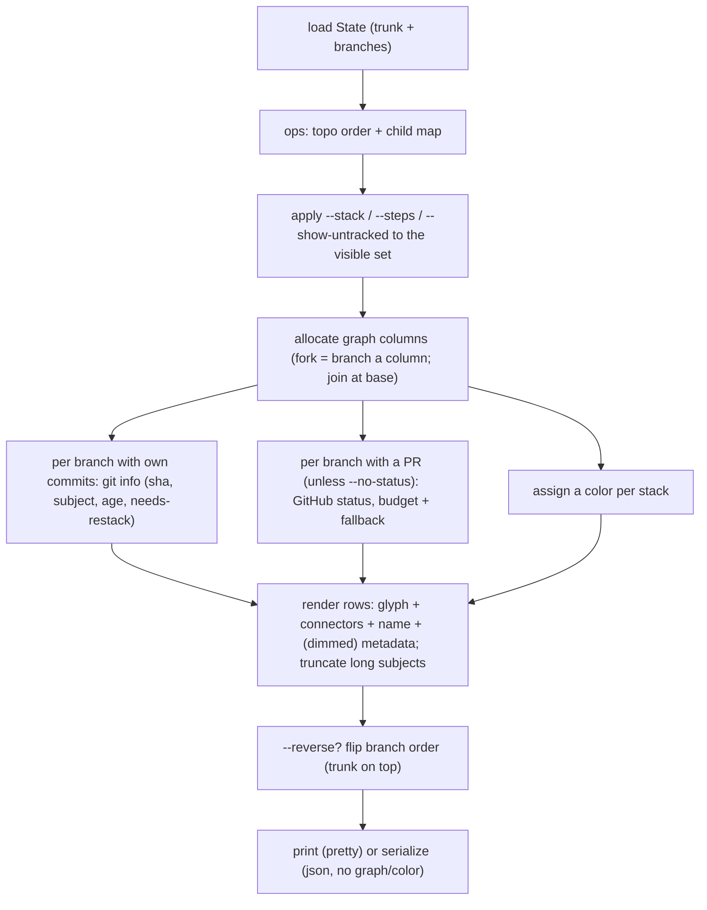

# feat: graphite log parity (forms, flags, visual)

Tracking issue: STA-49.

## Summary

Reshape `stacc log` to match graphite's `gt log`: a vertical, **multi-column**
git-graph (each branch on its own column where the stack forks, `│`/`├`/`└`/`─`
connectors, trunk at the bottom), per-stack **colors**, per-branch metadata
(commit age, SHA + subject, live PR status, needs-restack) for branches that have
their own commits, the three forms (`log`, `log short`, `log long`) with `ls`/`ll`
aliases, and the `--stack` / `--steps` / `--reverse` / `--show-untracked` /
`--no-status` flags, with `--format json` preserved across the forms. Only the
`log` command is in scope; the broader graphite option-parity audit for the other
commands stays its own ticket.

The current `log` is a simple indented tree (`crates/stacc/src/commands.rs` `log()`):
trunk at top, children indented, `o` per branch and `*` for current, branch names
only (plus a `(needs restack)` marker), and a `--short` boolean.

The target visual was confirmed against live graphite screenshots (`gt log` and
`gt log s` on a branching stack); the layout is settled (see High-level technical
design).

---

## Problem frame

stacc users coming from graphite expect `gt log`'s shape and ergonomics, and the
issue calls it out. Today's `log` differs in:

- **Visual.** An indented top-down tree with `o`/`*` markers and names only, vs
  graphite's bottom-up multi-column graph with `│`/`├`/`└` connectors, per-stack
  colors, and per-branch metadata (age, SHA + subject, PR status).
- **Forms.** Only `log` + `--short`; no `log short` / `log long` forms, no
  `ls`/`ll` aliases.
- **Flags.** Only `--short`; none of `--stack` / `--steps` / `--reverse` /
  `--show-untracked`.
- **Metadata.** Names only; no commit info, no PR status.

---

## Requirements

Derived from STA-49 (no upstream brainstorm).

| Req | Description | Advanced by |
| --- | --- | --- |
| R1 | `log` renders the vertical multi-column git-graph (`│`/`├`/`└`), trunk at bottom, per-stack colors | U4 |
| R2 | Three forms: `log` (full), `log short` (compact graph + names), `log long` (git history) | U1, U5 |
| R3 | `ls` = `log short`, `ll` = `log long` aliases (and `log s` / `log l`) | U1 |
| R4 | Per-branch metadata (age, short SHA + subject, needs-restack) for branches with their own commits | U2, U4 |
| R5 | Per-branch live PR status in the metadata block (default-on, with `--no-status` escape) | U3, U4 |
| R6 | Flags `--stack`, `--steps <n>`, `--reverse` on `log` and `log short` | U1, U6 |
| R7 | `--show-untracked` includes git branches stacc is not tracking | U1, U6 |
| R8 | `--format json` across the forms; the full form serializes the new metadata | U7 |

---

## Key technical decisions

- **Multi-column git-graph layout (confirmed against graphite).** The graph is the
  git `--graph` model, not a single-spine tree: each branch is a node on a column,
  `│` spines run down each column, and a fork renders as `├──┘` / `└` connectors
  that branch a sub-stack onto its own column and join it back at the shared base.
  Tip at top, `main` at the bottom, `◉` = current (with a ` (current)` suffix), `○`
  = others. The column-allocation engine (assign/free columns as stacks fork and
  rejoin) is the meatiest piece of U4.
- **Per-stack colors.** Each stack (an upstack chain / sub-tree branching off the
  trunk line) is colored distinctly, applied to **both** the graph glyphs and the
  branch name; the trunk path (trunk + its direct ancestors-of-everything) renders
  in the default color. Honor `--color` (`auto` colors only on a TTY; `never`
  emits plain glyphs; `always` forces). The exact palette and stack-to-color
  assignment are an execution detail (a small fixed palette, cycled per stack).
- **Metadata renders only for branches with their own commits.** A branch whose tip
  is its base (an empty stacked branch, e.g. graphite's `test-*` branches) shows
  just `<glyph> <name> [(current)]`. A branch with its own commit(s) shows the
  dimmed metadata block: `│ <age>`, `│ <sha> - <subject>`, a `│ #<n> <status>` PR
  line (when a PR is recorded), and a `│ needs restack` line (when its base moved),
  then a blank `│` spacer. Metadata lines are **dimmed** (gray); the branch name is
  bright/colored. Trunk shows only its name and `  <age>`.
- **Live PR status is default-on with a `--no-status` escape (decided).** When a
  branch has a recorded PR (and `--no-status` is not set), the full `log` fetches
  its live status (`github.get_pull_request` -> `PrState` Open/Closed/Merged) for
  the PR line. A per-invocation **wall-clock budget (~5s)** caps total fetch time;
  **any** failure (no token, no remote, a call errors, budget exceeded) degrades
  that branch to its PR number without a status and the command continues, never
  hard-failing. `--no-status` (alias `--offline`) skips fetching for a fast,
  network-free run. **Do NOT use `?`** on `GitHub::from_env()` or `get_pull_request`
  in the log path; match/`.ok()` and treat any `Err` as the fallback signal.
- **The JSON `pr` field becomes an object (deliberate breaking change, decided).**
  `stack_json` today emits `"pr": <number>` (or `null`); it becomes
  `{"number", "url", "status"}` (`status` null when unavailable). This **breaks**
  consumers reading `pr` as a scalar, so it is a documented contract bump: U7
  updates the README "For agents" log JSON sample and the PR flags it. Other keys
  (`name`, `base`, `children`, `trunk`) are unchanged; `commit {sha, subject, age}`
  is added per node (when the branch has its own commit).
- **`log long` is a thin git pass-through (decided), with a concrete invocation.**
  It runs `git log --graph --oneline --decorate <branch_tips...> --not <trunk>`
  (ordered tips from `topo_order`, trunk's own history excluded; untracked branches
  not included) and prints git's stdout verbatim, ignoring the log-specific flags.
  `--format json` is a **no-op for `long`** (pretty-only; documented).
- **Commit metadata from git, no new time crate.** `git log -1
  --format=%h%x00%s%x00%cr <rev>` packs short SHA, subject, relative age, split on
  NUL via `splitn(3, '\0')`, run with `LC_ALL=C` for stable English age.
- **`--all` deferred; `--show-untracked` included.** stacc is single-trunk (`trunk`
  is one `String`), so `--all` (across trunks) is a no-op today; defer it.
  `--show-untracked` is included and needs a new branch-listing method on
  `crates/stacc-git` (none exists today).
- **Forms are a positional `value_enum`, not a subcommand (decided).** Add an
  optional positional `form` to `LogArgs` via `#[arg(value_enum)]` (`Short` |
  `Long`, with `#[value(alias = "s")]` / `alias = "l"` so `log s` / `log l` work
  like graphite), NOT `#[command(subcommand)]` (which would reject the flags). So
  `stacc log`, `stacc log short`, `stacc log s`, `stacc log long`, and `stacc log
  short --stack` all parse. `--short` stays as a hidden deprecated flag for one
  release. `ls`/`ll` are built-in multi-token aliases in `DEFAULT_ALIASES`, lowest
  precedence (so a user/repo `ls` overrides; `ls` collides with `git ls-files`).
- **The `needs restack` marker is preserved (decided).** Carried into the metadata
  block as a `needs restack` line; the existing
  `log_marks_current_branch_and_needs_restack` test stays (updated for the layout).
- **Box-drawing glyphs (`◉`/`○`/`│`/`├`/`└`/`─`) are allowed.** Not em-dashes; the
  no-em-dash rule and the CI guard (U+2014 in `*.rs`/`*.md`/`*.toml`) do not apply.

---

## High-level technical design

### Target visuals (confirmed against graphite)

`stacc log` (full). Multi-column graph; the `test-*` stack forks off `sen-1092`;
empty branches show name only, branches with commits show the dimmed metadata
block; the stack is colored:

```
○ jillian/test-1
│
│   ◉ jillian/test-3 (current)
│   │
│   ○ jillian/test-2
│   │
├───┘
○ jillian/sen-1092-cancelling-a-plan-should-delete-scheduled-sessions
│ 2 hours ago
│ bd755054 - fix(sendsei-api): [SEN-1092] delete pending instances when cancelling a plan
│
○ main
  10 hours ago
```

`stacc log short` (same multi-column graph, compact, one row per branch, no
metadata, no spacers):

```
○   jillian/test-1
◉   jillian/test-3
○   jillian/test-2
├─┘ jillian/sen-1092-cancelling-a-plan-should-delete-scheduled-sessions
○   main
```

`stacc log long` (git's own history via pass-through):

```
* 95610c6 - (8 seconds ago) feat: render the user list - Jillian (add-ui)
* 95338df - (2 minutes ago) feat: add the user API - Jillian (add-api)
```

### PR-status line states (full form, branches with a recorded PR)

| Branch state | PR line |
| --- | --- |
| No PR recorded | (omitted) |
| PR recorded, status unavailable (fallback/`--no-status`) | `│ #<n>` |
| PR open | `│ #<n> Open` |
| PR merged | `│ #<n> Merged` |
| PR closed | `│ #<n> Closed` |

### Form / flag matrix

| Invocation | Renders | Flags honored | Network |
| --- | --- | --- | --- |
| `stacc log` | full multi-column graph + metadata | `--stack`, `--steps`, `--reverse`, `--show-untracked`, `--no-status`, `--color` | yes (PR status, unless `--no-status`) |
| `stacc log short` / `ls` / `log s` | compact graph + names | `--stack`, `--steps`, `--reverse`, `--show-untracked`, `--color` | no |
| `stacc log long` / `ll` / `log l` | `git log --graph ...` | none (ignored) | no |

### Rendering pipeline (full form)



---

## Implementation units

### U1. Log CLI surface: forms, flags, and aliases

- **Goal:** Parse the three forms and the new flags; wire the `ls`/`ll` aliases.
- **Requirements:** R2, R3, R6, R7.
- **Dependencies:** none.
- **Files:** `crates/stacc/src/cli.rs` (`LogArgs`), `crates/stacc/src/lib.rs`
  (`DEFAULT_ALIASES`, alias tests), `crates/stacc/tests/log.rs`.
- **Approach:** Replace `LogArgs { short: bool }` with `form: Option<LogForm>` via
  `#[arg(value_enum)]` (`Short` with `#[value(alias = "s")]`, `Long` with
  `alias = "l"`), NOT a subcommand, plus `--stack` (bool), `--steps <usize>`
  (Option; implies `--stack`), `--reverse` (bool), `--show-untracked` (bool),
  `--no-status` (bool, alias `--offline`). Keep `--short` as `#[arg(hide = true)]`
  mapping to `form = Short`. Add `("ls", "log short")` and `("ll", "log long")` to
  `DEFAULT_ALIASES` (lowest precedence). `--color` already exists globally.
- **Patterns to follow:** `StepsArgs`; the `DEFAULT_ALIASES` entries + multi-token
  alias tests in `crates/stacc/src/lib.rs`.
- **Test scenarios:**
  - `stacc log`, `log short`, `log s`, `log long`, `log l` parse the form.
  - `stacc log short --stack --reverse` parses positional + flags together.
  - `ls` -> `log short`, `ll` -> `log long` (via `expand_aliases`).
  - A user alias `ls = checkout` overrides the built-in `ls`.
  - `--steps 2` -> `Some(2)`; `--no-status` / `--show-untracked` parse as bools.
  - `stacc log nonsense` errors with a value-enum usage message.
- **Verification:** `stacc log --help` shows the form + flags; alias tests pass.

### U2. Git commit metadata helper

- **Goal:** Fetch short SHA, subject, relative age (locale-stable) and detect
  whether a branch has its own commits.
- **Requirements:** R4.
- **Dependencies:** none.
- **Files:** `crates/stacc-git/src/lib.rs` + its `#[cfg(test)]` module.
- **Approach:** Add a method returning a struct (sha, subject, age) via `git log -1
  --format=%h%x00%s%x00%cr <rev>` with `LC_ALL=C`, split with `splitn(3, '\0')`.
  Provide a way to tell "branch has its own commit beyond its base" (e.g. the tip
  differs from the base hash, reusing the recorded `base.hash`) so U4 can decide
  metadata-vs-name-only. Reuse the crate command/run helper.
- **Patterns to follow:** `commit_subject` / `rev_parse`.
- **Test scenarios:**
  - A temp-repo commit returns the expected short SHA + subject; age contains "ago".
  - A subject with `|` and a tab round-trips intact (NUL delimiter + `splitn`).
  - A branch whose tip equals its base reports "no own commit"; one with a commit
    reports "has own commit".
  - Unknown rev errors, no panic.
- **Verification:** correct fields for crafted commits; empty-branch detection works.

### U3. Live PR status fetch: default-on, budgeted, graceful

- **Goal:** Fetch live PR status by default, bounded and never fatal.
- **Requirements:** R5.
- **Dependencies:** none (consumes `stacc-github`).
- **Files:** `crates/stacc/src/commands.rs` (the `log` data path), reuse
  `crates/stacc-github` `get_pull_request` + `PrState`.
- **Approach:** Unless `--no-status`, build the client like `submit`/`merge`. For
  each visible branch with a `pr.number`, call `get_pull_request`, map `PrState` to
  a label. Wrap the loop in a wall-clock budget (`Instant`, ~5s); past it, remaining
  branches fall back. **No `?`** on the client build or per-call path; any `Err`
  (or no client) -> PR number with no status. Sequential for v1.
- **Patterns to follow:** client/token/owner-repo resolution in `submit`/`merge`
  (`crates/stacc/src/commands/operations.rs`); error-absorbing like `branch_line`,
  not the `status` command's `?`-propagation.
- **Test scenarios:**
  - `httpmock` GET `/pulls/{n}` `state: open` -> "Open".
  - A branch with no PR -> no call, no status.
  - A 500 (or no client) -> fall back to the PR number, exit 0.
  - Partial failure: 3 succeed, the 4th errors; the 3 keep status, the 4th shows
    just its number (loop does not abort).
  - `--no-status` -> zero API calls, PR numbers only.
- **Verification:** statuses show with a mock; with the mock erroring (and with
  `--no-status`), `log` still renders and exits 0.

### U4. Full-form multi-column graph renderer

- **Goal:** Render the multi-column git-graph (trunk at bottom) with per-stack
  colors and the conditional, dimmed metadata block.
- **Requirements:** R1, R4, R5.
- **Dependencies:** U2 (commit info + empty detection), U3 (PR status).
- **Files:** `crates/stacc/src/commands.rs` (replace `print_graph`/`branch_line`
  for the full form; add the column-allocation engine + a small color palette),
  `crates/stacc/tests/log.rs`.
- **Approach:** Build the branch order (tip on top, trunk at bottom) and the child
  map from `ops::topo_order`. Run a **column allocator**: each branch occupies a
  column; when a base has multiple children, the extra children take new columns,
  drawn with `├`/`└`/`─` joining back to the base's column; `│` continues open
  columns. Per branch emit `<glyph> <name> [(current)]` colored by its stack; if
  the branch has its own commits (U2), append the dimmed block (`│ <age>`,
  `│ <sha> - <subject>` truncated to terminal width with `...`, a `│ #<n> <status>`
  PR line per the table, a `│ needs restack` line when applicable), then a blank
  `│` spacer; empty branches and the trunk get name-only (trunk also `  <age>`).
  `◉` current, `○` others. Honor `--color` (plain glyphs + no ANSI when off/piped).
  Keep the orphan ("unreachable") handling.
- **Technical design (directional, not spec):** the column allocator is the crux,
  model it on git's `--graph` column lifecycle (open a column at a fork, draw the
  join row, free it at the merge point). A `Vec<Option<stack_id>>` of active
  columns updated per row is sufficient; exact glyph selection per row (`│` vs `├`
  vs `└` vs `─`) follows from which columns open/close on that row.
- **Patterns to follow:** the current `print_graph` recursion + `branch_line`
  (traversal, current check, `needs_restack`); `OutputFormat::Pretty` arm; the
  `--color` plumbing in `crates/stacc/src/`.
- **Test scenarios:**
  - Linear 3-branch stack: trunk at the bottom, `◉` current, `○` others, single
    column, metadata for committed branches only.
  - Branching stack (one base, two children, one of which has its own child):
    renders both columns with `├`/`└` join connectors (assert the connector row and
    both child names); matches the confirmed graphite layout.
  - An empty branch (tip == base) shows name only; a committed branch shows the
    metadata block.
  - A PR branch shows `#<n> Open`; merged shows `#<n> Merged`; no PR omits the line.
  - A branch needing restack shows `needs restack` (carry-over of the existing test).
  - A long subject is truncated with `...`, no wrap.
  - `--color never` emits no ANSI and plain glyphs; `--color always` colors.
  - Single branch on trunk; empty stack (trunk only); an orphan still surfaced.
- **Verification:** output matches the confirmed graphite visuals for linear and
  branching stacks; color toggles with `--color`.

### U5. `short` and `long` forms

- **Goal:** Compact graph for `short`; git pass-through for `long`.
- **Requirements:** R2.
- **Dependencies:** U1 (forms parse), U4 (shares the column engine + glyphs/colors).
- **Files:** `crates/stacc/src/commands.rs`, `crates/stacc/tests/log.rs`.
- **Approach:** `short` reuses U4's column allocator + glyphs + colors but emits
  **one row per branch** (`<connectors> <glyph> <name>`), no metadata, no spacers,
  **no network**. `long` runs `git log --graph --oneline --decorate <tips...> --not
  <trunk>` (tips from `topo_order`, trunk excluded, untracked excluded) and prints
  stdout verbatim, ignoring `--stack`/`--steps`/`--reverse`. `--format json` is a
  no-op for `long`; `short` JSON reuses the tree (see U7).
- **Patterns to follow:** the existing `--short` loop; the `External` git-proxy path
  for shelling to git.
- **Test scenarios:**
  - `stacc log short` prints one row per branch with the compact connectors + names,
    current `◉`; assert **no** API call.
  - `ls` and `log s` reach the same output.
  - `stacc log long` invokes git and prints its output (contains the tips' SHAs);
    `--reverse`/`--stack` do not change it.
- **Verification:** the three forms produce distinct shapes; `short` is provably
  network-free and shares U4's graph.

### U6. Scope flags: `--stack`, `--steps`, `--reverse`, `--show-untracked`

- **Goal:** Restrict/extend the rendered set and orientation.
- **Requirements:** R6, R7.
- **Dependencies:** U4, U5.
- **Files:** `crates/stacc/src/commands.rs`, `crates/stacc-git/src/lib.rs` (new
  branch-listing method for `--show-untracked`), `crates/stacc/tests/log.rs`.
- **Approach:** `--stack` limits the set to the current branch's ancestors
  (`ops::downstack_chain`) + descendants (`ops::upstack_order`). `--steps <n>`
  implies `--stack`, truncates n levels each way; clamp (0 or over-depth -> all in
  that bound, never error). `--reverse` flips branch order to trunk-on-top (per-node
  block layout unchanged; the column connectors render consistently for the flipped
  order). `--show-untracked` adds local git branches not in `state.branches` via a
  new `crates/stacc-git` method (`git branch --format=%(refname:short)`), in a
  separate trailing **untracked** group with a distinct glyph, not interleaved into
  stack order. From the trunk or an untracked branch, `--stack`/`--steps` degrade to
  the whole stack (no error).
- **Patterns to follow:** `ops::downstack_chain` / `ops::upstack_order`; the crate
  command/run helper for the branch list.
- **Test scenarios:**
  - 5-branch stack from a middle branch: `--stack` shows only its ancestors +
    descendants.
  - `--steps 1` -> one level up and down; `--steps 0` and `--steps 99` do not error.
  - `--stack` from the trunk shows the whole stack.
  - `--reverse` prints the trunk first with consistent connectors.
  - `--show-untracked` lists a git branch absent from state in the untracked group.
- **Verification:** each flag changes the set/orientation as specified.

### U7. JSON across forms (with the `pr`-object contract bump)

- **Goal:** Serialize the new metadata; carry the `pr`-object change and document
  the bump. JSON has no graph/color (data only).
- **Requirements:** R8.
- **Dependencies:** U2, U3 (metadata), U6 (scope flags shape the serialized tree).
- **Files:** `crates/stacc/src/commands.rs` (`OutputFormat::Json` arm, `stack_json`),
  `crates/stacc/tests/log.rs`, `README.md` (the "For agents" log JSON sample).
- **Approach:** Keep `{trunk, stack:[{name, base, children, ...}]}`; change `pr` to
  `{"number", "url", "status"}` (status null when unavailable); add per-node
  `commit: {sha, subject, age}` when the branch has its own commit (null/omitted
  otherwise). `--stack`/`--steps`/`--show-untracked` shape the serialized tree.
  `log short --format json` returns the tree (decide commit/pr inclusion for
  consistency; keep it valid). `log long --format json` is a documented no-op.
  Update the README agent-section sample to the `pr` object; flag the bump in the PR.
- **Patterns to follow:** `stack_json` and the `json!({...})` shape in `log()`.
- **Test scenarios:**
  - `stacc log --format json`: `pr` is `{number, url, status}` (status filled when
    mocked), `commit {sha, subject, age}` present for committed branches.
  - `name`/`base`/`children`/`trunk` unchanged (regression on the non-`pr` contract).
  - `--stack --format json` restricts the serialized tree.
  - `log short --format json` parses, preserves the children structure on a
    branching stack.
- **Verification:** JSON parses with the new `pr` object + `commit`; non-`pr` keys
  intact; README sample matches.

---

## Scope boundaries

### Deferred to follow-up work

- **`--all` (multi-trunk).** No-op under single-trunk; defer.
- **Parallel PR-status fetching.** v1 is sequential + budgeted; parallel is a perf
  follow-up.
- **`--classic` (graphite legacy style).** Not carried.
- **Graphite option parity for non-log commands** (merge, modify, move, etc.).

### Non-goals

- Changing other commands' output or flags.
- A bespoke commit-graph engine for `log long` (git pass-through).
- A new JSON shape for `log long` (`--format json` is a no-op there).
- Graph/color in the JSON output (JSON is data only).

---

## Open questions

- **`log short --format json` metadata.** Whether `short`'s JSON includes the
  `commit`/`pr.status` fields or stays name/base-only, resolve for consistency in
  U7 (does not block the other units).

---

## Risks and dependencies

- **The multi-column column-allocation engine is the meatiest piece.** N-way forks,
  the join-row connectors, and freeing columns at merge points are where the bugs
  live. Mitigation: model it on git's `--graph` column lifecycle and cover a
  multi-child branching stack in U4's tests against the confirmed graphite layout.
- **`log` becomes network/auth-bound by default.** Live status needs a token +
  remote and incurs latency; the wall-clock budget + graceful fallback +
  `--no-status` keep it usable.
- **JSON contract break.** `pr` scalar -> object breaks agents reading the
  documented log JSON; U7 updates the README sample and the PR flags it; non-`pr`
  keys stay stable.
- **CLI surface change.** `--short` (bool) -> positional `form`; `--short` kept as a
  hidden deprecated alias for one release.
- **New `stacc-git` branch-listing method** is required for `--show-untracked`.
- **Locale + terminal + color.** `%cr` forced to `LC_ALL=C`; long subjects
  truncated; `◉`/`○`/`│`/`├`/`└` assume UTF-8; colors gate on `--color`/TTY.

---

## Sources and research

- STA-49; graphite's docs (command reference, "Visualize a stack") and live
  `gt log` / `gt log s` screenshots on a branching stack (the confirmed
  multi-column colored layout with conditional metadata).
- Current implementation: `crates/stacc/src/commands.rs` `log()` (tree render +
  `--short` + the `needs_restack` marker + the JSON `pr`-scalar contract),
  `crates/stacc-core/src/ops.rs` (`topo_order`, `upstack_order`, `downstack_chain`),
  `crates/stacc-state/src/model.rs` (`trunk: String`, `BranchState { base, pr }`),
  `crates/stacc-git/src/lib.rs` (`commit_subject`, `rev_parse`; git
  `%h`/`%s`/`%cr`), `crates/stacc-github/src/lib.rs` (`get_pull_request`, `PrState`).
