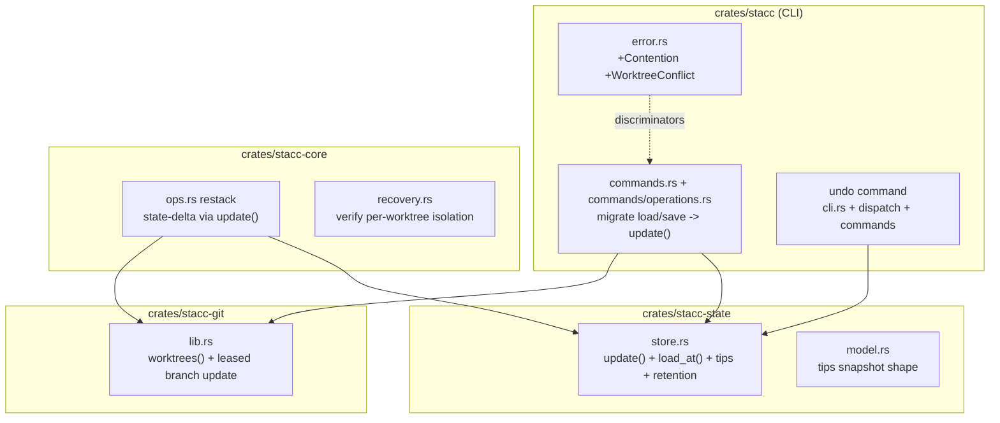
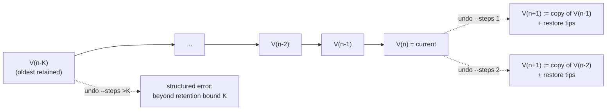

# P1: Parallel-agent foundation

## Summary

Make stacc's stack state safe for parallel agents and give them a one-command
safety net. Today `StateStore::save()` serializes the in-memory state into a tree
**once**, then on a compare-and-swap miss re-commits that same stale tree against
the new parent, silently clobbering a concurrent writer
(`crates/stacc-state/src/store.rs:68`). P1 replaces the load-mutate-save split
with a transactional read-modify-write API that re-applies the *logical* change
onto freshly loaded state and retries (R1), migrates every mutating command and
the mid-conflict restack save onto it, adds a worktree-safety guard so a mutating
operation refuses to rewrite a branch checked out in another worktree (R3),
verifies and hardens the already-per-worktree conflict-recovery records (R2), and
adds a multi-step `undo` over the state ref's existing commit chain with a bounded
retention window (R4, R5). Every new command and error honors the JSON /
`--no-interactive` / structured-error contract (R21).

The model is **isolation-first**: each agent owns a separate stack in its own
worktree, so the logical changes that race on `refs/stacc/data` touch disjoint
branch keys and a naive reload-and-re-apply converges without a real merge. The
harder shared-stack case (two agents editing the same branch) is **not** built
here, but the read-modify-write path is structured so a logical state merge can
drop into one place later without a rewrite (origin Key Decision: "isolation-first,
with the merge seam left open").

---

## Problem Frame

The June 3 `close-graphite-gaps` batch took stacc to a complete single-agent daily
loop. Parallel agents are now the primary use, and the current architecture was
not built for them. Three concrete defects, read directly from the code:

1. **Lost updates on the shared state ref (R1).** `StateStore::save()`
   (`crates/stacc-state/src/store.rs:68-101`) builds the tree from the passed-in
   `state` before the retry loop, then the loop only re-points the parent and
   re-commits the **same tree**. The compare-and-swap in
   `Git::update_ref` (`crates/stacc-git/src/lib.rs:327`) is correct and tested
   (`update_ref_cas_rejects_stale_old`), but `save()` defeats it: when agent B
   advances the ref between agent A's load and A's CAS retry, A's retry overwrites
   B's tree. The recorded change is whatever A held in memory; B's insert is gone.

2. **Recovery records assumed single-writer (R2).** The conflict-continuation
   record (`crates/stacc-core/src/recovery.rs`) and the GitHub-enriched
   conflict-context file (`write_conflict_context`,
   `crates/stacc/src/commands/operations.rs:1224`) both live under
   `Git::git_dir()`. Reading the code closely, `git_dir()` shells out to
   `git rev-parse --git-dir` (`crates/stacc-git/src/lib.rs:241`), which returns the
   **per-worktree** private dir for a linked worktree, so these records are in fact
   already isolated for the separate-worktree case. The gap is that this is
   undocumented and untested, and nothing prevents a future change to
   `--git-common-dir` from collapsing the isolation. R2 is verify-harden-and-test,
   not rebuild.

3. **No worktree safety (R3).** stacc has no `git worktree list` wrapper. A
   mutating op (`restack`, `modify`, `move`, `sync`, `merge`) that rebases a branch
   checked out in another worktree fails as a raw mid-pass `GitError` (or, for
   `git branch -f`, an opaque refusal), instead of a structured skip. graphite
   itself only reached partial multi-worktree safety in 1.8.4.

Plus the missing safety net: **no `undo` (R4, R5).** Recovery is limited to
conflict `abort`; an agent that makes a wrong but *successful* mutation has no
rollback. The substrate exists, every `save` commits the new state tree onto the
previous as a parent (`commit_tree(&tree, parent, ...)`,
`crates/stacc-state/src/store.rs:91`), so `refs/stacc/data` is already a full
version history `undo` can walk.

The cost shape: stacc runs a single-agent loop well, but a confident "I never
reach for graphite" requires concurrency the current state layer cannot provide
and a one-command rollback it does not have.

---

## Requirements Traceability

P1 implements origin requirements R1-R5 under cross-cutting R21, for actors A1
(coding agent) and A2 (parallel agents), against forge A4 (GitHub).

| Req | Summary | Units |
|---|---|---|
| R1 | Isolation-first transactional state writes; no lost updates; structured contention error; merge seam reserved | U2, U3, U4 |
| R2 | Multi-worker recovery state not assuming a single writer in `.git/` | U6 |
| R3 | Worktree-safety: refuse to rewrite a branch checked out elsewhere, structured error | U1, U5, U8 |
| R4 | `undo` reverts the most recent mutation, restoring prior state and affected branch tips; non-interactive, JSON-complete | U7, U8 |
| R5 | `undo` builds on the state-ref commit chain; restores tips alongside state; defined retention bound | U7, U8 |
| R21 | Every new command/error honors `--format json\|pretty`, `--color`, `--no-interactive`, structured errors | U2, U5, U8 (all new surface) |

Origin flows carried as constraints:
- **F1 (concurrent stack mutation)** is the acceptance behavior for U2/U3/U4: two
  agents mutate the same stack; the first CAS wins; the loser reloads, re-applies
  its logical change, and retries; bounded misses end in a structured contention
  error, never a clobber.
- **F2 (undo a wrong mutation)** is the acceptance behavior for U7/U8: `undo`
  reads the prior version from the ref's commit chain, restores that state and the
  affected branch tips, and reports what it reverted, bounded by the retention
  window.

---

## Key Technical Decisions

### KTD-1: A transactional `update(closure)` replaces the load/save split

Introduce a read-modify-write API on `StateStore` that owns the load → apply →
commit → CAS-retry loop, so the *logical* change is re-applied onto fresh state on
a miss rather than a stale tree being re-committed.

Directional shape (not an implementation spec):

```rust
impl StateStore {
    /// Apply `mutate` to the current state under compare-and-swap. Loads the
    /// state at the current ref tip, applies the logical change, commits the
    /// resulting tree onto that tip, and on a CAS miss RELOADS fresh state and
    /// re-applies `mutate` before retrying. Returns the closure's value, or a
    /// structured contention error after bounded attempts.
    pub fn update<T>(
        &self,
        mutate: impl FnMut(&mut State) -> Result<T, StateError>,
    ) -> Result<T, StateError>;
}
```

Loop sketch:

```text
for _ in 0..ATTEMPTS {
    parent = git.ref_commit(STATE_REF)?            // exact tip, None if absent
    state  = self.load_at(parent)?                 // read blobs FROM that commit, not by ref name
    value  = mutate(&mut state)?                   // apply the logical change
    tree   = self.write_state_tree(&state)?
    commit = git.commit_tree(tree, parent, "stacc: update state")?
    match git.update_ref(STATE_REF, commit, parent.or(ZERO_OID)) {
        Ok(())        => return Ok(value),
        Err(cas_miss) => continue,                 // ref moved; reload + re-apply
    }
}
Err(StateError::Contention { attempts: ATTEMPTS })
```

Rationale and consequences:
- **Load from the captured parent commit, not the ref name.** `load()` today
  re-resolves the ref (`crates/stacc-state/src/store.rs:45`); inside the loop that
  reopens a TOCTOU window. A `load_at(commit)` that reads blobs from the captured
  commit hash (`read_blob`/`list_tree` already take a rev) closes it: the loaded
  state, the commit parent, and the CAS `expected_old` are all the same commit.
- **Distinguishing a CAS miss from a real git failure.** `Git::update_ref` returns
  a generic `GitError::Command` on any failure. Prefer a dedicated CAS-miss variant
  on `Git::update_ref` that parses `git update-ref`'s own "cannot lock ref ...
  expected ..." stderr, so a CAS rejection is distinguished from a real error at
  the source. A re-read-the-ref fallback (retry when the ref no longer equals
  `parent`) is racier: a third writer advancing the ref between the failed CAS and
  the re-read can mask a genuine git error as a retryable miss, so it is the
  fallback, not the default.
- **The contention error is a top-level CLI error.** The store returns
  `StateError::Contention`, but the CLI must surface it as a dedicated
  `Error::Contention` with its own `as_json` discriminator, NOT as a `StateError`
  sub-variant: `Error::State(#[from] StateError)` is a blanket arm that renders
  every `StateError` as `"error": "state"`, so a sub-variant would never appear as
  `"contention"` (see U3).
- **Convergence rests on isolation, with one caveat for structural edges.** For
  disjoint branch keys whose change is an absolute value (insert/remove a branch,
  set a `base.hash`), re-applying the closure onto fresh state is correct. A
  mutation that rewrites a *stack edge* (`move`/`modify` changing `base.name`) is
  computed from the stale topology, so a blind re-apply onto fresh state can
  overwrite a concurrent re-parent/untrack of the same branch with no CAS miss to
  catch it. Such deltas MUST carry the expected prior `base.name`, and the re-apply
  MUST surface contention (or skip) on a mismatch rather than blind-overwrite (see
  KTD-2). For two agents editing the *same* branch key, the re-apply is
  last-writer-wins; that is the deferred shared-stack case, and the `update`
  closure is the single seam where a future logical merge replaces the naive
  re-apply.
- **Keep `Contention` exceptional.** Add randomized backoff between attempts and
  capture the branch-tip snapshot (U7) once before the retry loop rather than
  re-deriving it per attempt, so the work between `ref_commit()` and the CAS stays
  small and `Contention` signals genuine irreconcilable contention, not normal
  parallel load. Revisit `SAVE_ATTEMPTS` against the target agent count.
- **`load()` stays** for read-only commands (`status`, `log`, `pr`).

### KTD-2: The git side effects stay outside the transaction; only the state delta is transactional

`restack` runs `git rebase` (side effects on HEAD/refs that are not idempotent
under retry), so the transaction cannot wrap the whole operation. The engine
performs its git work, accumulates the resulting **state delta** (the set of
`branch -> new base.hash` updates), and commits that delta through
`store.update(|s| apply_deltas(s, &deltas))`, both at the mid-conflict save
(`crates/stacc-core/src/ops.rs:231`) and on success. The restack delta is a set of
*absolute* `base.hash` assignments for the already-restacked branches, which is
idempotent under reload-and-re-apply, and that is what makes the transaction sound
here (unlike `move`/`modify`'s `base.name` edits, which need the expected-prior
guard from KTD-1).

**Conflict-path ordering.** Because `store.update` can now return `Contention`
after bounded attempts while the rebase is in progress, the conflict path MUST
write the continuation marker before (or independently of) the transactional state
save, and a `Contention` at the conflict save MUST abort the rebase to a clean
tree exactly as a failed marker write does today
(`crates/stacc/src/commands/operations.rs:1124`). Otherwise a `Contention` return
would replace the `Conflict` return and strand an in-progress rebase with no
`stacc continue` marker.

**Single writer per command.** Once the engine owns persistence, the command-level
`store.save` that runs after the engine returns (`restack` at `operations.rs:840`,
`sync` at `operations.rs:390`) is removed, so each command performs one
transactional write, not two, keeping the contention surface and the undo-version
count honest. (Highest-risk unit; see U4.)

### KTD-3: Worktree-safety is a pre-flight guard plus a structured error

Add `Git::worktrees()` over `git worktree list --porcelain` and a guard checked
before any branch rewrite. Semantics follow the origin (R3): inside a multi-branch
pass (`restack`, `sync`), a branch checked out in **another** worktree is skipped
and collected, mirroring the existing `RestackOutcome::skipped` path; for a
single-branch op (`modify`, `move`, `rename`) it is a hard structured error. A new
`Error::WorktreeConflict { branch, worktree }` carries the JSON discriminator
`worktree_conflict`. The branch checked out in the *current* worktree is fine to
operate on.

### KTD-4: `undo` is multi-step over a bounded, tip-snapshotting version chain

Per the planning decision: `undo [--steps N]` (default 1) walks back N versions of
`refs/stacc/data`, restores that version's state **and** the tracked branch tips,
and records the restore as a new forward version so the chain stays monotonic and
`undo` is itself undoable.

- **Tip capture (R5 substrate).** Branch tips are not recorded today (`BranchState`
  holds the *base*'s hash, not the branch's own tip). The `update` write path
  snapshots each tracked branch's tip into a `tips` blob (a sibling of `repo` and
  `branches/` in the state tree), recording absent refs as absent.
- **Tip restore is worktree-safe (R3).** `undo` restores tips with a leased
  `update_ref` on `refs/heads/<branch>` (expected = current tip), but a raw
  `update_ref` will move a branch checked out in another worktree (or the current
  one), desyncing that worktree's HEAD/index, the exact corruption U5 prevents. So
  undo's tip restore routes through the U5 worktree guard
  (`branch_checked_out_elsewhere`): a branch checked out in *another* worktree is
  skipped and reported as a worktree conflict; a branch checked out in the
  *current* worktree is restored with a working-tree-syncing reset (or refused with
  a structured error if the tree is dirty), never a bare ref move; a branch whose
  tip moved under the lease is skipped and reported.
- **Bounded retention by shallow walk (R5).** `undo` refuses to walk past the
  `K`-th ancestor (default proposed: 50) with a structured beyond-retention error
  naming the bound. The bound is enforced by *not walking* past depth `K`, not by
  rewriting the ref, so there is no live-ref rewrite that could lose recoverable
  history or race a concurrent writer. `undo` resolves its target to a concrete
  commit hash up front and walks by that hash, so a concurrent write cannot strand
  it. Unbounded chain growth is left to git's own gc of unreferenced history; if
  active ref-size pruning is ever needed it is a separate, CAS-guarded compaction,
  out of P1 (see Scope Boundaries).
- **Non-interactive + JSON (R21).** `undo` never prompts; it reports the reverted
  version, the restored branches, and any worktree/tip skips as structured output.

### KTD-5: R2 is verified and fenced, not rebuilt

Because `git_dir()` already yields the per-worktree dir, U6 adds explicit
two-worktree isolation tests, documents the invariant on `git_dir()` and the
recovery module, and adds a guard/comment so the continuation and context paths are
never moved to the common dir. If testing surfaces a real leak (e.g. a path that
resolves to the common dir), the fallback is to key the records by a worktree/worker
id; the plan assumes the tests confirm isolation and no re-keying is needed.

---

## High-Level Technical Design

### Components touched



### F1: concurrent mutation under the transactional CAS-reapply loop

```mermaid
sequenceDiagram
  participant A as Agent A (stack /a)
  participant B as Agent B (stack /b)
  participant R as refs/stacc/data (CAS)
  A->>R: ref_commit() -> C0
  B->>R: ref_commit() -> C0
  A->>A: load_at(C0); mutate: insert branch a
  B->>B: load_at(C0); mutate: insert branch b
  A->>R: update_ref(C1a, expected=C0)
  R-->>A: ok (ref now C1a)
  B->>R: update_ref(C1b, expected=C0)
  R-->>B: CAS miss (ref is C1a)
  B->>R: ref_commit() -> C1a
  B->>B: load_at(C1a); re-apply: insert branch b
  B->>R: update_ref(C2, expected=C1a)
  R-->>B: ok (ref now C2 holds a AND b)
  Note over A,B: Disjoint keys converge.<br/>Same-key edits = deferred shared-stack merge seam.
```

### Undo over the bounded version chain



Each version's tree carries `repo`, `branches/<name>`, and a `tips` snapshot;
`undo` restores from a target version and appends a new forward version. Diagrams
are authoritative for direction; the prose governs on any disagreement.

---

## Implementation Units

Grouped into five phases. U-IDs are stable. Execution posture: the state-write and
restack changes are high-risk edits to existing machinery, so U2/U3/U4 are
**characterization-first** (lock current behavior with tests before refactoring);
the new surface (U1, U5, U7, U8) is **test-first**.

### Phase A: Concurrency-safe primitives

### U1. Worktree enumeration primitive

**Goal:** A typed wrapper over `git worktree list` plus a helper that answers "is
this branch checked out in another worktree?", with no behavior change to any
command yet.

**Requirements:** R3 (substrate). **Dependencies:** none.

**Files:**
- `crates/stacc-git/src/lib.rs` (add `worktrees()` and
  `branch_checked_out_elsewhere()`)
- `crates/stacc-git/src/lib.rs` (inline `#[cfg(test)]` tests)

**Approach:** Parse `git worktree list --porcelain` into `(path, branch)` entries
(a detached worktree has no branch). `branch_checked_out_elsewhere(branch)` returns
the other worktree's path when `branch` is checked out at a path other than this
`Git`'s `dir`, else `None`. Compare worktree paths canonically (the porcelain paths
are absolute; resolve symlinks before comparing to `self.dir`).

**Patterns to follow:** the exit-code/`output()` wrapper idiom in
`crates/stacc-git/src/lib.rs` (e.g. `symbolic_ref`, `remotes`); return
`Result<_, GitError>` and reuse `command_error`.

**Test scenarios:**
- Happy path: a repo with one extra linked worktree on branch `feat`; `worktrees()`
  returns both entries with correct paths and branch names.
- `branch_checked_out_elsewhere("feat")` returns the linked worktree path when
  called from the main worktree; returns `None` for a branch checked out in the
  *current* worktree.
- Edge: a detached-HEAD worktree is enumerated with no branch and never matches a
  branch name.
- Edge: single-worktree repo returns exactly one entry and
  `branch_checked_out_elsewhere` is always `None`.

**Verification:** `worktrees()` reflects `git worktree add`/`remove` against a temp
repo; no existing command behavior changes.

### U2. Transactional state writes

**Goal:** Add `StateStore::update(closure)` (load-at-tip → apply → commit →
CAS-retry-with-reload) and a structured `StateError::Contention`; fix the
stale-tree bug at its root.

**Requirements:** R1, R21. **Dependencies:** none (pairs with U1 in Phase A).

**Files:**
- `crates/stacc-state/src/store.rs` (`update`, `load_at`, `write_state_tree`
  helper, `Contention` variant; keep `load`/`push`/`fetch`)
- `crates/stacc-state/src/store.rs` (inline tests, including a real concurrent-race
  test)

**Approach:** Per KTD-1. Extract the tree-building from today's `save()` into a
private helper reused by `update`. Capture `parent = ref_commit()`, load state from
that exact commit via a `load_at(parent)`, apply the closure, commit onto `parent`,
CAS with `expected_old = parent.or(ZERO_OID)`. On `update_ref` error, re-read the
ref to classify miss-vs-error; retry on a miss up to `SAVE_ATTEMPTS`; return
`Contention` on exhaustion. `save(&State)` may remain as a thin
`update(|s| { *s = state.clone(); Ok(()) })` shim during migration, or be removed
once call sites move (U3/U4); implementer's call.

**Execution note:** characterization-first. Before changing `save`, add a test that
pins the lost-update bug (two `StateStore`s over one repo: A loads, B inserts and
saves, A inserts and saves, then assert B's branch survives) so the fix is proven
by the test flipping from red to green.

**Patterns to follow:** existing `store.rs` tests (`save_then_load_roundtrips`,
`save_updates_existing_state`) and the `update_ref` CAS test in
`crates/stacc-git/src/lib.rs`.

**Test scenarios:**
- Covers F1. Concurrent re-apply: two stores load at C0; A commits; B's first CAS
  misses, B reloads and re-applies its disjoint insert, second CAS succeeds; final
  state contains both A's and B's branches.
- Happy path: `update` that inserts one branch round-trips through `load`.
- Edge: `update` on a fresh repo (ref absent, parent `None`, `expected_old =
  ZERO_OID`) succeeds and creates the ref.
- Error path: simulate persistent contention (ref advanced on every attempt) and
  assert `StateError::Contention` after `SAVE_ATTEMPTS`, never a silent clobber.
- Error path: a closure returning `Err` propagates without moving the ref.
- Regression: the prior bug test (A then B then A) now preserves both writers.

**Verification:** the lost-update characterization test passes; `cargo test -p
stacc-state` green; contention surfaces as a typed error.

### Phase B: R1 rollout

### U3. Migrate mutating commands to `update`

**Goal:** Convert every load-mutate-save command site (outside the restack conflict
path) to `store.update(|state| ...)` so each command's write goes through CAS-reapply.

**Requirements:** R1. **Dependencies:** U2.

**Files:**
- `crates/stacc/src/commands.rs` (`init`, `track`, `untrack`, `create`, `rename`,
  and the other `load()/save()` pairs at lines ~31/49, 77/105, 123/158, 186/228,
  422/506, 550/612)
- `crates/stacc/src/commands/operations.rs` (the non-conflict command save sites:
  `modify` (~22/93), `move` (~138/215), `merge`, and `sync`'s reconcile saves
  (~371/390); `restack`'s final save (~840) is removed in U4, not migrated here)
- `crates/stacc/src/error.rs` (add a dedicated top-level `Error::Contention`
  variant with its own `as_json` arm emitting `"error": "contention"`, plus a
  non-`#[from]` mapping from `StateError::Contention`, because the blanket
  `Error::State(#[from] StateError)` arm renders every `StateError` as
  `"error": "state"` and cannot discriminate the inner variant)
- `crates/stacc/tests/*.rs` (extend existing per-command tests)

**Approach:** Move the in-memory mutation (the insert/update/remove and any derived
output values) inside the closure; return the values the command needs for its
report out of the closure. Read-only reporting that must reflect the committed
state reads `state` after `update` returns, or returns it from the closure. Preserve
each command's existing JSON/pretty output exactly. Commands that both read GitHub
and mutate (e.g. `submit`, `merge`) keep network I/O outside the closure and only
the state delta inside it. For `move`/`modify`, the closure carries the expected
prior `base.name` (the edge observed at command start) and surfaces contention if
fresh state already moved that edge, per KTD-1, so a stale structural edit never
blind-overwrites a concurrent re-parent. For `sync`, the dropped/re-parented sets
are derived from merge-status/network probes (`operations.rs:339-365`) that a
reload cannot reproduce, so they are computed once before the closure and
re-asserted inside it, never recomputed on re-apply.

**Patterns to follow:** the `track` idiom
(`crates/stacc/src/commands.rs:73-115`) for the load/mutate/report shape; the
existing error-mapping arms in `crates/stacc/src/error.rs:83`.

**Test scenarios:**
- Happy path per migrated command: behavior and JSON output are unchanged
  (existing tests in `crates/stacc/tests/{track,create,modify,move,rename,sync}.rs`
  still pass).
- Integration: two processes each `create` a different branch concurrently against
  one repo; both branches end up tracked (no lost update). (Covers F1 at the CLI
  layer.)
- Error path: a `contention` error renders with the `"error": "contention"`
  discriminator under `--format json`.
- Edge: a closure that early-returns a `Usage` error (e.g. tracking the trunk)
  leaves the ref unchanged.

**Verification:** full `cargo test` green; no command’s output shape changed;
concurrent-create integration test passes.

### U4. Transactional restack and conflict persistence

**Goal:** Route the restack engine's mid-conflict and success state writes through
`update`, applying the computed base-hash delta onto fresh state so a concurrent
writer is never clobbered mid-rebase.

**Requirements:** R1. **Dependencies:** U2.

**Files:**
- `crates/stacc-core/src/ops.rs` (`restack`: accumulate `(branch, new_base_hash)`
  deltas; replace `store.save(state)` at line 231 with a delta-applying `update`)
- `crates/stacc/src/commands/operations.rs` (`restack_with_recovery` at line 1098:
  align with the engine's new write contract, and order the continuation-marker
  write before/around the transactional conflict save per KTD-2; `continue_op`'s
  resume save at ~1045, which independently resolves the resumed branch's
  `base.hash` at ~1032-1034, also routes through the delta-applying `update`;
  remove the redundant command-level `store.save` at ~840 now that the engine owns
  persistence)
- `crates/stacc-core/src/ops.rs` (inline tests)
- `crates/stacc/tests/recovery.rs`, `crates/stacc/tests/restack.rs` (extend)

**Approach:** Per KTD-2. The engine mutates the caller's `&mut State` as today for
its own bookkeeping, but persistence happens by applying the accumulated deltas via
`store.update(|s| apply_deltas(s, &deltas))`, both at the conflict interrupt and at
the end of a clean pass. At the conflict interrupt, the continuation marker is
written before (or independently of) the transactional save, and a `Contention`
returned by `update` at that point aborts the rebase to a clean tree rather than
stranding it, mirroring the existing failed-marker-write guard. The continuation
record write (the typed `Operation`) is otherwise unchanged. Keep the existing
skip-on-missing-ref behavior (`RestackOutcome::skipped`).

**Execution note:** characterization-first. Pin current restack-conflict behavior
(`restack_conflict_returns_remaining_queue`,
`crates/stacc-core/src/ops.rs:584`) before refactoring the save path, then add the
concurrent-writer case.

**Test scenarios:**
- Covers F1 mid-conflict: agent B inserts a disjoint branch while agent A is paused
  on a restack conflict; A's continuation save re-applies its base-hash deltas onto
  B's updated state; both survive.
- Happy path: a clean multi-branch restack persists all base-hash updates through
  `update`; recorded hashes match (mirrors
  `restack_rebases_chain_and_updates_base_hashes`).
- Edge: idempotent restack (nothing to do) performs a no-op `update`.
- Error path: a conflict still leaves the rebase in progress, writes the
  continuation, and a later `continue` resumes correctly.
- Edge: continuation write failure still aborts to a clean tree (existing
  `restack_with_recovery` guard behavior preserved).
- Error path: a `Contention` at the mid-conflict save still leaves a written
  continuation marker (or aborts to a clean tree), never an in-progress rebase with
  no `stacc continue`.

**Verification:** `recovery.rs` and `restack.rs` integration suites pass; the
concurrent-mid-conflict test passes; `continue`/`abort` round-trip unchanged.

### Phase C: Worktree safety

### U5. Worktree-safety guard on mutating operations

**Goal:** Before rewriting a branch, refuse if it is checked out in another
worktree, structured error for single-branch ops, structured skip inside
multi-branch passes.

**Requirements:** R3, R21. **Dependencies:** U1.

**Files:**
- `crates/stacc-core/src/ops.rs` (skip a branch in the restack pass when
  `branch_checked_out_elsewhere` is set; collect into a worktree-skip list)
- `crates/stacc/src/commands/operations.rs` (`modify`, `move`, `sync`, `merge`
  pre-flight guard) and `crates/stacc/src/commands.rs` (`rename`)
- `crates/stacc/src/error.rs` (`Error::WorktreeConflict { branch, worktree }` +
  `as_json` discriminator `"worktree_conflict"`)
- `crates/stacc/tests/` (new `worktree_safety.rs`)

**Approach:** Per KTD-3. Single-branch ops fail fast with `WorktreeConflict` before
touching git. The restack pass treats an elsewhere-checked-out branch like a
skipped ghost: it does not rebase it, collects it, and surfaces a warning/structured
field distinct from the missing-ref skip. The current-worktree branch is always
operable. `undo` (U8) reuses this guard for its tip-restore step, so the guard's
`branch_checked_out_elsewhere` helper is the single source of truth for both
mutating ops and undo.

**Test scenarios:**
- Happy path: `modify` on a branch checked out only in the current worktree
  succeeds.
- Error path: `modify`/`move`/`rename` on a branch checked out in another worktree
  returns `WorktreeConflict` with the other worktree path; JSON discriminator is
  `worktree_conflict`; the branch is not rewritten.
- Multi-branch: `restack`/`sync` over a stack where one branch is checked out
  elsewhere skips that branch, restacks the rest, and reports the skip distinctly
  from a missing-ref skip.
- Edge: nothing is checked out elsewhere → no behavior change vs today.

**Verification:** corrupting a branch checked out elsewhere is impossible via stacc;
`worktree_safety.rs` passes; multi-branch passes make forward progress around the
skip.

### Phase D: Recovery isolation

### U6. Verify and fence multi-worker recovery isolation

**Goal:** Prove and document that the continuation and conflict-context records are
per-worktree isolated, and prevent regression to the common dir.

**Requirements:** R2. **Dependencies:** none (validates U4’s conflict path; can run
in parallel).

**Files:**
- `crates/stacc-core/src/recovery.rs` (doc the per-worktree invariant; no API
  change expected)
- `crates/stacc-git/src/lib.rs` (doc that `git_dir()` returns the per-worktree dir,
  which the recovery records rely on)
- `crates/stacc/tests/recovery.rs` or new `crates/stacc/tests/worktree_recovery.rs`
  (two-worktree isolation tests)

**Approach:** Per KTD-5. Drive two linked worktrees into independent conflicts and
assert each `stacc continue`/`abort` reads and clears only its own record; assert
the records resolve to the per-worktree git dir, not the common dir. Add a guard or
comment so the continuation/context paths are never switched to `--git-common-dir`.
Only if a real leak is found, key records by a worktree/worker id (fallback).

**Test scenarios:**
- Isolation: worktree A and worktree B each in a stopped operation; A’s `continue`
  resumes A’s op and leaves B’s record intact; B’s `abort` unwinds B only.
- Path: the continuation file for a linked worktree lives under
  `.git/worktrees/<name>/`, not `.git/`.
- Regression guard: a test (or compile-time choice) ensures the record path tracks
  `git_dir()` and not the common dir.

**Verification:** two-worktree recovery test passes; the invariant is documented at
both `git_dir()` and the recovery module.

### Phase E: Undo

### U7. Per-version branch-tip capture and bounded retention

**Goal:** Make each saved state version carry a snapshot of tracked-branch tips, and
bound how far `undo` can walk back, so `undo` can restore tips and is
retention-limited.

**Requirements:** R5. **Dependencies:** U2.

**Files:**
- `crates/stacc-state/src/store.rs` (snapshot tips into a `tips` blob during the
  `update` write; expose reading a version’s tips; chain-length bound/compaction)
- `crates/stacc-state/src/model.rs` (the `tips` snapshot shape, e.g. a
  `BTreeMap<String, Option<String>>` serialized form)
- `crates/stacc-state/src/store.rs` (inline tests)

**Approach:** Per KTD-4. Snapshot tips once before the `update` retry loop (the tip
set is stable across re-apply) and write a `tips` blob alongside `repo`/`branches/`
on each commit; a branch with no ref is recorded absent. The `K`-bound (proposed
default 50) is enforced at *read* time by `undo`'s shallow walk, which refuses to
resolve a target older than the `K`-th ancestor, not by rewriting the chain, so U7
adds no live-ref compaction and carries no history-loss risk. Provide helpers to
read a given version's `tips` and to count chain depth up to `K`.

**Test scenarios:**
- Happy path: after an `update`, the version’s `tips` blob records the current tip
  of each tracked branch.
- Edge: a tracked branch with a deleted ref is recorded as absent in `tips`.
- Retention: after more than `K` updates, `undo` refuses to resolve a target older
  than the `K`-th ancestor with a structured beyond-retention error; the chain
  itself is not rewritten.
- Round-trip: reading version `n-2`’s tips returns exactly the tips captured at that
  write.

**Verification:** `cargo test -p stacc-state` green; tips and retention bound behave
as specified; no change to existing `branches/<name>` round-trips.

### U8. `undo` command

**Goal:** Add `stacc undo [--steps N]` that walks back N versions, restores prior
state and branch tips, records a forward undo version, and reports structured
results, non-interactive and JSON-complete.

**Requirements:** R4, R5, R3, R21. **Dependencies:** U7, U5 (worktree guard for tip
restore).

**Files:**
- `crates/stacc/src/cli.rs` (add `Undo(UndoArgs)` with `--steps`)
- `crates/stacc/src/lib.rs` (add `"undo"` to `BUILTINS`; dispatch arm)
- `crates/stacc/src/commands/operations.rs` (or a new `commands/undo.rs`):
  `undo` implementation
- `crates/stacc/src/error.rs` (a `beyond retention` structured error, or reuse
  `Usage` with a distinct message; prefer a discriminator)
- `crates/stacc/tests/undo.rs` (new)

**Approach:** Per KTD-4. Resolve the target version `N` steps back and capture its
concrete commit hash up front (walk by hash, not by step-from-tip, so a concurrent
write cannot retarget it); if `N` exceeds the retained window `K`, return a
structured beyond-retention error naming the bound. Restore the target version’s
state by appending a new forward version equal to it (through `store.update`), then
restore branch tips, each routed through the U5 worktree guard: a branch checked
out in another worktree is skipped and reported as a worktree conflict; a branch
checked out in the current worktree is restored with a working-tree-syncing reset
(or refused if the tree is dirty), not a bare `update_ref`; an unchecked-out branch
is restored with a leased `update_ref` and skipped if its tip moved. Output lists
the reverted version, restored branches, and worktree/tip skips.

**Execution note:** test-first; start from a failing integration test for the
F2 contract (a wrong mutation, then `undo`, then assert state and tips restored).

**Test scenarios:**
- Covers F2. `track` then `undo` removes the branch from state and restores the tip
  state; JSON reports the reverted version and restored branch.
- Multi-step: three mutations, `undo --steps 2` lands on the correct version and
  restores its tips.
- Bounded: `undo --steps` past the retention window returns the structured
  beyond-retention error (discriminator), not a panic or a silent no-op.
- Edge: `undo` with no prior version (fresh repo, single version) returns a
  structured "nothing to undo" error.
- Tip-skip: a branch whose tip advanced since the target version is skipped under
  the lease and reported, the rest restore.
- Worktree-safety: a branch checked out in another worktree is skipped with a
  worktree-conflict report, not force-moved; that worktree's HEAD/index are
  untouched.
- Current-worktree restore: undoing a mutation to the branch checked out in the
  current worktree resyncs the working tree (or refuses on a dirty tree), never
  leaving HEAD desynced from a moved ref.
- R21: `undo --no-interactive --format json` never prompts and emits a complete
  object; `undo` is itself recorded as a version (re-running `undo` steps further
  back).

**Verification:** `undo.rs` integration suite passes; F2 holds end to end; bounded
and empty cases are structured errors.

---

## Scope Boundaries

### Deferred to follow-up work (plan-local sequencing)

- **Active ref-size pruning** of `refs/stacc/data`. P1 bounds `undo` by a shallow
  walk (no ref rewrite), so the chain grows with mutations and is reclaimed only by
  git gc of unreferenced history. If the ref ever needs active trimming, that is a
  separate, CAS-guarded compaction unit, not P1.

### Deferred for later (from origin)

- **Shared-stack logical merge.** Two agents editing the *same* branch key:
  the `update` closure reserves the seam (KTD-1), but no real state merge is built.
- **P2 (daily-driver command parity):** stack surgery (`absorb`/`squash`/`fold`/
  `split`/`reorder`), branch removal (`delete`/`pop`), ergonomics, fallout flags.
  P2's mutating surgery commands must honor U5's worktree-safety once they land.
- **P3 (team + full parity):** `get`, `freeze`/`unfreeze`, auth profiles,
  multi-trunk, `revert`, long-tail flags.
- **MCP server.** Only ever a thin wrapper over `stacc-core`, if demand appears.

### Outside this product's identity (from origin)

- Web dashboard, merge queue, web PR review.
- AI generation of branch names, commit messages, or PR prose (`--ai`). The agent
  authors PR prose; stacc supplies context.

---

## Risks & Dependencies

- **U4 is the highest-risk unit.** Threading the mid-conflict save through the
  transactional path while keeping `continue`/`abort` correct is the place a
  regression is most likely. The new failure mode is a `Contention` return at the
  conflict save replacing the `Conflict` return and stranding an in-progress
  rebase, so the continuation marker is written first and Contention-at-conflict
  aborts to a clean tree (KTD-2). Mitigation: characterization-first on the
  existing conflict tests before refactoring; the restack delta is a set of
  absolute `base.hash` assignments, idempotent under re-apply.
- **CAS-miss classification.** Mis-classifying a real git failure as a retryable
  miss could loop or mask errors. Mitigation: re-read the ref to confirm it moved
  before retrying (KTD-1); cap attempts; return `Contention` on exhaustion.
- **Re-apply convergence depends on isolation, and on edge-aware deltas.**
  Same-key concurrent edits are last-writer-wins by design (deferred merge seam).
  Structural edits (`move`/`modify` rewriting `base.name`) are the sharp edge: a
  blind re-apply of a stale edge can corrupt the DAG with no CAS miss, so those
  deltas carry the expected prior `base.name` and contend on mismatch (KTD-1).
  Absolute-value deltas (branch insert/remove, `base.hash`) converge safely.
- **Retention is a shallow walk, not a live-ref rewrite.** `undo` enforces the
  `K`-bound by refusing to walk past the `K`-th ancestor and by resolving its
  target to a commit hash up front; nothing rewrites `refs/stacc/data`, so there is
  no compaction that could lose recoverable history or race a concurrent write.
- **Undo's tip restore can corrupt a checked-out worktree if unguarded.** A bare
  `update_ref` moves a branch checked out in another (or the current) worktree,
  desyncing it. Mitigation: route undo's tip restore through the U5 worktree guard
  and use a working-tree-syncing reset for the current worktree (KTD-4).
- **Dependencies verified in-tree:** the CAS primitive (`update_ref` with
  `expected_old`, `crates/stacc-git/src/lib.rs:327`), the per-`save` commit chain
  (`crates/stacc-state/src/store.rs:91`), the typed `Operation` continuation and
  `recovery.rs`, and the per-worktree `git_dir()` resolution all exist as the origin
  assumed.
- **External research:** not load-bearing. The origin already grounded the
  CLI-vs-MCP and graphite-1.8.4 decisions; P1 is local git mechanics confirmed by
  reading the code.

---

## Open Questions (deferred to implementation)

- **Default `K` for undo retention.** The mechanism is settled (shallow walk, no
  ref rewrite; KTD-4); only the default depth remains, proposed `K = 50`. Pick the
  final value when writing the U7 retention test.
- **Exact CAS-miss stderr match.** KTD-1 prefers a dedicated CAS-miss variant on
  `Git::update_ref` that parses `git update-ref`'s "cannot lock ref ... expected
  ..." stderr; confirm the exact stderr text on the target git version (the
  re-read fallback exists if the text proves unstable).
- **`save()` retirement.** Whether to keep a `save` shim over `update` through the
  migration or remove it once U3/U4 land. Mechanical; decide during U3.
- **Exact `undo` output schema fields** (version id form, restored/skipped lists).
  Settle against the existing report helpers in `commands/operations.rs`.

---

## Sources / Research

- Origin requirements: `docs/brainstorms/2026-06-07-graphite-swap-readiness-requirements.md`
  (R1-R5, R21, actors A1-A4, flows F1-F2, isolation-first decision).
- Prior artifacts: `docs/brainstorms/2026-06-03-close-graphite-gaps-requirements.md`,
  `docs/plans/2026-06-03-001-feat-graphite-command-parity-plan.md`,
  `plans/stacc.md`, `plans/algorithms.md`.
- Codebase (read directly):
  - `crates/stacc-state/src/store.rs` (the stale-tree save bug; CAS retry; commit chain)
  - `crates/stacc-state/src/model.rs` (state shapes; no tip recorded today)
  - `crates/stacc-git/src/lib.rs` (`update_ref` CAS, `git_dir()` per-worktree, no worktree wrapper)
  - `crates/stacc-core/src/ops.rs` (restack engine; mid-conflict `store.save`)
  - `crates/stacc-core/src/recovery.rs` (continuation record under `git_dir()`)
  - `crates/stacc/src/commands.rs`, `crates/stacc/src/commands/operations.rs` (~15 load/save sites; conflict-context writer)
  - `crates/stacc/src/error.rs`, `crates/stacc/src/lib.rs` (structured error contract; dispatch; BUILTINS)
