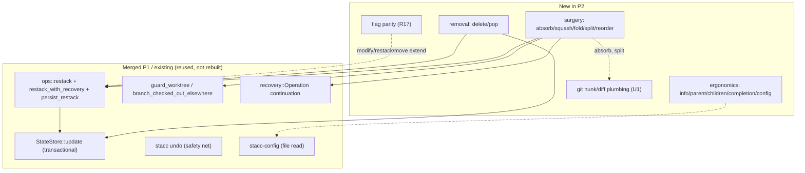
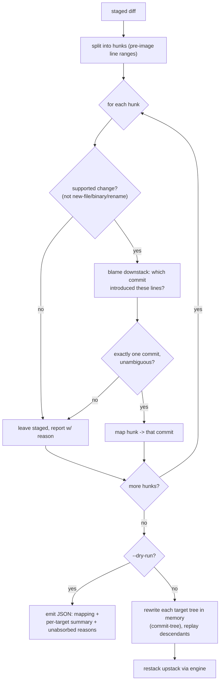

# P2: Daily-driver command parity

## Summary

Close the remaining graphite command gaps so stacc is the unconditional daily
driver: the mid-stack surgery toolkit (`absorb`, `squash`, `fold`, `split`,
`reorder`), branch removal (`delete`, `pop`), ergonomics (`info`, `parent`,
`children`, `completion`, `config`), and the daily-driver flag gaps on shipped
commands. P2 is additive and low-risk relative to P1: the hard architectural work
(transactional state, worktree-safety, conflict recovery, undo) is already merged,
so every mutating command here **builds on the merged P1 engine** rather than new
infrastructure. The one genuinely new plumbing is hunk-level git manipulation for
`absorb` and `split`; the other surgery commands are rebase-and-reparent operations
that reuse `ops::restack` + `restack_with_recovery` directly.

Every new command honors the stacc thesis (origin R21): non-interactive and
JSON-emitting by default, a structured error (never a silent prompt) when a
required input is missing under `--no-interactive` or off a TTY, with interactive
pickers reserved as a TTY-only convenience. The surgery commands in particular
ship a **scriptable form first** (a structured order spec, hunk-to-commit mapping
output, `--dry-run` preview), per the origin's inverted-interactivity constraint.

P2 and P1 were decoupled by design (origin Key Decision: "three projects split
along architectural risk"); P1 having landed first means P2's mutating surgery and
removal commands inherit worktree-safety (R3, via the merged P1 engine) and
transactional persistence automatically by routing through the shared engine.

---

## Problem Frame

The June-3 `close-graphite-gaps` batch took stacc to a complete single-agent daily
loop (`create`, `modify`, `restack`, `continue`/`abort`, navigation, `move`,
`rename`, `log`, `pr`, `merge`), and P1 made that loop safe for parallel agents.
What remains is the surface a graphite user reaches for once the loop itself is
solid:

1. **Mid-stack editing is absent.** graphite users lean on `absorb`, `squash`,
   `fold`, `split`, and `reorder` to reshape a stack in place; stacc has none of
   them. These are the commands that turn "a working stack" into "a reviewable
   stack."
2. **Branch removal is `untrack`-only.** There is no `delete` (drop a branch and
   its metadata, restacking children onto its parent) or `pop` (drop the current
   branch but keep its changes in the working tree).
3. **Ergonomics gaps.** No `info` (per-branch detail), `parent`/`children`
   (deterministic navigation primitives an agent scripts against), `completion`
   (shell tab-completion), or a `config` command (a get/set surface over the
   config files that exist but have no command).
4. **Flag-level gaps** on shipped commands that fall out of the daily driver:
   `create` (`--all`/`--onto`/`--insert`/`--patch`), `modify`
   (`--into`/`--all`/`--patch`/`--edit`), `restack`
   (`--downstack`/`--upstack`/`--only`), `move` (`--only`), `submit`
   (`--stack`/`--update-only`/`--draft`). Verified against the current surface in
   `crates/stacc/src/cli.rs`: `create` today is `name` + `--message`; `modify` is
   `--commit`/`--message`; `restack` is `--stack`; `move` is `--onto`; `submit` is
   `--description`.

The cost shape: stacc runs the loop well and runs it safely in parallel, but a
graphite user editing a stack mid-flight still drops back to raw git or graphite.
P2 closes that.

**What's already in place (verified in-tree, P1 merged to main):**
- `StateStore::update(closure)` (transactional read-modify-write under CAS) and
  the dead-but-tested `save` shim; `version_back`/`tips_at`/`load_version`.
- The restack engine `ops::restack(git, state, order, &mut applied)` returning a
  `RestackOutcome { restacked, skipped, worktree_skipped }`, plus the CLI's
  `restack_with_recovery(git, store, state, repo, order, make_op, command_deltas)`
  and `persist_restack`.
- `guard_worktree` (focused-op pre-flight) and the engine's worktree skip, both
  over `Git::branch_checked_out_elsewhere`.
- `Git` helpers: `rebase_onto`, `rebase_continue`/`abort`, `reset_hard`,
  `has_uncommitted_changes`, `merge_base`, `commit_amend`. **No** hunk/diff/apply
  helpers yet (U1 adds them).
- `recovery::Operation { Sync, Restack, Modify, Move }` continuation variants;
  `stacc undo` as a post-hoc safety net.

---

## Requirements Traceability

P2 implements origin requirements R6-R17 under cross-cutting R21, for actors A1
(coding agent, the primary driver) and A3 (human operator, who gets the
interactive conveniences). No new origin flows are defined for P2 (the origin
settles per-command semantics in this plan).

| Req | Command(s) | Units |
|---|---|---|
| R6 | `absorb` | U2 (and U1 substrate) |
| R7 | `squash` | U3 |
| R8 | `fold` | U4 |
| R9 | `split` | U5 (and U1 substrate) |
| R10 | `reorder` | U6 |
| R11 | `delete` | U7 |
| R12 | `pop` | U7 |
| R13 | `info` | U8 |
| R14 | `parent` / `children` | U9 |
| R15 | `completion` | U10 |
| R16 | `config` | U11 |
| R17 | flag parity on `create`/`modify`/`restack`/`move`/`submit`/`checkout` | U12, U13 |
| R21 | all new commands and flags | every unit |

(The origin gap table also marks `checkout --stack/--trunk/--all` as P2; U13 closes it
under R17 even though R17's prose enumerated only the other five commands.)

---

## Key Technical Decisions

### KTD-1: Surgery commands reuse the merged restack engine, not new infrastructure

Every mutating surgery command follows the established `modify`/`move` shape:
load state, perform the command-specific git mutation, then restack the affected
upstack through `restack_with_recovery` with a `command_deltas` closure carrying
any state change. This buys, for free:
- **Worktree-safety** (R3, P1): each focused surgery op calls `guard_worktree` on
  the branches it will rewrite before mutating; the engine skips elsewhere-checked-
  out branches during the restack pass.
- **Transactional persistence** (R1, P1): state writes go through `persist_restack`
  → `StateStore::update`, never the dead `save`.
- **Conflict recovery** (P1): a restack conflict surfaces structurally and resumes
  via `continue`/`abort`.

Two distinct recovery strategies, matched to whether the op can conflict
mid-stack (corrected during the prior-art + adversarial review; git-spice uses
exactly this split):
- **Atomic rollback (single anchor)** for ops that re-point at most one branch /
  rebase nothing that can conflict: `squash`, `fold`, and `split --by-commit`. The
  anchor is just the pre-op branch/HEAD hash, restored on any error (git-spice's
  detached-HEAD-with-deferred-reset, `squash/handler.go`). Because these **require
  the branch to be restacked onto its base first** (see below), their git step is a
  fast-forward / soft-reset that cannot conflict; the upstack restack that follows
  emits `Operation::Restack`.
- **Resumable continuation** for ops that re-point *N* branches and then rebase the
  chain, where any of the N rebases can conflict after earlier ones already
  applied: `reorder` and `split --by-file`. A single `pre_base` anchor cannot
  describe a conflict on branch k with 1..k-1 already rewritten, `abort` must
  restore *every* re-pointed base regardless of where the conflict landed, and
  `continue` must drain the remaining queue. These record a new
  `recovery::Operation` variant carrying the full reordered queue plus the
  `{branch → pre_base}` map, reusing the engine's existing remaining-queue conflict
  path. (The existing single-branch abort guard, "only roll back if the conflict
  hit the first branch", does **not** generalize and must not be reused for these.)

**Precondition for `squash`/`fold` (git-spice `VerifyRestacked`):** both refuse a
branch that is not already restacked onto its base, with a structured error. A
non-restacked branch's `reset --soft <base>` (squash) or fast-forward into the
parent (fold) would otherwise fold in commits that are not part of the branch's own
diff. `stacc undo` is the post-completion safety net regardless of which strategy
applies.

### KTD-2: `absorb` maps hunks by line annotation and applies them as in-memory tree rewrites

`absorb` distributes the staged hunks into the downstack commits that **introduced
the lines each hunk edits**, then restacks the upstack. This KTD was corrected
during the prior-art + adversarial review: the canonical absorb implementations
(Sapling `ext/absorb`, jj `lib/src/absorb.rs`) both do this and both reject the
weaker "first commit it applies cleanly to" heuristic, because a hunk's context
lines apply cleanly to *many* downstack commits, so "first clean apply" silently
rewrites the wrong commit.

- **Mapping: by line annotation, not apply-check.** For each changed file, blame /
  annotate the parent content over the downstack range and map each hunk's
  pre-image line range to the commit that **last touched those lines**. A hunk
  whose changed lines blame to more than one commit, or a pure insertion at a
  commit boundary, is **ambiguous** (jj is deliberately strict here) and is left
  unabsorbed. Apply-check is kept only as a fallback validity gate, never the
  mapper.
- **Apply: in-memory tree rewrite, not autosquash.** For each target commit,
  rebuild its tree with the absorbed hunks (`read_blob` → patch → `hash_object` →
  `write_tree` → `commit_tree`) and replay descendants onto the new commit ids,
  then restack the upstack through the engine. This is one transactional rewrite
  with **no rebase-in-progress window**. A `git rebase -i --autosquash` is
  explicitly rejected: it conflicts mid-stack and strands the repo in a non-stacc
  rebase that `stacc abort` refuses to clean up (`operations.rs` abort guard) and
  that no `recovery::Operation` can resume.
- **Ambiguous and unsupported changes are left staged and reported**, never
  prompted under `--no-interactive`. The reported set distinguishes *no match*
  from *unsupported change kind*: new files (no commit introduced them, jj
  `absorb.rs:124`), binary files and symlinks (no line hunks), renames (detect via
  `-M`; map the old path or report), and a target commit that becomes empty after
  absorbing (decide drop-vs-keep, report it).
- `--dry-run` emits, as JSON: the `{hunk → target commit}` mapping, a per-target
  summary (commit id + hunk count + short subject), and the unabsorbed set **with a
  reason string per hunk** (jj's `skipped_paths` shape), so an agent inspects an
  accurate preview before committing.

This is the hardest unit; its git plumbing is U1. References:
`jj/lib/src/absorb.rs` (cleanest Rust model), `sapling/.../ext/absorb/__init__.py`
(canonical linelog), `git-spice/internal/git/rebase_wt.go` (git-shelling restack).

### KTD-3: `split` ships a non-interactive by-file form; by-commit is the natural default

`split` divides the current branch into multiple branches (origin R9). Two
scriptable modes, no editor required:
- **by-commit** (default): each commit on the branch becomes its own stacked
  branch, in order. **Re-points refs at existing commits, no cherry-pick** ,
  create `refs/heads/<name>` at the already-existing commit hash and record
  `(branch, base.name, base.hash)` chaining each to its predecessor, then restack
  any prior upstack onto the new tip. This is git-spice's and graphite's mechanic
  (`internal/handler/split/handler.go` `SetRef` per split point); re-authoring
  would needlessly change commit ids that downstream PRs reference. Validate the
  whole spec (no duplicate/existing names; every commit resolves into
  `base..head`) **before** writing any ref (two-phase: validate → write refs →
  commit tracking state).
- **by-file**: `--by-file` maps pathspecs to new branch names. This is **novel
  territory**, no reference implements a non-interactive by-file split (all are
  interactive). It necessarily **re-authors** commits, so the whole upstack
  restacks. A single commit touching files in two groups (the hard case) is
  handled by **flattening** `base..head` and re-partitioning by pathspec
  (build each group's tree via `read-tree`/`checkout-index` restricted to its
  pathspecs → `commit-tree`; U1), accepting that by-file does **not** preserve
  original commit boundaries or authorship dates (documented cost). A by-file
  split that cannot cleanly partition (overlapping pathspecs, a path in no group)
  is a **structured error**, never a silent mis-split (which would be data loss).
- An interactive picker is a **TTY-only** convenience; off a TTY or under
  `--no-interactive`, a missing split spec is a structured error.

By-commit (cheap ref surgery) uses atomic rollback (the pre-op branch hash);
by-file (a rebasing re-author) uses the resumable-continuation recovery path
(KTD-1). References: `git-spice/internal/handler/split/handler.go`,
`git-spice/commit_split.go`.

### KTD-4: `reorder` takes a structured order spec, not an editor

`reorder` reorders the branches between the trunk and the current branch and
restacks descendants (origin R10). The non-interactive form is `--order
<b1,b2,...>` listing the downstack branches in their new bottom-up order. stacc
**strictly validates** the list is a permutation of exactly the current downstack
set, rejecting unknown names and duplicates (git-spice's `editStackFile`
validation in `internal/spice/stack_edit.go`), and erroring on a non-permutation
rather than graphite's permissive "re-parent whatever names appear". It re-points
each branch's recorded base to its new predecessor walking bottom-up, then restacks
the reordered chain.

Because reorder restacks N branches and **any one rebase can conflict after
earlier branches already re-pointed**, it is a *rebasing* operation: a one-shot
rollback anchor cannot unwind a conflict that lands on branch k with 1..k-1 already
rewritten. It records a **resumable continuation** (KTD-1), not a single anchor, so
a mid-restack conflict resumes via `continue` or unwinds fully via `abort`. This is
git-spice's `StackEdit`-over-`RebaseRescue` model (`internal/spice/rebase.go`).
graphite's editor reorder is the TTY-only convenience; off a TTY `--order` is
required.

### KTD-5: `delete` leaves an open PR alone by default; `--close` closes it

`delete` removes a branch and its stacc metadata, restacking its children onto its
parent (origin R11). Decisions (the origin deferred the open-PR default to
planning), grounded in graphite/git-spice:
- **Safety predicate** (mirror graphite's `isSafeToDelete`): allow without
  `--force` when the branch is *merged into its base*, **or** its recorded PR is
  CLOSED/MERGED, **or** its diff is empty; otherwise refuse and name `--force`. The
  empty-branch and merged-PR escape hatches are ones users hit often.
- An associated **open PR is left open by default**, confirmed best practice:
  neither graphite nor git-spice closes a PR on delete. `--close` is stacc's opt-in
  addition (closing a teammate-visible PR is a remote, hard-to-undo side effect).
- Reparent children onto the deleted branch's base (`child.base = deleted.base`),
  then restack.
- `pop` (origin R12) shares the removal-and-reparent core but **keeps the branch's
  changes in the working tree** via `git reset --mixed <base>` (the canonical
  graphite/Sapling mechanic: moves the ref to the base, leaves the diff as unstaged
  modifications; `--soft` would stage, `--hard` would discard). **Ordering matters:**
  reparent and restack children onto the base *while the branch's commits still
  exist*, **then** do the mixed reset, so the children rebase onto a real commit.
  Refuse `pop` on a dirty working tree (or define merge behavior) so the popped
  diff cannot collide with existing uncommitted changes. delete + pop land in one
  unit (U7).

### KTD-6: `config` is a get/set surface over the existing config files

`config` (origin R16) exposes a non-interactive get/set over the `.stacc.toml`
(repo-local) and user config that `crates/stacc-config` already reads (`read_file`,
`aliases_from_file`, `user_config_path`, `detect`, `resolve`). `stacc config get
<key>` / `set <key> <value>` / `list`, JSON-complete, with an interactive menu as a
TTY-only convenience. No new config storage, just a command over what exists.

### KTD-7: `completion` is generated from the clap command

`completion` (origin R15) emits shell tab-completion for bash, zsh, and fish via
`clap_complete` generated from the existing clap `Command`. Pure output, no state.

### KTD-8: Flag parity is additive, reusing existing command internals

The R17 flags extend shipped commands without reshaping them: `create`
(`--all`/`--onto`/`--insert`/`--patch`), `modify` (`--into`/`--all`/`--patch`/
`--edit`), `restack` (`--downstack`/`--upstack`/`--only`), `move` (`--only`),
`submit` (`--stack`/`--update-only`/`--draft`). Each keeps the non-interactive +
JSON contract. Grouped into two units by concern: content-staging flags (U12) and
scope flags (U13).

---

## High-Level Technical Design

### How P2 commands slot onto the merged engine

### `absorb` hunk-to-commit mapping (the novel flow)

Diagrams are authoritative for direction; prose governs on disagreement.

---

## Implementation Units

Grouped into five phases. U-IDs are stable. Most units are independent (the origin
calls P2 "additive, independent command builds"); the only hard dependency is the
shared hunk/blame plumbing (U1) that `absorb` (U2), `split --by-file` (U5), and
`create`/`modify --patch` non-interactively (U12) consume. Surgery and removal units
all depend on the merged P1 engine. Execution posture: the surgery units are the
most conflict-prone, so they are **test-first on the non-interactive contract** (a
failing integration test for the scriptable form before implementation); the others
proceed pragmatically.

### Phase A: Surgery substrate

### U1. Git hunk/diff plumbing (stacc-git)

**Goal:** Add the hunk-level git helpers `absorb` and `split --by-file` need: split a
staged diff into hunks with pre-image line ranges, blame/annotate which downstack
commit introduced each line, and rewrite a commit's tree in memory (`commit-tree`)
or carve a tree by pathspec. No command behavior change.

**Requirements:** R6, R9 (substrate). **Dependencies:** none.

**Files:**
- `crates/stacc-git/src/lib.rs` (new diff/hunk/blame/tree-rewrite helpers; inline tests)

**Approach:** Wrap the git plumbing the surgery commands need: `diff_hunks` (the
staged diff parsed into addressable hunks with pre-image line ranges),
`blame`/annotate over a file's downstack range (which commit last touched each
line, the absorb mapper per KTD-2), and the in-memory tree-rewrite primitives
absorb and by-file split use (`read_blob` → patch a blob → `hash_object` →
`write_tree` → `commit_tree`, plus a `read-tree`/`checkout-index` restricted to a
pathspec). `stacc-git` already has `write_tree`/`commit_tree`/`hash_object`/
`read_blob`/`update_ref`/`force_branch`, extend, don't duplicate. Note what is
**not** needed: no `apply --check`-as-mapper (apply-check is at most a fallback
validity gate, not the absorb mapper), no fixup/autosquash helper (KTD-2 rejects
autosquash), and by-commit split uses the existing `update_ref`/`force_branch` (no
cherry-pick). Mirror the existing exit-code/`output()` wrapper idiom; keep
`stacc-git` a thin typed shell over `git`.

**Patterns to follow:** the `rebase_onto` / `commit_tree` / `write_tree` wrappers in
`crates/stacc-git/src/lib.rs`.

**Test scenarios:**
- Happy path: a multi-hunk staged diff splits into the expected hunks with correct
  pre-image line ranges; blame over a downstack range attributes each line to the
  commit that introduced it.
- Edge: an empty staged diff yields zero hunks; a binary file and a symlink are
  reported as unsupported (not a panic); a new-file change has no blame attribution.
- Tree rewrite: `commit-tree`-ing a patched blob into a target commit's tree
  produces a new commit whose tree differs only in that blob; carving a tree by
  pathspec yields only the matched paths.

**Verification:** the helpers round-trip a known hunk into a known commit's tree on
a temp repo; blame attribution matches `git blame`; no existing command behavior
changes.

### Phase B: Stack surgery

### U2. `stacc absorb`

**Goal:** Distribute staged hunks into the downstack commits that introduced their
lines (by blame), applied as in-memory tree rewrites, restack the upstack, with
`--dry-run` and ambiguous/unsupported-left-unabsorbed.

**Requirements:** R6, R21. **Dependencies:** U1.

**Files:**
- `crates/stacc/src/cli.rs` (`Absorb(AbsorbArgs)` with `--dry-run`)
- `crates/stacc/src/lib.rs` (BUILTINS + dispatch)
- `crates/stacc/src/commands/operations.rs` (or new `commands/absorb.rs`)
- `crates/stacc/tests/absorb.rs` (new)

**Approach:** Per KTD-2. Pre-flight `guard_worktree` on the upstack. **Map** each
staged hunk by blame to the downstack commit that introduced its lines (U1);
ambiguous hunks (multi-commit blame, boundary insertions) and unsupported kinds
(new file, binary/symlink, rename, would-empty-a-commit) are left staged and
reported with a reason. **Apply** by rewriting each target commit's tree in memory
(`commit-tree`) and replaying descendants onto the new ids, no autosquash, no
rebase-in-progress window, then restack the upstack through `restack_with_recovery`
(`Operation::Restack`). `--dry-run` emits mapping + per-target summary +
unabsorbed-with-reasons JSON and exits without mutating.

**Execution note:** test-first on the `--dry-run` mapping contract (the agent-facing
surface) before the apply path.

**Test scenarios:**
- Happy path: two hunks blaming to two different downstack commits are each
  absorbed into the right commit; the upstack restacks; output names where each
  landed.
- Mapping correctness (load-bearing): a one-line edit whose surrounding context
  exists unchanged in several downstack commits lands in the commit that
  *introduced the edited line* (blame), not the newest commit it merely applies
  cleanly to.
- `--dry-run`: emits the `{hunk → commit}` mapping, per-target summary, and the
  unabsorbed set with reason strings; mutates nothing (working tree and refs
  unchanged).
- Ambiguous: a hunk whose lines blame to two commits, and a pure insertion at a
  commit boundary, are left staged and reported under `unabsorbed`, never prompted.
- Unsupported kinds: a new file, a binary file, and a staged rename are each left
  staged and reported with a distinct reason (not a silent drop, not a panic).
- No mid-rebase strand: an absorb that cannot complete leaves no rebase-in-progress
  and no half-rewritten branch (the repo is fully absorbed or untouched).
- Worktree-safety: an upstack branch checked out elsewhere makes `absorb` refuse
  with `worktree_conflict` before mutating.
- Conflict: an absorb whose upstack restack conflicts surfaces a structured
  conflict resumable via `continue`.

**Verification:** `absorb.rs` passes; a real staged change lands in the
blame-correct downstack commit and the upstack is rebased onto it; no rebase is ever
left in progress.

### U3. `stacc squash`

**Goal:** Squash all commits on the current branch into one, restack the upstack.

**Requirements:** R7, R21. **Dependencies:** none (engine only).

**Files:**
- `crates/stacc/src/cli.rs` (`Squash(SquashArgs)`; optional `--message`)
- `crates/stacc/src/lib.rs`, `crates/stacc/src/commands/operations.rs`
- `crates/stacc/tests/squash.rs` (new)

**Approach:** Per KTD-1, **refuse unless the branch is already restacked onto its
base** (git-spice `VerifyRestacked`); otherwise `reset --soft <base>` would fold in
commits that are not part of the branch's diff. `guard_worktree` on the upstack.
Then detach HEAD (deferred re-attach on early return = the atomic rollback anchor),
`reset --soft <base.hash>`, one `commit` with the oldest-first concatenated message
(or `--message`), and `SetRef`/`force_branch` the branch with the original tip as an
optimistic-lock guard. Restack the upstack via the engine (`Operation::Restack`).
Since the branch is pre-restacked, the squash itself cannot conflict (atomic
rollback, not a continuation).

**Test scenarios:**
- Happy path: a branch with three commits becomes one; the upstack restacks onto
  the squashed tip; the tree content is unchanged.
- Precondition: a branch not restacked onto its base is refused with a structured
  error, not silently squashed.
- Edge: a single-commit branch is a no-op (or a clear "nothing to squash").
- `--message`: overrides the squashed commit's subject; default is the oldest-first
  concatenation of the squashed commits' messages.
- Worktree-safety: refuses when the branch or an upstack child is checked out
  elsewhere.

**Verification:** `squash.rs` passes; `git log` shows one commit; content preserved.

### U4. `stacc fold`

**Goal:** Fold a branch's changes into its parent, reparent and restack
descendants; optional remote-PR close.

**Requirements:** R8, R21. **Dependencies:** none (engine only).

**Files:**
- `crates/stacc/src/cli.rs` (`Fold(FoldArgs)`; `--close` for the PR)
- `crates/stacc/src/lib.rs`, `crates/stacc/src/commands/operations.rs`
- `crates/stacc/tests/fold.rs` (new)

**Approach:** Per KTD-1, **refuse unless the branch is restacked onto its parent**
(git-spice `VerifyRestacked`), so the parent can absorb the child as a true
**fast-forward** (git-spice's `git fetch . <child>:<parent>` refspec, no checkout of
the parent). `guard_worktree`. Then ff the parent to the child tip, reparent the
child's children onto the parent (`child.base = parent` with the new hash), drop the
folded branch from state, and restack (a no-op or cheap, since descendant content
didn't move). Warn (non-interactive) before folding onto the trunk. Optionally close
the folded PR with `--close`. Fold re-points at most the immediate children and
cannot conflict once pre-restacked, so it uses the **atomic single anchor** (the
pre-fold base map), not a continuation.

**Test scenarios:**
- Happy path: `a → b → c`, folding `b` ff-merges `b` into `a`, reparents `c` onto
  `a`, and restacks `c`.
- Precondition: folding a branch not restacked onto its parent (parent not an
  ancestor) is refused with a structured error, never a forced ref move that drops
  the parent's commits.
- Edge: folding a branch with no children just ff-merges into the parent; folding
  onto the trunk warns.
- `--close`: closes the folded branch's PR (mock the GitHub call).
- Abort: an abort after a fold restores the pre-fold base map (children re-pointed
  back).
- Worktree-safety: refuses when the folded branch or a descendant is checked out
  elsewhere.

**Verification:** `fold.rs` passes; the parent contains the folded commits;
descendants reparented and restacked.

### U5. `stacc split`

**Goal:** Split the current branch into multiple branches; by-commit and by-file,
with by-file runnable non-interactively.

**Requirements:** R9, R21. **Dependencies:** U1.

**Files:**
- `crates/stacc/src/cli.rs` (`Split(SplitArgs)`; `--by-file <spec>`, optional names)
- `crates/stacc/src/lib.rs`, `crates/stacc/src/commands/operations.rs` (or
  `commands/split.rs`)
- `crates/stacc/tests/split.rs` (new)

**Approach:** Per KTD-3. **by-commit** (default): validate the whole spec first
(no duplicate/existing names; commits resolve into `base..head`), then create each
new branch ref **at the existing commit hash** (`update_ref`/`force_branch`, no
cherry-pick), chaining each `(branch, base.name, base.hash)` on its predecessor, and
restack any prior upstack onto the new tip, atomic rollback (pre-op hashes).
**by-file**: `--by-file` maps pathspecs to names; flatten `base..head`, carve each
group's tree by pathspec (`read-tree`/`checkout-index`), `commit-tree` a new commit
per group onto its predecessor (U1). Re-authoring changes commit ids, so the whole
upstack restacks; this is a *rebasing* op → resumable continuation (KTD-1). A spec
that cannot cleanly partition (a path in no group, overlapping groups) is a
**structured error**, never a silent mis-split (data loss). Track the new branches
transactionally. Off a TTY with no spec → structured error; the picker is TTY-only.

**Execution note:** test-first on the by-file spec contract (the non-interactive
surface the origin requires).

**Test scenarios:**
- Happy path (by-commit): a 3-commit branch splits into 3 stacked branches in
  order, each created at the *existing* commit hash (ids unchanged), each tracked,
  the stack restacked.
- Happy path (by-file): a spec mapping two disjoint pathspecs to two names yields
  two branches each carrying only its files; the upstack restacks.
- by-file straddling: a commit touching files in both groups is flattened and
  re-partitioned per pathspec (changes preserved across the two new branches); an
  unpartitionable spec is a structured error, not a silent drop.
- Validation: a duplicate or already-existing target name aborts before any ref is
  written (zero side effects).
- Error: `--by-file` off a TTY with no/empty spec is a structured error, not a
  prompt.
- Edge: a single-commit branch by-commit is a no-op or clear message.
- Worktree-safety + transactional tracking of the new branches.

**Verification:** `split.rs` passes; by-commit branches point at the original commit
hashes; by-file branches carry the right files with no lost changes; the stack
restacks.

### U6. `stacc reorder`

**Goal:** Reorder branches between the trunk and the current branch via a structured
order spec, restacking descendants.

**Requirements:** R10, R21. **Dependencies:** none (engine only).

**Files:**
- `crates/stacc/src/cli.rs` (`Reorder(ReorderArgs)`; `--order <list>`)
- `crates/stacc/src/lib.rs`, `crates/stacc/src/commands/operations.rs`
- `crates/stacc/tests/reorder.rs` (new)

**Approach:** Per KTD-4. **Strictly validate** `--order` is a permutation of exactly
the current downstack set (reject unknown names, duplicates, non-permutations) before
mutating. Re-point each branch's `base.name` to its new predecessor walking
bottom-up; restack the reordered chain through the engine. Because any of the N
rebases can conflict after earlier branches already re-pointed, reorder records a
**resumable continuation** carrying the remaining queue plus the `{branch →
pre_base}` map (per KTD-1), `continue` drains the queue, `abort` restores *every*
re-pointed base regardless of where the conflict landed. (Do **not** reuse the
single-branch Move abort guard.) Off a TTY with no `--order` → structured error;
editor reorder is TTY-only.

**Test scenarios:**
- Happy path: `main → a → b → c`, `--order c,a,b` re-points bases and restacks into
  the new order.
- Error: an `--order` with an unknown name, a duplicate, or a non-permutation of the
  downstack set is rejected with a structured error; off a TTY with no `--order` is
  a structured error.
- Edge: an order equal to the current order is a no-op.
- Conflict + continue: a reorder that conflicts on branch k (with 1..k-1 already
  re-pointed) is resumable via `continue` and drains the remaining queue.
- Conflict + abort: aborting a mid-reorder conflict restores *all* original bases,
  not just the first branch's.
- Worktree-safety on the reordered branches.

**Verification:** `reorder.rs` passes; recorded bases and git history reflect the
new order.

### Phase C: Branch removal

### U7. `stacc delete` and `stacc pop`

**Goal:** Remove a branch and its metadata, restacking children onto its parent
(`delete`); or remove the current branch but keep its changes in the working tree
(`pop`). Shared removal-and-reparent core.

**Requirements:** R11, R12, R21. **Dependencies:** none (engine only).

**Files:**
- `crates/stacc/src/cli.rs` (`Delete(DeleteArgs)` with `--force`/`--close`; `Pop`)
- `crates/stacc/src/lib.rs`, `crates/stacc/src/commands/operations.rs`
- `crates/stacc/tests/delete.rs`, `crates/stacc/tests/pop.rs` (new)

**Approach:** Per KTD-5. Shared core: remove the target from state, reparent its
children onto its base (the `untrack` reparent logic), restack the reparented
children, all transactionally. `delete` additionally deletes the git branch ref,
applying the **safety predicate** (allow without `--force` when merged-into-base OR
PR is CLOSED/MERGED OR diff is empty; else refuse and name `--force`), and optionally
closes its PR with `--close` (PR left open by default). `pop` keeps the branch's
changes via `git reset --mixed <base>`, and **orders the steps** so children are
reparented and restacked *before* the mixed reset (while the branch commits still
exist), refusing `pop` on a dirty working tree so the popped diff can't collide.
Both `guard_worktree` the branches they rewrite.

**Test scenarios:**
- `delete` happy path: `a → b → c`, deleting `b` reparents `c` onto `a`, restacks
  `c`, removes `b`'s ref and metadata; an associated open PR is left open.
- `delete` safety predicate: refuses an unmerged branch with an open PR without
  `--force`; allows when the PR is merged/closed, or the branch is merged into base,
  or the diff is empty; `--force` overrides; `--close` closes the PR (mocked).
- `pop` happy path: popping the current branch leaves its changes as unstaged
  modifications (`reset --mixed`), drops the ref, reparents children onto the base.
- `pop` ordering/dirty: children land on the base (not a dangling ref); `pop` on a
  dirty working tree is refused with a structured error.
- Edge: deleting the trunk is refused; deleting a leaf has no children to reparent.
- Worktree-safety: refuses to delete/pop a branch checked out elsewhere.

**Verification:** `delete.rs`/`pop.rs` pass; state, refs, children, and (for pop) the
working tree end in the expected shape; delete never closes a PR without `--close`.

### Phase D: Ergonomics

### U8. `stacc info`

**Goal:** Show per-branch detail (PR body, diff, patch, diffstat) in pretty and JSON.

**Requirements:** R13, R21. **Dependencies:** none.

**Files:**
- `crates/stacc/src/cli.rs` (`Info(InfoArgs)`; `--diff`/`--patch`/branch arg)
- `crates/stacc/src/lib.rs`, `crates/stacc/src/commands/` (read-only command)
- `crates/stacc/tests/info.rs` (new)

**Approach:** Read-only. Gather the branch's recorded base/PR (from state), its
commit metadata, and on request its diff/patch/diffstat vs. its base. Emit JSON
(the full object) and a pretty rendering. Reuse the GitHub client for PR body when
present (best-effort, like `pr`).

**Test scenarios:**
- Happy path: `info` on a tracked branch emits base, PR number/body (when present),
  and diffstat; `--diff`/`--patch` include the diff/patch.
- Edge: `info` on an untracked or trunk branch gives a clear structured result.
- JSON completeness: every pretty field is present in the JSON object.

**Verification:** `info.rs` passes; JSON carries the full per-branch detail.

### U9. `stacc parent` / `stacc children`

**Goal:** Print the parent and the children of the current branch deterministically.

**Requirements:** R14, R21. **Dependencies:** none.

**Files:**
- `crates/stacc/src/cli.rs` (`Parent`, `Children`)
- `crates/stacc/src/lib.rs`, `crates/stacc/src/commands/navigation.rs`
- `crates/stacc/tests/parent_children.rs` (new)

**Approach:** Read-only over state. `parent` prints the recorded base of the current
branch; `children` prints the branches whose recorded base is the current branch, in
deterministic (name) order. Reuse `ops::parent` / `ops::children` (already in
`crates/stacc-core/src/ops.rs`). JSON and pretty.

**Test scenarios:**
- Happy path: on a `main → a → b` stack, `parent` from `b` prints `a`; `children`
  from `a` prints `b`.
- Edge: `parent` of a trunk-based branch prints the trunk; `children` of a leaf is
  empty; a branched stack lists multiple children in name order.
- JSON shape is stable for scripting.

**Verification:** `parent_children.rs` passes; output matches `ops::parent`/`children`.

### U10. `stacc completion`

**Goal:** Emit shell tab-completion for bash, zsh, and fish.

**Requirements:** R15, R21. **Dependencies:** none.

**Files:**
- `crates/stacc/src/cli.rs` (`Completion(CompletionArgs)` with a shell value-enum)
- `crates/stacc/src/lib.rs`, `crates/stacc/src/commands/`
- `crates/stacc/tests/completion.rs` (new)
- `Cargo.toml` (add `clap_complete`)

**Approach:** Per KTD-7. Generate completion for the chosen shell from the clap
`Command` via `clap_complete`. Pure stdout output.

**Test scenarios:**
- Happy path: `completion bash` (and zsh, fish) emit non-empty scripts mentioning
  `stacc` subcommands.
- Error: an unknown shell value is a clap usage error.

**Verification:** `completion.rs` passes; generated scripts are non-empty and shell-shaped.

### U11. `stacc config`

**Goal:** A non-interactive get/set surface over the existing config files.

**Requirements:** R16, R21. **Dependencies:** none.

**Files:**
- `crates/stacc/src/cli.rs` (`Config(ConfigArgs)`: `get`/`set`/`list` subforms)
- `crates/stacc/src/lib.rs`, `crates/stacc/src/commands/`
- `crates/stacc-config/src/lib.rs` (a write path alongside the existing reads)
- `crates/stacc/tests/config.rs` (new)

**Approach:** Per KTD-6. `config get <key>` / `set <key> <value>` / `list` over the
repo-local `.stacc.toml` and user config that `stacc-config` already reads. Add a
minimal write helper to `stacc-config` (read-modify-write the TOML). JSON-complete;
an interactive menu is TTY-only. Define the key namespace (e.g. `trunk`, `remote`,
`aliases.<name>`).

**Test scenarios:**
- Happy path: `set trunk main` then `get trunk` round-trips; `list` shows all keys.
- Error: `get` of an unknown key is a structured error; `set` off a TTY with a
  missing value is a structured error, not a prompt.
- Edge: setting an alias key (`aliases.co=checkout`) persists and is read back by
  the alias loader.

**Verification:** `config.rs` passes; values persist to the config file and are read
back by the existing config loader.

### Phase E: Flag parity (R17)

### U12. Content-staging flags on `create` / `modify`

**Goal:** Add the daily-driver content flags: `create`
(`--all`/`--onto`/`--insert`/`--patch`), `modify` (`--into`/`--all`/`--patch`/`--edit`).

**Requirements:** R17, R21. **Dependencies:** U1 only for non-interactive `--patch`
(hunk selection); the rest depend on nothing new.

**Files:**
- `crates/stacc/src/cli.rs` (extend `CreateArgs`, `ModifyArgs`)
- `crates/stacc/src/commands.rs` (`create`), `crates/stacc/src/commands/operations.rs`
  (`modify`)
- `crates/stacc/tests/create.rs`, `crates/stacc/tests/modify.rs` (extend)

**Approach:** Additive flags reusing existing internals. `create --all` stages all
changes; `--onto <base>`/`--insert` control where the new branch lands. `modify
--into <branch>` targets a specific commit; `--all` stages; `--edit` rewords.
`--patch` selects hunks: **non-interactive `--patch` requires U1's hunk surface**
(so this flag is the one U1-dependent piece); off a TTY without a hunk spec it is a
structured error, never a prompt. Each keeps the non-interactive + JSON contract.

**Test scenarios:**
- `create --all` stages and commits all changes; `--onto`/`--insert` place the
  branch correctly; behavior with no flags unchanged.
- `modify --into` directs the change to the named branch; `--all` stages; `--edit`
  rewords; non-interactive contract preserved (`--patch` off a TTY errors, not
  prompts).
- Existing `create`/`modify` tests still pass.

**Verification:** extended `create.rs`/`modify.rs` pass; new flags behave per graphite.

### U13. Scope flags on `restack` / `move` / `submit` / `checkout`

**Goal:** Add the scope flags: `restack` (`--downstack`/`--upstack`/`--only`), `move`
(`--only`), `submit` (`--stack`/`--update-only`/`--draft`), and `checkout`
(`--stack`/`--trunk`/`--all`), the last closes the `checkout` row the origin gap
table marks P2, which the current `CheckoutArgs` (only a branch positional) lacks.

**Requirements:** R17, R21. **Dependencies:** none.

**Files:**
- `crates/stacc/src/cli.rs` (extend `RestackArgs`, `MoveArgs`, `SubmitArgs`,
  `CheckoutArgs`)
- `crates/stacc/src/commands/operations.rs` (`restack`, `move`),
  `crates/stacc/src/commands.rs` (`submit`, `checkout`)
- `crates/stacc/tests/restack.rs`, `crates/stacc/tests/move.rs`,
  `crates/stacc/tests/submit.rs`, `crates/stacc/tests/checkout.rs` (extend)

**Approach:** Additive flags that narrow the engine's `order` or the target set.
`restack --downstack`/`--upstack`/`--only` scope which branches the pass touches
(compute the order slice and pass it to `restack_with_recovery`). `move --only`
moves just the current branch without its upstack. `submit --stack` submits the
whole stack; `--update-only` skips creating new PRs; `--draft` opens drafts.
`checkout --stack`/`--trunk`/`--all` scope the interactive picker's candidate set
(current stack / trunk / all tracked); off a TTY they pair with the branch
positional or are a structured error. Each keeps the non-interactive + JSON contract.

**Test scenarios:**
- `restack --only` restacks just the current branch; `--downstack`/`--upstack` scope
  correctly; default unchanged.
- `move --only` moves the current branch alone, leaving its upstack on the old base.
- `submit --stack` submits all; `--update-only` updates without creating; `--draft`
  marks drafts (mock GitHub).
- `checkout --trunk` switches to the trunk; `--stack`/`--all` scope the picker
  candidate set; the bare branch positional still works.
- Existing tests for these commands still pass.

**Verification:** extended `restack.rs`/`move.rs`/`submit.rs`/`checkout.rs` pass;
scope flags behave per graphite.

---

## Scope Boundaries

### Deferred to follow-up work (plan-local sequencing)

- **Interactive pickers beyond the TTY convenience.** Each surgery command ships
  its scriptable form (the requirement); a richer interactive picker (graphite-style
  editor reorder, hunk-by-hunk absorb UI) can layer on later without changing the
  non-interactive contract.
- **Sub-hunk (line-level) absorb splitting.** KTD-2 treats each git hunk atomically;
  Sapling/jj can route different lines of one hunk to different commits. stacc
  absorbs strictly less in those cases (documented), and finer splitting can follow
  later without changing the contract.

### Deferred for later (from origin, P3)

- `get`, `freeze`/`unfreeze`, auth profiles, multi-trunk, `revert`, and the long
  tail of flag parity beyond the daily-driver subset.
- MCP server (thin wrapper over `stacc-core`, if demand appears).
- Additional forges (GitLab, Bitbucket).

### Outside this product's identity (from origin)

- Web dashboard / `app.graphite.com`, merge queue, web-based PR review (stacc is
  CLI-only).
- AI generation of branch names, commit messages, or PR prose (`--ai`). The agent
  authors PR prose; stacc supplies context.

---

## Risks & Dependencies

- **`absorb` (U2) is the highest-risk unit.** A wrong mapping silently rewrites the
  wrong commit. The prior-art review corrected the design to blame-based mapping
  (jj/Sapling), not apply-check, precisely because apply-check mis-routes. Residual
  mitigation: jj-strict ambiguity (leave unabsorbed); the `--dry-run` mapping (now
  blame-accurate) is the agent's pre-check; in-memory tree rewrite avoids any
  rebase-in-progress strand; `stacc undo` recovers after the fact. Getting hunk
  line-range and blame math right is the bulk of the risk.
- **Surgery conflict-recovery is two different shapes.** Atomic single-anchor ops
  (`squash`, `fold`, `split --by-commit`) cannot conflict once pre-restacked.
  Multi-branch rebasing ops (`reorder`, `split --by-file`) need a **resumable
  continuation**, a one-shot anchor cannot unwind a conflict that lands mid-chain,
  and the existing single-branch abort guard does not generalize. New
  `recovery::Operation` variants must be added carefully (the conflict path is where
  P1 regressions hid). Mitigation: characterization-first on the existing recovery
  tests; model reorder on git-spice's `RebaseRescue` continuation.
- **`split --by-file` is novel** (no reference implements non-interactive by-file
  split). The straddling-commit case is data-loss-prone: an unpartitionable spec is
  a structured error, never a silent mis-split. Mitigation: flatten-and-partition
  with explicit refusal; treat as a rebasing op for recovery.
- **`absorb`/`split` autosquash-free.** No command leaves a `git rebase -i
  --autosquash` in progress: `stacc abort` refuses a non-stacc rebase, so any
  autosquash strand would be unrecoverable via stacc. The in-memory `commit-tree`
  path (KTD-2) is the mitigation, using `stacc-git`'s existing tree primitives.
- **`stacc-git` grows hunk/blame plumbing.** U1 adds the first hunk/blame/tree-rewrite
  helpers; keep them thin and well-tested since absorb/split correctness rides on
  them. Binary/symlink/rename/CRLF edge cases in the staged diff are reported, never
  silently dropped.
- **`base.hash` freshness after surgery.** Squash and by-commit split rewrite tips;
  they must update each branch's recorded `base.hash` so the next restack doesn't
  unexpectedly fork-point-recover. Worth a characterization test.
- **Dependencies verified in-tree:** the merged P1 engine (`ops::restack` with the
  `applied` accumulator + `worktree_skipped`, `restack_with_recovery`,
  `persist_restack`, `guard_worktree`), `StateStore::update`, the
  `recovery::Operation` continuation, `stacc-config`'s file readers, `stacc-git`'s
  `write_tree`/`commit_tree`/`hash_object`/`read_blob`, and the current command/flag
  surface in `crates/stacc/src/cli.rs`.
- **External research was load-bearing.** The prior-art reference repos materially
  corrected three KTDs (absorb mapping, absorb apply, reorder recovery) and confirmed
  the delete open-PR default. References are local sibling repos: `../sapling`,
  `../jj`, `../git-spice`, `../graphite-cli`.

---

## Open Questions (deferred to implementation)

- **`absorb` `--dry-run` JSON schema**, the exact shape of the mapping, per-target
  summary, and unabsorbed-reason entries; settle against the real blame plumbing in
  U1/U2. (The mapping *algorithm*, blame, not apply-check, is settled in KTD-2.)
- **`split` by-file spec format**, inline `path=name` pairs vs. a file. (The
  straddling-commit *policy*, flatten-and-partition, refuse-if-unpartitionable, is
  settled in KTD-3.)
- **`reorder` order-spec syntax**, comma list vs. a richer spec. (Strict
  permutation validation is settled in KTD-4.)
- **`config` key namespace**, which keys are settable and the alias key form;
  settle in U11 against `stacc-config`'s shape, reporting source file in `list`.
- **`recovery::Operation` variant shapes**, whether `fold` reuses `Move { pre_base }`
  with a base-map snapshot vs. a named variant, and the exact `reorder`/`split
  --by-file` continuation record. The *strategy* (atomic anchor vs. resumable
  continuation, per op) is settled in KTD-1; the struct shapes settle when wiring
  `continue`/`abort`.

---

## Sources / Research

- Origin requirements: `docs/brainstorms/2026-06-07-graphite-swap-readiness-requirements.md`
  (P2 section R6-R17, cross-cutting R21, inverted-interactivity decision, the
  deferred-to-planning questions).
- Prior artifacts: `docs/plans/2026-06-03-001-feat-graphite-command-parity-plan.md`
  (the command-loop batch this extends), `docs/plans/2026-06-07-001-feat-parallel-agent-foundation-plan.md`
  (P1, the merged engine this builds on), `plans/stacc.md`, `plans/algorithms.md`.
- Prior-art reference repos (sibling repos under `../`, read during the doc-review
  pass; these materially corrected KTD-2 and KTD-4):
  - `../sapling`, `eden/scm/sapling/ext/absorb/__init__.py` (canonical linelog
    absorb; the blame-based mapping and leave-and-report ambiguity), `commands/uncommit.py`
    (pop semantics), `ext/amend/split.py`, `fold.py`.
  - `../jj`, `lib/src/absorb.rs` + `cli/src/commands/absorb.rs` (cleanest Rust
    blame-based absorb with strict ambiguity + in-memory tree rewrite).
  - `../git-spice`, `branch_split.go`, `internal/handler/split/handler.go` (by-commit
    = `SetRef` at existing hashes), `branch_squash.go` + `internal/handler/squash`
    (detach + soft-reset + `VerifyRestacked`), `branch_fold.go` (ff-merge via
    `fetch . child:parent`), `downstack_edit.go` + `internal/spice/stack_edit.go`
    (reorder permutation validation), `internal/spice/rebase.go` (`RebaseRescue`
    resumable continuation), `internal/git/rebase_wt.go` (git-shelling `rebase --onto`).
  - `../graphite-cli`, `apps/cli/src/actions/delete_branch.ts` (`isSafeToDelete`
    predicate, leaves PR open), `lib/engine/engine.ts` (`unbranch` = `reset --mixed`
    pop), `actions/show_branch.ts` (`info` field set), `user-commands/*` (config shape).
- Codebase (read directly): `crates/stacc/src/cli.rs` (current command/flag surface),
  `crates/stacc-git/src/lib.rs` (existing git wrappers, has `write_tree`/`commit_tree`/
  `hash_object`/`read_blob`; no hunk/blame helpers yet),
  `crates/stacc-core/src/ops.rs` (engine, `parent`/`children`/`upstack_order`),
  `crates/stacc/src/commands/operations.rs` (the `modify`/`move`/`restack` shape to
  mirror; the `abort` non-stacc-rebase guard), `crates/stacc-config/src/lib.rs`
  (config file readers).
