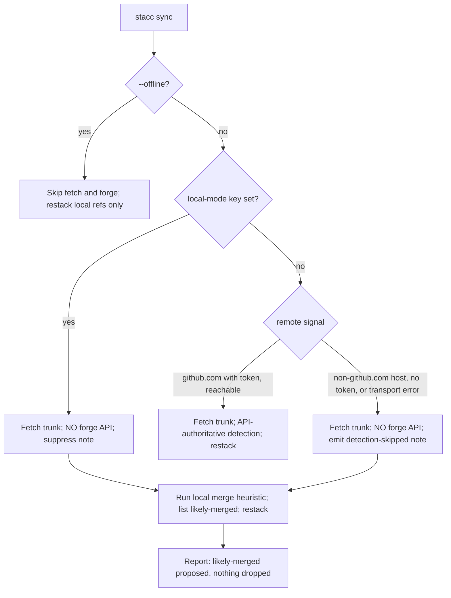
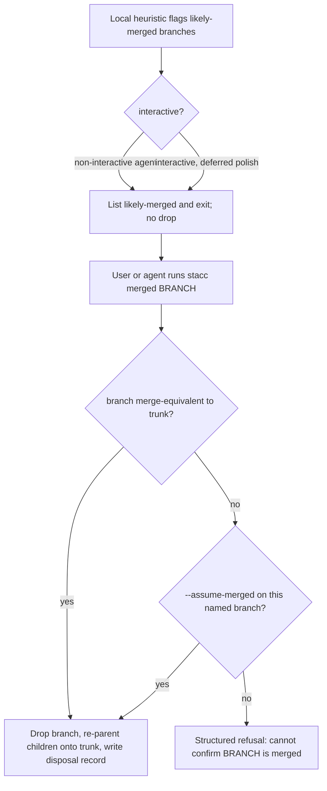

# feat: Forge-less local floor (slice 1)

## Summary

Make stacc's forge-less local experience first-class so an engineer on GitLab, on a locked-down GitHub, or on no usable forge gets the full stack loop without flag-spam. `sync` gains a third mode that fetches trunk and restacks while making zero forge API calls (distinct from `--offline`, which also skips the fetch); a propose-only local heuristic flags branches whose changes already landed in trunk; an explicit `stacc merged <branch>` disposes of them by dropping the branch, re-parenting its children onto trunk, and writing a disposal record; a per-repo `.stacc.toml` local mode selects the forge-less path repo-wide; and the forge-less surface carries forge-neutral copy. `submit` and `merge` stay GitHub-only this slice. Slice 2 (the forge-equal abstraction) is out of scope (see origin: `docs/brainstorms/2026-06-11-seamless-local-multi-forge-requirements.md`).

Each implementation unit is independently reviewable and squash-mergeable, lands on its own `jillian/sta-<n>-<slug>` branch, and uses crate-scoped conventional commits (`feat(stacc-git): ...`). The one genuinely net-new capability (a merge-equivalence git primitive) sits at the base so every later unit is an extension of existing machinery.

---

## Problem Frame

stacc's stack mechanics are already pure git, but six command areas reach the GitHub API, and STA-90 deliberately made a non-GitHub remote a hard error on `sync` (`github_client` in `crates/stacc/src/commands/operations.rs`) to kill a phantom-conflict data-safety bug. The only escape today is `--offline`, which skips both the upstream fetch and merged-PR detection. That leaves a real gap: a GitLab user, or a locked-down GitHub user whose API is unreachable, who wants "pull trunk, restack my stack, skip the forge" has no clean single command, and after an out-of-band merge their stack carries a phantom branch with no forge to detect it. Today they fall back to hand-rolled `git rebase`, because Graphite's repo/server init is a non-starter in those environments.

The design doc (`plans/algorithms.md`) previously rejected diff-based squash detection because, with an authoritative forge API, asking the forge is simpler and more reliable. That verdict was conditional on an API being present. This slice reverses it only for the forge-less floor: with no authoritative API reachable, a propose-only local heuristic is strictly better than the hard-error it replaces. The API-authoritative path stays the default whenever a GitHub remote and token are present.

---

## Requirements

Traceability to origin requirements (see origin: `docs/brainstorms/2026-06-11-seamless-local-multi-forge-requirements.md`).

**Forge-less sync and restack**

- R1. `sync` supports a mode that fetches trunk and restacks while making zero forge API calls, distinct from `--offline` (which also skips the fetch). Advanced by U4.
- R2. On that path a non-GitHub remote is not an error; an unreachable but real GitHub remote stays non-fatal yet still emits the merged-detection-skipped note (preserving the STA-94 loud-beats-silent contract). Advanced by U4.
- R3. `--offline` (skip both fetch and forge, restack local refs only) is unchanged for the no-network case. Advanced by U4.

**Merge reconciliation**

- R4. A local heuristic flags branches whose changes already appear in trunk as likely-merged, propose-only. Advanced by U1, U2.
- R5. An explicit `stacc merged <branch>` (or `--assume-merged` on a named branch) drops the branch and restacks its children onto trunk, and records the disposal. Advanced by U5.
- R6. Non-interactively, the path lists likely-merged branches and exits without dropping; the interactive confirm is deferred polish. Advanced by U4 (list), U5 (dispose).
- R7. A false negative is safe; the no-silent-loss guarantee is scoped to explicit per-branch disposition, and `--assume-merged` drops only the named, trunk-verified branch. Advanced by U2, U5.

**Local mode and configuration**

- R8. A per-repo `.stacc.toml` setting selects forge-less local mode, extending the currently-closed config key set. Advanced by U3.
- R9. In local mode, `submit` and `merge` stay GitHub-only with a clear, forge-generic message (no forge-specific URLs, no forge detection), not a crash. Advanced by U6.

**Forge-neutral surface**

- R10. Error, hint, and help text on the forge-less path do not assume GitHub. Advanced by U6.
- R11. No new per-flag "skip the forge" override is added; exact flag/mode names stay deferred. Honored by the design (U3/U4 select the mode via config, not a flag); documented in U6.

---

## Key Technical Decisions

- **KTD1. Forge-less engages via the local-mode config key and non-GitHub auto-detection, never a new "skip forge" flag.** R11 and the STA-90 plan both forbid multiplying the `--offline` / `--no-status` flag surface. Forge-less mode turns on when (a) the per-repo local-mode key is set, or (b) the remote is non-GitHub (R2 makes that non-fatal). `--offline` keeps its existing meaning (skip fetch too). This honors the flag-naming hold without inventing `--no-detect`.

- **KTD2. The merge heuristic is a net-diff patch-id check plus the existing `same_tree` and `is_ancestor` signals, propose-only, and deliberately reverses the `algorithms.md` API-only stance for the no-forge case.** `same_tree` (whole-tree identity) only catches a squash when trunk's tip tree still equals the branch's; it misses a squash after trunk advances. The new primitive computes the branch's net-diff patch-id and looks for a matching commit on trunk ahead of the fork point. The plan cites the reversal explicitly (see Problem Frame) so reviewers read it as an intentional floor. It catches the top-of-stack or single-branch squash only; a downstack branch that merges and advances trunk is out of reach, which is why the explicit `stacc merged` signal, not the heuristic, is the primary reconciliation route for multi-branch stacks (R7's conceded false negative). The patch-id match is a PROPOSE signal only and never authorizes a destructive drop on its own (see KTD4); it has known false positives (a reverted-then-overwritten change, an independent backport/cherry-pick of the same diff) and false negatives (the branch landed as several commits rather than one squash, a rename/binary/textconv-affected diff), all of which are safe precisely because the signal only proposes.

- **KTD3. `stacc merged` supplements `stacc delete` rather than replacing it, and the squash-merge propose notices repoint to `stacc merged`.** `delete` stays the general-purpose branch removal; `merged` is the merge-reconciliation-specific dispose that also writes a disposal record. The existing STA-90 tree-identical skip notice (and U2's likely-merged list) point users at `stacc merged <branch>` instead of `stacc delete`. The dispose routes through `reconcile_with` with `dropped = {branch}`, the exact path `sync` uses when the GitHub API reports a branch merged, so children re-parent and restack identically to the proven API-detected-merge path rather than via a hand-rolled `resolve_base` walk. This sidesteps the mid-stack reparent-target question (onto trunk vs onto a surviving local base) by reusing the one reconciliation path already known correct.

- **KTD4. `stacc merged` disposes only on a deterministic merge proof; the patch-id heuristic requires the `--assume-merged` override.** `stacc merged <branch>` disposes on its own only when a deterministic check proves the merge: `is_ancestor` (plain merge) or `same_tree` (tip-tree-identical). A patch-id net-diff match is a likely-merged PROPOSE signal, not proof, so when only the heuristic matches, `stacc merged` refuses with a structured error that names the branch and the reason (the agent's next step is informed, not blind) and requires the explicit `--assume-merged` to proceed. `--assume-merged` still requires an explicitly named branch, never the heuristic's flagged set wholesale. The branch tip OID is captured at verification and the branch ref is deleted with that expected old OID (a CAS delete), so a tip that moved between check and drop aborts rather than dropping the wrong commit. This keeps "propose, don't dispose" intact even in a non-interactive agent loop, and means a patch-id false positive can never silently drop unmerged work.

- **KTD5. The disposal record lives in replicated state; the drop, record, and keep-alive ref are two ordered atomic units (state-first), because git cannot span them.** The record is a new blob in the state tree, real wiring rather than a free inheritance: a `#[serde(default)]` field on `State` for back-compat (`crates/stacc-state/src/model.rs`), a write arm in `commit_state`, and a read arm in `load_at` (`crates/stacc-state/src/store.rs`); the CAS retry in `update` then carries it. Two atomic units are coordinated: (1) the state change (drop the branch from state, re-parent children, append the disposal record) is one compare-and-swap on `refs/stacc/data`; (2) the branch-ref delete plus the keep-alive ref write are one `git update-ref --stdin` transaction with old-OID guards. They run state-first, then the ref transaction, so a partial failure never loses recoverability: if the ref transaction fails after the state CAS, the branch ref still exists (re-trackable) and the record is already written. The keep-alive ref is `refs/stacc/dropped/<branch>-<short-sha>` (SHA-suffixed so re-using a branch name cannot orphan an earlier dropped tip) at the dropped tip; it is local-only (never pushed) and bounded by a retention cap mirroring the existing `UNDO_RETENTION` so the refs cannot bloat the repo. Recovery is re-creating the branch at that ref. The record is keyed by branch name plus tip SHA so a CAS replay stays idempotent, and it stores no remote URLs or tokens. The alternative (a `.git/`-local append, matching the conflict-context file precedent) is simpler but not durable across clones; the replicated record is preferred so a wrong drop is diagnosable on any checkout, with the accepted tradeoff that branch names, tips, and disposal history travel to collaborators who fetch `refs/stacc/data` (already true of existing per-branch state). (Confirmed with the user during planning.)

- **KTD6. Preserve the STA-94 loud-beats-silent contract; classify from signals stacc actually has.** `parse_remote` matches `github.com` literally, so stacc cannot tell a GitHub Enterprise host (`github.mycorp.com`) from a GitLab host by URL. Classification therefore keys on available signals, not an idealized remote-kind oracle: a `github.com` remote with a resolvable token stays the reachable, API-authoritative path; a `github.com` remote with no token (`GitHubError::MissingToken`) takes the forge-less path; any non-`github.com` remote (`parse_remote` returns `None`, which covers GitLab, Bitbucket, and GitHub Enterprise) also takes the forge-less path; and a transport error on the first API call (the only point a reachable-URL-but-network-down GitHub surfaces) drops to forge-less too. Auto-engaged forge-less always emits the merged-detection-skipped note (reusing the existing `detection_skipped` reporting); the note is suppressed only when the user has explicitly set the local-mode key (they opted in). So a GitHub Enterprise host, a temporarily-mirrored non-GitHub remote, or an unreachable GitHub can never silently skip detection. GitHub Enterprise stays out of scope this slice and falls into the noted forge-less path, not a silent one. Error and note copy names the remote but never prints the raw remote URL, which can carry `user:token@host` credentials.

- **KTD7. The sync tree-identical guard keeps its invariants.** The existing `same_tree` tree_guard stays sync-scoped, skip-with-notice (never mutates state), and surfaced in JSON. The net-diff heuristic relaxes the guard's zero-false-positive property, so the compensating safety control is "never auto-drop; only `stacc merged` disposes."

- **KTD8. The local-mode config key is the first legitimately repo-scoped behavioral mode.** The `stacc-config` key namespace is deliberately closed; prior plans rejected adding keys for auth (which is not repo-scoped). A per-repo forge-less mode is a deliberate, justified widening. Proposed key: a boolean `local` in `.stacc.toml`; the exact name is settled here and read per-invocation (file-only, like aliases), not threaded into persisted state.

---

## High-Level Technical Design

Two shapes carry the design: the tri-state remote classification that the forge-less `sync` mode introduces, and the propose-then-dispose reconciliation lifecycle. Prose remains authoritative where a diagram and the text disagree.

**Forge-less sync mode: remote classification and fetch/detect split.**

**Propose-then-dispose reconciliation lifecycle.**

---

## Implementation Units

### U1. Merge-equivalence git primitive (`stacc-git`)

- **Goal:** Add a forge-agnostic git primitive that reports whether a branch's changes already appear in trunk even after trunk has advanced, the squash-after-advance case the existing `same_tree` whole-tree check misses.
- **Requirements:** R4.
- **Dependencies:** none (leaf; unblocks U2 and U5).
- **Files:** `crates/stacc-git/src/lib.rs` (new method plus in-crate `#[cfg(test)] mod tests`).
- **Approach:** Compute the branch's net-diff patch-id with `git patch-id --stable` (the unstable default is sensitive to hunk ordering and has varied across git versions, producing intermittent false negatives) over the diff from `merge_base(trunk, branch)` to the branch tip, generating both sides with the same pinned diff options (`--no-renames`, `--no-ext-diff`, `--no-textconv`, fixed context) so the IDs are comparable across machines and git versions, and check it against the patch-ids of trunk commits ahead of the branch's recorded base hash (a bounded scan window, not all of trunk, so a long-lived trunk does not make every sync walk full history). A match means the branch's combined change is already on trunk (the clean-squash case). Short-circuit cheaply on `is_ancestor` (plain merge) and `same_tree` (tip-tree-identical) first. Return a typed result distinguishing "already in trunk" from "not found," with which signal fired (for evidence). Document in a rationale comment that the net-diff match is reliable only when no intervening trunk commit touched the branch's files: it catches the top-of-stack or single-branch squash, and a downstack branch whose merge advanced trunk (or a squash that required conflict resolution) reads as not-found, the conceded R7 false negative. This primitive feeds the PROPOSE path only (U2's list and the `stacc merged` refusal evidence); it never authorizes a drop on its own (KTD4), which is what makes its false positives (a reverted-then-overwritten change, an independent backport of the same diff) safe.
- **Patterns to follow:** `same_tree`, `is_ancestor`, `merge_base`, `fork_point` in `crates/stacc-git/src/lib.rs`; the exit-code `command(...).output()` match shape (as in `is_ancestor`) for status-driven checks and the `run(...)` stdout shape for parsing patch-ids.
- **Test scenarios:**
  - Happy: a single-commit branch squash-merged into trunk reports already-in-trunk via the net-diff patch-id match.
  - Happy: a multi-commit branch squashed into one trunk commit (with no intervening same-file trunk commit) reports already-in-trunk (net-diff patch-id of the whole range matches the squash commit), where per-commit `git cherry` would not.
  - Plain fast-forward merge reports already-in-trunk via the `is_ancestor` short-circuit.
  - Edge: a branch whose diff coincidentally matches a trunk commit is reported already-in-trunk (acceptable, propose-only downstream).
  - Edge (documents the limit): a downstack branch merged after trunk advanced is NOT reported already-in-trunk.
  - Edge (documents the limit): a single-branch squash preceded by a trunk commit that modifies the SAME file reports not-found, because the net diffs diverge (the conceded R7 false negative; the test asserts not-found so the limit is explicit, not silent).
  - Negative: an unmerged branch with distinct changes reports not-found.
  - Edge (false positive, safe because propose-only): a change landed then reverted on trunk still patch-id-matches the old commit and reports already-in-trunk; this is exactly why a patch-id match never disposes on its own (KTD4).
  - Edge (false negative): a branch landed as several separate commits on trunk (not one squash) reports not-found, since no single trunk commit matches the net-diff patch-id.
- **Verification:** The new primitive passes its unit tests against real temp-repo squash-then-advance scenarios; `cargo clippy --workspace --all-targets` is clean for the crate.

### U2. Propose-only merge detector (`stacc-core`)

- **Goal:** A forge-agnostic function that, given the tracked stack and trunk, returns the branches that look merged, with per-branch evidence, mutating no state. Used by the forge-less sync list (U4) to surface likely-merged branches; the dispose path (U5) verifies its single named branch directly via U1 rather than depending on this detector.
- **Requirements:** R4, R6, R7.
- **Dependencies:** U1.
- **Files:** `crates/stacc-core/src/ops.rs` (alongside `restack_forced`; a single classifier function does not warrant a new module) plus in-crate tests.
- **Approach:** Iterate tracked branches; classify each via U1's primitive plus `same_tree` and `is_ancestor`; collect the likely-merged set with the signal that fired as evidence. No state mutation, no dropping. Mirror the per-branch loop and the `tree_identical_skipped` accumulation already in `restack_forced`, returning a result struct shaped like `RestackOutcome`.
- **Patterns to follow:** `restack_forced` per-branch loop and `RestackOutcome` in `crates/stacc-core/src/ops.rs`; `resolve_base` for base walking.
- **Test scenarios:**
  - A stack with one squash-merged top branch returns exactly that branch, with evidence.
  - A downstack branch merged after trunk advanced is NOT returned (documents the R7 false negative).
  - A clean stack with no merges returns empty.
  - Evidence records which signal fired per flagged branch (ancestor vs tree-identical vs net-diff).
- **Verification:** Unit tests cover the flagged, not-flagged, and empty cases; the function performs no writes (asserted by running against a read-only state fixture).

### U3. Per-repo local-mode config key (`stacc-config`)

- **Goal:** Add a boolean `local` key to the closed config namespace, read per-invocation, that selects the forge-less path repo-wide.
- **Requirements:** R8 (and R11 by avoiding a per-command flag).
- **Dependencies:** none (independent of U1/U2).
- **Files:** `crates/stacc-config/src/lib.rs` (the `Key` enum, `Key::parse`, `Display`, the `Overrides` struct, `set_in_file` / `unset_in_file`, `resolve`, and a `local_from_file` helper) plus tests; `crates/stacc/src/commands/config.rs` (`Sources::resolve` / `load`, and the `list` rows).
- **Approach:** Add `Key::Local`; extend `Overrides` with `local: Option<bool>`; add the four `Key` arms (parse, Display, set, unset); add a `local_from_file` helper mirroring `aliases_from_file` so forge-touching commands read the mode per-invocation without threading it into persisted `RepoConfig`. Update the namespace-closure test to include the new key.
- **Patterns to follow:** `aliases_from_file` (file-only read), the `Key` match arms, and the `toml_edit` `set_in_file` / `unset_in_file` format-preserving write path in `crates/stacc-config/src/lib.rs`.
- **Test scenarios:**
  - `Key::parse("local")` round-trips through `Display`; unknown keys still return `None` (the namespace-closure test gains the new case).
  - `stacc config local true` writes the key format-preservingly and reads back; `stacc config --unset local` removes it.
  - Resolve precedence holds (flags over file over detected) with the new key present and absent.
  - `local_from_file` returns the file value and defaults to off when absent or the file is missing.
- **Verification:** Config round-trip and precedence tests pass; the `list` command shows the new key; clippy clean.

### U4. Forge-less sync mode (`stacc`)

- **Goal:** Add the third `sync` mode: fetch trunk and restack with no forge API, classified by the tri-state remote check, engaged by the local-mode key (U3) or a non-GitHub remote, surfacing U2's likely-merged list without dropping.
- **Requirements:** R1, R2, R3, R6 (list), R10 (forge-neutral copy on this path); covers F1.
- **Dependencies:** U2, U3 (sequenced after U5 so the advertised `stacc merged` command already exists).
- **Files:** `crates/stacc/src/commands/operations.rs` (`sync`, splitting `github_client` into a tri-state classifier, reusing the `detection_skipped` note and `report_sync` flag); integration test `crates/stacc/tests/sync.rs` (extend) or a new `crates/stacc/tests/sync_forge_less.rs`.
- **Approach:** Replace the single `github_client` hard-error with a classifier that keys on real signals (see KTD6): a `github.com` remote with a token stays the reachable API path; `parse_remote` returning `None` (any non-`github.com` host, including GitHub Enterprise) or a `MissingToken` on `github.com` takes the forge-less path; a `Transport` error on the first API call also drops to forge-less. On the forge-less path, run `reconcile_with` with the fetch enabled and detection skipped, then run U2 to list likely-merged branches via `report_sync` (proposed, nothing dropped). Emit the merged-detection-skipped note (reuse the existing `detection_skipped` eprintln and JSON field) on every auto-engaged forge-less run, suppressing it only when the local-mode key is explicitly set. `report_sync` gains a parameter to carry U2's likely-merged list. Leave `--offline` (skip fetch and forge) and the reachable-GitHub path unchanged. Never echo the raw remote URL.
- **Patterns to follow:** the existing `detection_skipped` eprintln plus `report_sync` JSON flag; `reconcile_with` (fetch already separated from detection); `fast_forward_trunk`; the `parse_remote`-returns-`None` usage-error sites for the non-GitHub branch.
- **Test scenarios:**
  - Covers AE4. Given a GitLab remote in local mode, `sync` fetches trunk and restacks with zero forge API calls.
  - Covers AE5. Given a GitLab remote with tracked branches, `sync` in local mode fetches trunk and restacks with no "not a GitHub URL" error.
  - Covers AE1. Given a likely-merged branch, `sync` run non-interactively lists it as likely-merged, drops nothing, and exits successfully.
  - Given an unreachable `github.com` remote with no local-mode key, `sync` emits the merged-detection-skipped note, marks it in JSON, and proceeds forge-less.
  - Given a GitHub Enterprise host (a non-`github.com` URL) with no local-mode key, `sync` auto-engages forge-less and emits the detection-skipped note rather than skipping silently.
  - Given the local-mode key set, the forge-less run suppresses the detection-skipped note (the user opted in).
  - Covers R3. Given `--offline`, no fetch occurs and the restack uses local refs only.
  - Error and note copy on the forge-less path never contains the raw remote URL.
- **Verification:** The forge-less integration tests pass against temp repos with GitLab-style and unreachable remotes; the reachable-GitHub path is unchanged (existing `sync` tests still pass).

### U5. `stacc merged` disposer and disposal record (`stacc`, `stacc-state`)

- **Goal:** The explicit dispose command: `stacc merged <branch>` drops a branch proven merged (or asserted via `--assume-merged`), routes the drop and child re-parent through `reconcile_with`, and records the disposal with a keep-alive ref (the state and ref plumbing lands in U7). Register the subcommand.
- **Requirements:** R5, R7; covers F2 (dispose half).
- **Dependencies:** U1 (the deterministic and patch-id checks), U7 (disposal state plumbing and keep-alive-ref helper).
- **Files:** `crates/stacc/src/commands/removal.rs` (new `merged` handler); `crates/stacc/src/cli.rs` (`Command::Merged` variant in alphabetical position, `MergedArgs` with `--assume-merged`); `crates/stacc/src/lib.rs` (`BUILTINS` entry and `dispatch` arm); `crates/stacc/src/commands.rs` (re-export); integration test `crates/stacc/tests/merged.rs`. (The disposals blob, the keep-alive-ref transaction helper, and retention live in U7.)
- **Approach:** `stacc merged <branch>` captures the branch tip OID, then verifies the merge: a deterministic `is_ancestor` or `same_tree` match disposes; a patch-id-only match (U1) refuses with a structured error naming the branch and the reason, requiring `--assume-merged` to proceed (KTD4). On dispose it routes `dropped = {branch}` through `reconcile_with` (sync's proven reparent-and-restack path, so children reparent correctly by construction), appends the disposal record, then via U7's helper writes the `refs/stacc/dropped/<branch>-<short-sha>` keep-alive ref and deletes `refs/heads/<branch>` in one guarded `git update-ref --stdin` transaction against the captured OID, state-first then refs (KTD5). `--assume-merged` requires an explicitly named branch and never the flagged set wholesale. Repoint the STA-90 tree-identical notice and U2's list at `stacc merged`. No PR close by default (forge-neutral); a best-effort `--close` stays GitHub-gated if added later.
- **Patterns to follow:** `reconcile_with` and `cleanup_merged_refs` in `crates/stacc/src/commands/operations.rs` (the reconcile-then-ref-cleanup order this dispose mirrors); `ensure_safe_to_delete` and the `delete` / `pop` clap-to-handler registration in `crates/stacc/src/commands/removal.rs`; the alphabetical `Command` ordering test and the `BUILTINS` array; U7's disposal-state and keep-alive helpers.
- **Test scenarios:**
  - Covers AE2. `stacc merged B` on a branch provably merged onto trunk (`is_ancestor` or `same_tree`) removes B, re-parents its children via `reconcile_with`, writes a disposal record, and leaves a `refs/stacc/dropped/B-<sha>` keep-alive ref.
  - Covers AE3 / R7. When only the patch-id heuristic matches (not `is_ancestor`/`same_tree`), `stacc merged B` refuses with a structured reason and drops nothing; `stacc merged B --assume-merged` on that named branch drops it.
  - A tip that moves between verification and drop aborts (the expected-old-OID guard fires) rather than dropping the wrong commit.
  - `--assume-merged` never drops more than the single named branch.
  - Mid-stack: `stacc merged B` re-parents B's children exactly as a sync-detected merge of B does (both route through `reconcile_with`), so the reparent target matches the proven path.
  - State-first ordering: if the ref transaction fails after the state CAS, the branch ref still exists and is re-trackable and the disposal record is present (no unrecoverable loss).
  - Structured errors for branch-not-found, dirty worktree, or current-branch cases; no raw remote URL echoed.
- **Verification:** `merged` integration tests pass; the new subcommand appears in alphabetical help; clippy clean.

### U6. Forge-neutral surface and GitHub-only boundary (`stacc`)

- **Goal:** R9 and R10: in local or forge-less mode, `submit` and `merge` are unavailable with a clear, forge-generic message (no forge-specific URLs, no forge detection), not a crash; and the forge-less path's errors, hints, and help read forge-neutrally. Document that R11 is satisfied by the config-key design.
- **Requirements:** R9, R10, R11 (documentation); covers F3.
- **Dependencies:** U4 (mode detection).
- **Files:** `crates/stacc/src/commands/operations.rs` (the `submit` / `merge` boundary messages and forge-less-path copy), plus help and hint strings; integration coverage in `crates/stacc/tests/` (the relevant submit/merge test files).
- **Approach:** Sweep the forge-less-path user-facing strings to forge-generic phrasing. The in-mode `submit` / `merge` boundary returns a forge-generic message ("push your branch and open a change through your forge"), reusing the existing `parse_remote`-returns-`None` usage-error pattern, with no forge-specific URL construction and no forge detection. Confirm no new "skip the forge" flag was introduced (R11) and note the flag-naming hold in the relevant help text. Never echo the raw remote URL.
- **Patterns to follow:** the existing `Error::Usage` "remote ... is not a GitHub URL" sites and `github_client` in `crates/stacc/src/commands/operations.rs`.
- **Test scenarios:**
  - Covers F3. A GitLab or forge-less repo running `submit` gets a forge-generic boundary message, a non-zero exit, no crash, and no forge-specific URL.
  - Help and hint text on the forge-less path names the forge generically rather than assuming GitHub.
  - No forge-less message contains a raw remote URL.
- **Verification:** Boundary-message integration tests pass; a grep of forge-less-path strings shows no GitHub-specific assumptions and no raw-URL interpolation; clippy clean.

### U7. Disposal state plumbing and keep-alive refs (`stacc-state`)

- **Goal:** Add the persisted disposal record and the keep-alive-ref lifecycle the disposer (U5) builds on: a back-compatible state field, an atomic keep-alive-and-delete ref helper, bounded retention, and the documented recovery path.
- **Requirements:** R5 (disposal record), R7 (recoverability).
- **Dependencies:** none (`stacc-state` and `stacc-git` only; lands before U5).
- **Files:** `crates/stacc-state/src/model.rs` (a `#[serde(default)]` `disposals` field on `State`); `crates/stacc-state/src/store.rs` (write arm in `commit_state`, read arm in `load_at`, a helper that writes `refs/stacc/dropped/<branch>-<short-sha>` and deletes `refs/heads/<branch>` as one `git update-ref --stdin` transaction with old-OID guards, and a retention prune of `refs/stacc/dropped/*` beyond the cap); in-crate tests.
- **Approach:** Add a `disposals` blob keyed by branch plus tip SHA, `#[serde(default)]` so state written by the current schema still deserializes. Provide the keep-alive-and-delete ref helper (one guarded ref transaction) and a prune capping `refs/stacc/dropped/*` (mirroring `UNDO_RETENTION`). Keep the dropped refs local-only by excluding them from the `refs/stacc/data` push refspec. Document the recovery procedure (re-create the branch at its keep-alive ref); a first-class `stacc restore` / `stacc dropped prune` command is deferred.
- **Patterns to follow:** the `State` / blob layout, `commit_state` / `load_at`, the `update` CAS loop, `UNDO_RETENTION`, and the push refspec in `crates/stacc-state/src/store.rs`; the `update_ref` / `delete_ref` CAS wrappers in `crates/stacc-git/src/lib.rs`.
- **Test scenarios:**
  - Back-compat: state written without `disposals` deserializes under the new schema; a record round-trips through a state push/fetch.
  - The keep-alive helper writes `refs/stacc/dropped/<branch>-<sha>` and deletes `refs/heads/<branch>` atomically; a stale expected-OID aborts both.
  - Re-using a branch name produces a distinct keep-alive ref (SHA-suffixed), so an earlier dropped tip is not orphaned.
  - Retention prune removes the oldest dropped refs beyond the cap; dropped refs are not included in the state push.
  - Recovery: re-creating a branch at its keep-alive ref restores the dropped commits.
- **Verification:** state and ref-helper unit tests pass; old-state fixtures deserialize; dropped refs stay local; clippy clean.

---

## Scope Boundaries

**Deferred for later (slice 2 and beyond)**, carried from origin.

- The forge trait plus GitLab end-to-end (open, merge, and detect MRs), the neutral change vocabulary migration, self-hosted base-URL support, and forges past GitLab.
- Replacing the heuristic with forge-authoritative merge detection on non-GitHub forges; that arrives per forge as slice 2 fills in.

**Outside what stacc will fix (platform-policy limits)**, carried from origin.

- Stacking requires push access to the shared repo; a developer who cannot push branches gets local stack management only, with no submit on any forge.
- Repos that dismiss approvals when a change's base branch moves are fundamentally incompatible with restacking; the only remedy is reconfiguring the repo.

**Deferred to Follow-Up Work**, plan-local.

- Empirical tuning of the heuristic's confidence behavior (false-positive rate against real squash histories) is a post-ship measurement, a strong `/ce-compound` candidate once slice 1 lands.
- An interactive confirm-to-drop affordance on the reconcile path (R6 marks it deferred polish, not slice 1).
- A best-effort `--close` on `stacc merged` (GitHub-gated) is not required this slice.
- A first-class `stacc restore` / `stacc dropped prune` command. Slice 1 keeps the dropped tip reachable (keep-alive ref), bounds retention, and documents the manual recovery; the polished restore and prune UX is deferred.

---

## Risk Analysis and Mitigation

| Risk | Severity | Mitigation |
|---|---|---|
| `stacc merged` drops an unmerged branch (data loss) | High | Patch-id never disposes on its own; `stacc merged` disposes only on a deterministic `is_ancestor`/`same_tree` proof and otherwise requires `--assume-merged` on a named branch; the tip is OID-guarded at drop; the state change and the keep-alive-plus-delete ref transaction run state-first, so a partial failure leaves the branch re-trackable and the record written, and recovery re-creates the branch at the kept tip (KTD4, KTD5). |
| Keep-alive `refs/stacc/dropped/*` accumulate and bloat the repo | Low | SHA-suffixed (no name-reuse orphaning), local-only (never pushed), and pruned to a retention cap mirroring `UNDO_RETENTION` (U7, KTD5). |
| Heuristic false positives flag unmerged branches | Medium | Never auto-drop; non-interactive path lists and exits (KTD7). A patch-id-only match cannot dispose without an explicit `--assume-merged`, so a false positive is at most a noisy proposal, never a silent drop. |
| Net-diff patch-id primitive is net-new with no reference | Medium | Isolated in U1 as a leaf; `git patch-id --stable` with matched diff options for reproducibility; tests cover squash, squash-after-advance, and the same-file-advance not-found case, so the conceded false negatives are asserted, not silently assumed. |
| Forge-less mode silently skips detection (unreachable GitHub, GitHub Enterprise, or a non-GitHub mirror) | Medium | Auto-engaged forge-less always emits the merged-detection-skipped note; the note is suppressed only when the user explicitly sets the local-mode key, so GHE and mirror remotes cannot silently skip detection (KTD6). |
| Raw remote URL leaks credentials in an error or note | High | All forge-less copy names the remote without printing its URL (KTD6); covered by U4 and U6 tests. |
| Widening the closed config namespace invites future creep | Low | The local-mode key is justified as the first repo-scoped behavioral mode; auth stays out of config (KTD8). |
| Disposal-record storage choice constrains portability | Low | Resolved to the replicated state blob (CAS-safe, travels with the repo), with the local-file alternative recorded (KTD5). |

---

## Dependencies and Sequencing

- U1 (merge-equivalence primitive), U3 (config key), and U7 (disposal state plumbing) are independent leaves.
- U2 (detector) depends on U1.
- U5 (`stacc merged` command) depends on U1 and U7.
- U4 (forge-less sync mode) depends on U2 and U3, and is sequenced after U5 so `sync` never advertises `stacc merged` before the command exists.
- U6 (forge-neutral copy) depends on U4.

Suggested order: U1, U3, U7 (parallelizable leaves), then U2, then U5 (disposer), then U4 (sync-list), then U6 last. Each unit is its own `jillian/sta-<n>-<slug>` branch with crate-scoped conventional commits and squash-merge, landing the plan as the first commit per the project convention.

---

## Acceptance Examples Trace

| Origin AE | Covered by | Test home |
|---|---|---|
| AE1 (non-interactive lists likely-merged, no drop) | U4 | `crates/stacc/tests/sync.rs` (or `sync_forge_less.rs`) |
| AE2 (`stacc merged B` drops and re-parents) | U5 | `crates/stacc/tests/merged.rs` |
| AE3 (coincidental match never dropped) | U5 (refusal), U4 (list) | `crates/stacc/tests/merged.rs` |
| AE4 (GitLab local-mode sync, zero forge API) | U4 | `crates/stacc/tests/sync_forge_less.rs` |
| AE5 (non-GitHub remote fetched without error) | U4 | `crates/stacc/tests/sync_forge_less.rs` |

---

## Sources and Research

- Origin requirements: `docs/brainstorms/2026-06-11-seamless-local-multi-forge-requirements.md`.
- sync flow, `--offline` gating, `github_client` hard error, `detection_skipped` note, `reconcile_with`: `crates/stacc/src/commands/operations.rs`.
- SyncArgs and CLI registration (alphabetical `Command`, `BUILTINS`): `crates/stacc/src/cli.rs`, `crates/stacc/src/lib.rs`.
- restack engine, `same_tree` tree_guard, `resolve_base`: `crates/stacc-core/src/ops.rs`.
- git wrappers (`same_tree`, `is_ancestor`, `merge_base`, `fork_point`, `fetch`); no patch-id/cherry primitive exists today: `crates/stacc-git/src/lib.rs`.
- config `Key` namespace, `Overrides`, `resolve`, `aliases_from_file`, `set_in_file`: `crates/stacc-config/src/lib.rs`, `crates/stacc/src/commands/config.rs`.
- removal core and safety predicate (`remove_and_restack_children`, `ensure_safe_to_delete`): `crates/stacc/src/commands/removal.rs`.
- state model and CAS save path (`refs/stacc/data`): `crates/stacc-state/src/store.rs`, `crates/stacc-state/src/model.rs`.
- Prior design and the API-only squash-detection verdict this slice reverses for the forge-less case: `plans/algorithms.md`, `plans/stacc.md`.
- STA-90 / STA-94 prior work (tree guard, loud-beats-silent, never echo remote URL): `docs/plans/2026-06-10-001-fix-sync-credential-loud-failure-plan.md`.
- git-spice reference (is-ancestor-only local detection; the net-diff half is net-new): `../git-spice/internal/forge/forge.go` and `../git-spice/` local detection.
- Conventions (`AGENTS.md`): crate-scoped conventional commits, squash-merge only, `jillian/sta-<n>-<slug>` branches, cite clippy/Rust Book for idiom claims, explain in response not comments.
