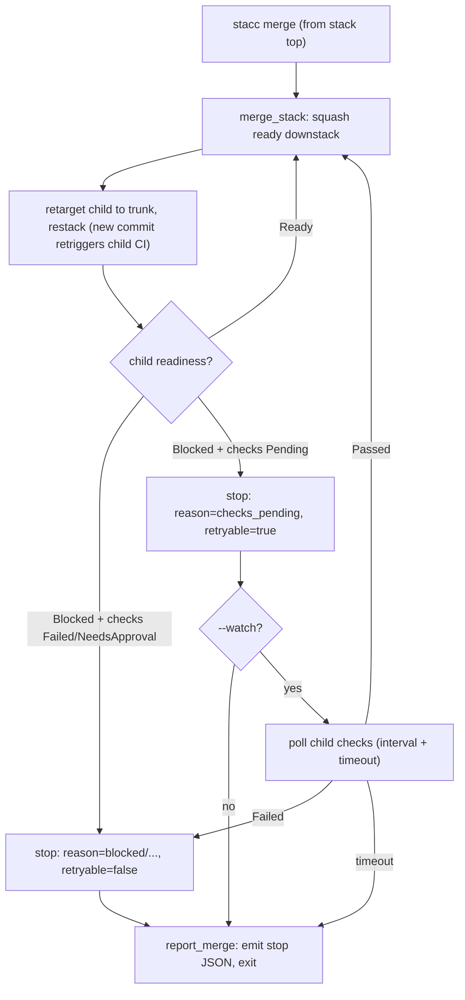

# feat: Dogfood stack: create `-a` gitignore fix, merge CI-wait ergonomics, version stamping

A three-PR stack found during 2026-06-16 dogfooding. Each issue is one branch in the stack, landed bottom to top: **STA-117** (a `create -a` / `modify -a` footgun) at the base, **STA-118** (smoothing the stacked-merge CI-wait stop) in the middle, **STA-116** (version stamping) at the top so it rides last and the v0.2.0 release reflects all three fixes.

This whole stack is itself a dogfood: the lifecycle (`create`, `submit`, `sync`, `merge`) is driven through `stacc` on the real GitHub repo. Any bug or papercut hit while running it gets filed as a new Linear issue (Team STA) rather than worked around silently. STA-118, fixing the merge flow, is the most pointed example: we land the stack with today's merge (manual poll-and-re-merge) and the new `--watch` only helps the *next* stack.

---

## Problem Frame

Three independent defects/papercuts surfaced while using `stacc` to manage `stacc`:

- **STA-117** (fix, low priority): `stacc create -a` and `stacc modify -a` run `git add -A`. When the same change adds a path to `.gitignore` (the original trigger: ignoring the `.tokensave/` index dir), the still-untracked dir is swept into the commit "before the new ignore takes effect." Chicken-and-egg between the ignore edit and the sweep.
- **STA-118** (feat): merging from the top of a stack squash-merges the ready bottom PR, retargets the child to trunk, and restacks it (a new commit), which retriggers the child's CI. The merge then correctly **stops** at the child because its CI is pending. Correct and safe, but the operator (human or agent) has to poll the child's CI and re-run `merge` once green. The JSON stop already carries `kind: not_ready` plus a neutral `readiness`, but "waiting on CI" (poll-and-retry) is not distinguishable from a hard block (conflict, review required).
- **STA-116** (fix, low priority): `stacc --version` reports `stacc 0.1.0`, unchanged since the v0.1.0 release, despite STA-104/107/108 and others landing major features. A from-source dogfood build is indistinguishable from the published release, which hurts bug reports (you cannot tell which build you are on).

## Scope

In scope: the three fixes above as a stacked set of PRs, plus the version bump to **0.2.0** that cuts the next release.

Out of scope: the mechanical release itself (git tag, cargo-dist run). The plan covers the version *mechanics*; cutting v0.2.0 is a post-merge operational step documented in [Operational / Rollout Notes](#operational--rollout-notes), not an implementation unit.

---

## Key Technical Decisions

- **KTD-1 (STA-117): real fix, not a doc note.** Make `-a` honor the about-to-be-committed `.gitignore` state instead of documenting `-a` as literal `git add -A`. The fix is shared by both call sites (`create --all` and `modify --all`), which both call `Git::stage_all` today.
- **KTD-2 (STA-117): stage `.gitignore` first, then sweep, with the exact git mechanism confirmed by a failing repro.** Directional approach: stage the `.gitignore` delta before `git add -A` so the new ignore rules are authoritative for the sweep. The precise reason the dir lands in the commit today (a plain `git add -A` already consults the working-tree `.gitignore`, so the live repro likely involves an already-tracked path inside the dir) is an execution-time investigation. The implementer writes the failing repro first; if it shows an already-tracked-but-now-ignored path, the fix also drops those paths from the index (`git rm --cached`). See [Deferred Implementation Notes](#deferred-implementation-notes).
- **KTD-3 (STA-118): both halves, stop-reason first.** Surface a distinct, retryable "waiting on CI" stop reason **and** add `stacc merge --watch`. The stop-reason work is the floor (cheap, high agent value) and `--watch` builds on it.
- **KTD-4 (STA-118): derive "retryable" from `ChecksState`, do not overload `MergeReadiness`.** The neutral model already distinguishes `ChecksState { Pending, Passed, Failed, NoChecks }`. Add a `MergeRejectionReason::ChecksPending` variant (neutral wire `checks_pending`) and a `retryable` boolean on the merge stop envelope, derived at the gate when `readiness == Blocked` and `checks == Pending`. Keep `MergeReadiness` as the coarse display signal it already is, rather than adding a CI-pending readiness variant that each forge would have to map.
- **KTD-5 (STA-116): hand-rolled `build.rs`, no new dependency.** Add `crates/stacc/build.rs` that shells `git` and emits `cargo:rustc-env=STACC_VERSION`, with a graceful fallback to `env!("CARGO_PKG_VERSION")` when `.git` or the `git` binary is absent. Chosen over `vergen` / `shadow-rs` / `built`: the task is one version string, the crates add a dependency tree and MSRV pressure (vergen is now MSRV 1.95), and the hand-rolled script gives full control over the fallback and the rebuild triggers. (See [Sources & Research](#sources--research).)
- **KTD-6 (STA-116): compose `0.2.0 (<short-sha>[-dirty])` from `CARGO_PKG_VERSION` + `git rev-parse --short HEAD`.** `git describe --tags` only yields the `X.Y.Z-N-gHASH` form once a matching tag is reachable, and the authoritative version is the workspace version, so the displayed string is built from `CARGO_PKG_VERSION` plus the short hash and a dirty flag. Release tarballs with no `.git` fall back to plain `0.2.0`.
- **KTD-7 (stack shape): one branch per issue, code-independent but PR-stacked.** The three fixes touch disjoint files and have no cross-issue code dependency, but they are stacked per the request so STA-116 rides last and the release reflects the full set. `USER_AGENT` (in `stacc-github`) stays on `CARGO_PKG_VERSION`, not `STACC_VERSION`, so a dev build's dirty/hash suffix never leaks into the GitHub API user-agent.

---

## High-Level Technical Design

### Stack shape (bottom to top)

```mermaid
graph BD
    trunk["main (trunk)"]
    a["STA-117 · create/modify -a gitignore fix<br/>crates/stacc/src/commands.rs, operations.rs, stacc-git"]
    b["STA-118 · merge CI-wait ergonomics<br/>stacc-forge model, stacc-github forge, merge command"]
    c["STA-116 · version stamp + bump to 0.2.0<br/>build.rs, cli.rs, root Cargo.toml"]
    trunk --> a --> b --> c
    c -. "after merge: tag v0.2.0 + cargo-dist" .-> rel(["v0.2.0 release"])
```

### STA-118 merge walk with `--watch`



Both diagrams are authoritative for the intended structure; exact field names and loop placement are pinned during implementation.

---

## Implementation Units

Units are grouped by the three stacked branches. Use the Linear-suggested branch name for each issue (run `linear issue view STA-1NN` to get it) so the PR auto-links, for example `jekozyra/sta-117-create-a-stages-the-dir-you-are-about-to-gitignore`. Within a branch, units are separate commits.

### Phase A: STA-117 (stack base)

#### U1. Make `-a` honor an in-commit `.gitignore` addition

**Goal:** `stacc create -a` and `stacc modify -a` do not commit a path that the same change adds to `.gitignore`; legitimate tracked and untracked changes still stage as before.

**Requirements:** STA-117.

**Dependencies:** none.

**Files:**
- `crates/stacc/src/commands.rs` (the `create` function: `if args.all { git.stage_all()?; }` around line 223)
- `crates/stacc/src/commands/operations.rs` (the `modify` function: identical `if args.all { git.stage_all()?; }` block)
- `crates/stacc-git/src/lib.rs` (`stage_all` at line 409, `stage_paths` at 415, `unstage_paths`; add the shared ignore-aware staging helper here)
- `crates/stacc/src/cli.rs` (update the `--all` doc comments on `CreateArgs` and `ModifyArgs` to describe the new behavior)
- `crates/stacc/tests/create.rs` (existing `create_all_stages_tracked_and_untracked_changes` at line 215; add the repro test)
- `crates/stacc/tests/modify.rs` (existing `modify_all_stages_everything_then_amends` at line 309; add the repro test)

**Approach:** add a single `Git` helper (e.g. `stage_all_respecting_ignores`) that stages the `.gitignore` delta first and then runs `git add -A`, so both `create --all` and `modify --all` call one code path. If the failing repro shows the offending path was already tracked (so a newly added ignore rule cannot exclude it), extend the helper to drop newly-ignored tracked paths from the index. Keep the change behavior-only: no new flags.

**Execution note:** start with a failing repro test that mirrors STA-117 exactly (untracked dir `X`; edit `.gitignore` to add `X`; `create X-branch -a`), then make it pass. This is the fastest way to pin the real git mechanism before choosing the precise fix.

**Patterns to follow:** the existing `stage_all` / `stage_paths` / `unstage_paths` helpers in `crates/stacc-git/src/lib.rs`; the httpmock-free local-git test style in `crates/stacc/tests/create.rs`.

**Test scenarios:**
- Covers STA-117. Repro (create): untracked `.tokensave/` exists; `.gitignore` is edited to add `.tokensave/`; `stacc create feat-x -a -m msg` commits the `.gitignore` change but **not** `.tokensave/`; working tree clean afterward.
- Repro (modify): same setup on a tracked branch; `stacc modify -a` amends with the `.gitignore` change and excludes the ignored dir.
- Regression: `create -a` / `modify -a` still stage and commit a normal modified tracked file plus a normal new untracked file (the existing `create_all_stages_tracked_and_untracked_changes` and `modify_all_stages_everything_then_amends` behavior is preserved).
- Edge: a file inside the dir was already tracked before the ignore was added; after the fix it is removed from the commit (or the test documents the chosen behavior if the team decides tracked paths stay).
- Edge: `-a` with no `.gitignore` change behaves identically to today (pure `git add -A`).

**Verification:** the two repro tests pass; the existing `-a` staging tests still pass; `cargo test -p stacc` green.

### Phase B: STA-118 (middle of stack)

#### U2. Neutral model: a retryable `checks_pending` rejection reason

**Goal:** the forge-neutral vocabulary can express "the merge was refused because CI is still pending, retry later" as distinct from a hard block.

**Requirements:** STA-118.

**Dependencies:** none (first unit of Phase B).

**Files:**
- `crates/stacc-forge/src/model.rs` (`MergeRejectionReason` enum at line 68; tests `merge_rejection_reason_serializes_to_neutral_strings` at 206 and `enums_round_trip_through_json` at 216)

**Approach:** add `MergeRejectionReason::ChecksPending` serializing to the neutral wire string `checks_pending`. Add a small predicate (for example `MergeRejectionReason::is_retryable(&self) -> bool`, true only for `ChecksPending`) so the merge command and tests share one definition of "retryable." Keep `MergeReadiness` unchanged (KTD-4).

**Patterns to follow:** the existing snake_case `#[serde(rename_all)]` enums and their per-variant wire-string assertions in the same file.

**Test scenarios:**
- `ChecksPending` serializes to `"checks_pending"` and round-trips through JSON (extend the two existing exhaustive tests so the new variant is covered, not silently skipped).
- `is_retryable` is true for `ChecksPending` and false for every other reason (`Conflict`, `Behind`, `Blocked`, `NeedsApproval`, `Draft`, `Unknown`).

**Verification:** `cargo test -p stacc-forge` green; the exhaustive enum tests include the new variant.

#### U3. GitHub mapping: tell pending CI apart from a hard block

**Goal:** when GitHub reports a PR as `blocked`, the adapter classifies "blocked because checks are pending" as the retryable `ChecksPending` reason and leaves genuine hard blocks (failed checks, required review) as `Blocked` / `NeedsApproval`.

**Requirements:** STA-118.

**Dependencies:** U2.

**Files:**
- `crates/stacc-github/src/forge.rs` (`readiness(mergeable_state)` at line 70, `rejection_reason(readiness)` at 128; the merge-gate path that already fetches `ChangeStatus.checks`)
- `crates/stacc-github/src/forge.rs` tests (`rejection_reason_derives_from_readiness` at 381, `merge_change_rejection_derives_a_structured_reason` at 471)

**Approach:** at the gate, when `readiness == Blocked`, consult the already-fetched `ChecksState`: `Pending` maps to `MergeRejectionReason::ChecksPending`; `Failed` / other stay `Blocked`. The no-CI guard (`ChecksState::NoChecks` distinct from `Passed`) is unchanged. Do not add a network round-trip the gate does not already make.

**Patterns to follow:** the existing `readiness` and `rejection_reason` mapping functions and their table-style unit tests; the `ChangeStatus { review, checks }` fetch the gate already performs.

**Test scenarios:**
- Covers STA-118. `blocked` + `ChecksState::Pending` derives `ChecksPending` (retryable).
- `blocked` + `ChecksState::Failed` stays `Blocked` (hard).
- `blocked` + `ReviewState::ReviewRequired` with passing checks stays `NeedsApproval` / `Blocked` (hard); pending CI does not mask a genuine review block.
- `NoChecks` is still treated as the no-CI case, never as pending.

**Verification:** `cargo test -p stacc-github` green; new cases assert the retryable-vs-hard split.

#### U4. Surface the stop reason in `merge` output

**Goal:** when `merge` stops at a child waiting on CI, the JSON stop carries `reason: "checks_pending"` and `retryable: true`, and the pretty output says "waiting on CI," so an agent knows to poll-and-retry rather than treating it as a hard block.

**Requirements:** STA-118.

**Dependencies:** U2, U3.

**Files:**
- `crates/stacc/src/commands/operations.rs` (`merge` at line 1694, `merge_stack` at 1917, `MergeWalk` struct at 1677, `report_merge` at 2093)
- `crates/stacc/tests/merge.rs` (the httpmock-based merge tests, for example `merge_squashes_ready_downstack_and_stops_at_unready` at 121)

**Approach:** thread the `MergeRejectionReason` (and its `retryable` flag) into the `MergeWalk.stopped` value and render it in `report_merge` for both JSON and pretty forms. Keep the existing `kind: not_ready` and neutral `readiness` fields for backward compatibility; add `reason` and `retryable` alongside them rather than replacing them.

**Patterns to follow:** the existing `stopped: Option<Value>` shape and the `report_merge` JSON/pretty branches; the `MockServer` setup in `crates/stacc/tests/merge.rs` for mocking `/pulls/N` and branch protection.

**Test scenarios:**
- Covers STA-118. A stack whose child PR is `blocked` with pending checks: `merge --format json` stops with `reason: "checks_pending"`, `retryable: true`, and the bottom PRs still merged.
- A child that is hard-blocked (failed checks or review required): stop carries `retryable: false`.
- Pretty output for the pending case contains a "waiting on CI" phrase; the merged-then-stopped refs behavior (existing `merge_deletes_merged_refs_and_keeps_the_stopped_branch`) is unchanged.

**Verification:** `cargo test -p stacc --test merge` green; JSON stop envelope includes the new fields.

#### U5. `stacc merge --watch`: poll the restacked child's CI and continue

**Goal:** `stacc merge --watch` waits on a child that stopped for `checks_pending`, polls its CI, and automatically continues the merge when checks pass (stopping hard on failure or timeout).

**Requirements:** STA-118.

**Dependencies:** U4.

**Files:**
- `crates/stacc/src/cli.rs` (`MergeArgs`: add `--watch`, and `--watch-timeout` / `--watch-interval` with sensible defaults)
- `crates/stacc/src/commands/operations.rs` (`merge` loop: on a retryable stop under `--watch`, poll then re-enter `merge_stack`)
- `crates/stacc/tests/merge.rs` (a watch test that flips the child's checks from pending to passing across polls)

**Approach:** reuse the existing polling shape (`poll_pr_ready` at `operations.rs:2075`, and the backoff in `crates/stacc-github/src/auth.rs` `poll_token` / `advance_poll`). When the walk returns a retryable stop and `--watch` is set, poll the child PR's checks until `Passed` (re-enter the walk), `Failed` (stop hard), or the timeout elapses (emit the stop as in U4). Inject the sleep function so tests run without real waits. Bound the total wait by `--watch-timeout`.

**Execution note:** keep the watch loop a thin wrapper around the existing `merge_stack`; do not duplicate the walk logic. The retryable-stop contract from U4 is the single signal that drives re-entry.

**Patterns to follow:** `poll_pr_ready`'s bounded retry loop; the injectable-`sleep` pattern in `poll_token`; the `MockServer` mocks that return different bodies across sequential requests in `crates/stacc/tests/merge.rs`.

**Test scenarios:**
- Covers STA-118. `--watch`: child checks are pending on the first poll and clean on the second; the merge auto-continues and merges the child (no second manual `merge`).
- `--watch` with a child whose checks go `Failed`: the watch stops hard with `retryable: false`, does not loop forever.
- `--watch-timeout` reached while still pending: the command exits with the `checks_pending` stop (U4 envelope), not an error.
- Without `--watch`: behavior is exactly U4 (stop and report, no polling).

**Verification:** `cargo test -p stacc --test merge` green, including the pending-then-passing transition; `stacc merge --help` shows the new flags.

### Phase C: STA-116 (stack top, cuts the release)

#### U6. Bump the workspace version to 0.2.0

**Goal:** the workspace version reflects the features landed since v0.1.0.

**Requirements:** STA-116.

**Dependencies:** none (first unit of Phase C).

**Files:**
- `Cargo.toml` (root `[workspace.package] version = "0.1.0"` to `"0.2.0"`)

**Approach:** single-line bump; member crates inherit via `version.workspace = true`.

**Test expectation: none, pure version metadata.** Verified indirectly by U7's `--version` test.

**Verification:** `cargo build` succeeds; `cargo metadata` shows 0.2.0 for the members.

#### U7. Stamp the git build into `--version`

**Goal:** `stacc --version` on a from-source build shows the version plus the git short hash and a dirty flag (for example `stacc 0.2.0 (gc16d0bf)` or `0.2.0 (gc16d0bf-dirty)`); a build with no `.git` falls back to plain `0.2.0`.

**Requirements:** STA-116.

**Dependencies:** U6.

**Files:**
- `crates/stacc/build.rs` (new build script)
- `crates/stacc/src/cli.rs` (`#[command(name = "stacc", version, long_about = None)]` at line 11: change `version` to `version = env!("STACC_VERSION")`)
- `crates/stacc/Cargo.toml` (no new dependency; build script is picked up by convention)
- `crates/stacc/tests/` (a `--version` integration test)

**Approach:** the build script composes the display string from `CARGO_PKG_VERSION` plus `git rev-parse --short HEAD` (and a `--dirty`-style suffix), falling back to plain `CARGO_PKG_VERSION` on any git failure, then emits `cargo:rustc-env=STACC_VERSION=...`. Emit exactly four rebuild triggers so the hash updates when HEAD moves but the binary does not rebuild on every `cargo build`:

```
cargo:rerun-if-changed=build.rs
cargo:rerun-if-changed=.git/HEAD
cargo:rerun-if-changed=.git/index
cargo:rerun-if-changed=.git/refs
```

Guard the `.git/*` lines so a tarball build with no `.git` does not reference missing paths. Leave `USER_AGENT` (in `crates/stacc-github/src/lib.rs`) on `CARGO_PKG_VERSION` so the dirty/hash suffix never leaks into the GitHub API user-agent (KTD-7). The build script writes nothing to the source tree (publish-safe) and adds no dependency.

**Execution note:** if a future need arises to guarantee the hash on every release artifact (musl/cross builds may run where `.git` is absent), prefer a `GIT_SHA` env var set by the release workflow over making the build hard-fail. Out of scope for this unit; noted in [Operational / Rollout Notes](#operational--rollout-notes).

**Patterns to follow:** the build.rs shape and rerun-if-changed set in [Sources & Research](#sources--research); the existing integration-test harness in `crates/stacc/tests/`.

**Test scenarios:**
- Covers STA-116. In the repo's own git build, `stacc --version` output starts with `stacc 0.2.0` and contains a 7-or-more-char hex short hash.
- A dirty working tree adds the dirty marker to the string (assert the marker substring is present when an untracked/modified file exists; gate carefully so the test is not itself flaky).
- The fallback path (no `.git`) yields plain `0.2.0`: documented as a manual or `OUT_DIR`-isolated verification, since removing `.git` under the test harness is awkward (see [Deferred Implementation Notes](#deferred-implementation-notes)).

**Verification:** `cargo build -p stacc` then `target/debug/stacc --version` shows `0.2.0` plus a hash; editing and committing changes the hash on the next build but an unrelated `cargo build` does not rebuild the binary.

---

## Deferred Implementation Notes

- **STA-117 exact git mechanism (U1):** confirm via the failing repro why the ignored dir lands in the commit today, since a plain `git add -A` already consults the working-tree `.gitignore`. The most likely cause is an already-tracked path inside the dir; the fix's index-drop branch is conditional on what the repro shows.
- **STA-116 fallback test (U7):** the no-`.git` fallback is hard to exercise in a normal `cargo test` run (the test runs inside the repo). Decide at implementation time between a build-script unit test over the compose-the-string helper, a manual verification step in the PR description, or an `OUT_DIR`-isolated harness.
- **STA-118 watch defaults (U5):** the default `--watch-interval` and `--watch-timeout` values are tuned during implementation against real GitHub CI latencies; start from the `poll_pr_ready` cadence and adjust.

---

## Scope Boundaries

### Deferred to Follow-Up Work
- Cutting the v0.2.0 release (git tag + cargo-dist) is an operational step after the stack merges, not an implementation unit. See [Operational / Rollout Notes](#operational--rollout-notes).
- Passing a `GIT_SHA` from the release workflow so every cross-compiled artifact carries the hash (STA-116 follow-up if musl artifacts degrade to the plain version).
- Hunk-granular or interactive `--all` selection for the `.gitignore` case: out of scope; `-a` stays "stage all" with the ignore fix.

### Non-Goals
- Changing `MergeReadiness` to add a CI-pending readiness variant (KTD-4 keeps it as the coarse display signal).
- Adopting `vergen` / `shadow-rs` / `built` (KTD-5).
- Any change to GitLab forge behavior beyond what the neutral `checks_pending` reason implies (the GitLab adapter maps its own `detailed_merge_status`; only the shared model variant is added here).

---

## Dogfooding Execution Posture

Drive the entire lifecycle through `stacc` on the real repo, and file Linear issues (Team STA) for any bug or papercut encountered, rather than silently working around it.

Per branch (bottom to top):

1. **STA-117:** `stacc create <linear-branch> -m "fix(stacc): create/modify -a honor in-commit .gitignore"`, implement U1, `stacc submit`.
2. **STA-118:** from the STA-117 branch, `stacc create <linear-branch> -m "feat(stacc): merge --watch and checks_pending stop reason"`, implement U2 to U5 as separate commits (`stacc modify --commit` / `stacc create` as appropriate), `stacc submit --stack`.
3. **STA-116:** from the STA-118 branch, `stacc create <linear-branch> -m "fix(stacc): stamp git build into --version, bump to 0.2.0"`, implement U6 to U7, `stacc submit --stack`.

Landing: `stacc merge` from the top. Because STA-118's `--watch` is not merged yet while this stack lands, expect the current poll-and-re-merge behavior (merge stops at each restacked child until its CI is green, then re-run `merge`). That friction is exactly STA-118; note it but do not let it block. After STA-116 merges, cut v0.2.0.

Conventional-commit titles with the Linear ref, for example `fix(stacc): [STA-117] create/modify -a honor an in-commit .gitignore`.

---

## Risks & Dependencies

- **STA-117 index subtlety:** if the real cause is an already-tracked path, "stage `.gitignore` first" alone will not fix it; the repro-first execution note de-risks this by forcing the mechanism into the open before the fix is chosen.
- **STA-118 watch test flakiness:** the pending-to-passing transition must be driven by sequential mock responses with an injected sleep, never a real wait, or the test becomes timing-dependent. The existing `poll_token` injectable-sleep pattern is the guardrail.
- **STA-116 rebuild churn:** an incorrect rerun-if-changed set either rebuilds on every `cargo build` (annoying) or never updates the hash (wrong). The exact four-line set in Sources is the tested shape; verify both directions (hash updates on commit, no rebuild on unrelated build).
- **STA-116 publish/cross safety:** the build script must fail soft and write nothing to the source tree, or `cargo publish` verification breaks and musl cross-builds hard-fail. The fallback-to-`CARGO_PKG_VERSION` design covers this.
- **Stack landing order:** STA-116 must merge last so v0.2.0 includes all three. Landing out of order would tag a release missing fixes. Retarget child PRs to `main` before merging-and-deleting a parent (project convention) so GitHub does not auto-close them.

---

## Operational / Rollout Notes

After all three PRs merge to `main`:

1. Confirm `Cargo.toml` reads `version = "0.2.0"` on `main`.
2. Tag and release with the existing cargo-dist flow (the repo is public; the release uses the Actions token). The tag should be `v0.2.0`.
3. Verify the published binary's `stacc --version`: a release build from the tagged checkout shows `0.2.0` plus the release commit's hash (cargo-dist builds from a checkout that has `.git`); a `cargo install`-from-tarball build shows plain `0.2.0`.
4. If musl/cross artifacts degrade to plain `0.2.0` and the hash is wanted there too, file the `GIT_SHA`-from-workflow follow-up.

---

## Sources & Research

- **Codebase (current):** `create` (`crates/stacc/src/commands.rs:223`) and `modify` (`crates/stacc/src/commands/operations.rs`) both call `Git::stage_all` (`crates/stacc-git/src/lib.rs:409`, literally `git add -A`); neutral model `crates/stacc-forge/src/model.rs` already has `ChecksState { Pending, Passed, Failed, NoChecks }`, `MergeReadiness`, `MergeRejectionReason`; GitHub mapping `readiness`/`rejection_reason` (`crates/stacc-github/src/forge.rs:70`, `:128`); merge walk `merge`/`merge_stack`/`MergeWalk`/`report_merge` (`crates/stacc/src/commands/operations.rs:1694`, `:1917`, `:1677`, `:2093`); existing polling `poll_pr_ready` (`operations.rs:2075`) and `poll_token`/`advance_poll` backoff (`crates/stacc-github/src/auth.rs`); clap version wiring `#[command(... version ...)]` (`crates/stacc/src/cli.rs:11`); workspace version `Cargo.toml [workspace.package] version`.
- **Build-time git version in Rust (external, accessed 2026-06-16):** hand-rolled `build.rs` shelling `git describe --tags --always --dirty` (or `rev-parse --short HEAD`) with an `unwrap_or_else(|| env!("CARGO_PKG_VERSION"))` fallback and `cargo:rustc-env=STACC_VERSION`; rerun set `build.rs` + `.git/HEAD` + `.git/index` + `.git/refs`; clap derive `version = env!("STACC_VERSION")` (env! expands at compile time). Considered and rejected for this task: `vergen` (v10, MSRV 1.95, full dependency tree), `shadow-rs`, `built`, `git-version`. Key caveats: `.git` is absent in `cargo publish`/`cargo install` tarballs (fallback covers it), build.rs must not write to the source tree (publish-verify hard-errors otherwise), cargo-dist builds from a checkout with `.git` for host targets but musl/cross may run where `.git` is absent. References: The Cargo Book (Build Scripts), clap issue #3034 and derive docs, rust-lang/cargo #15716, mozilla/jsonschema-transpiler #59, cargo-dist build sources, vergen README.
