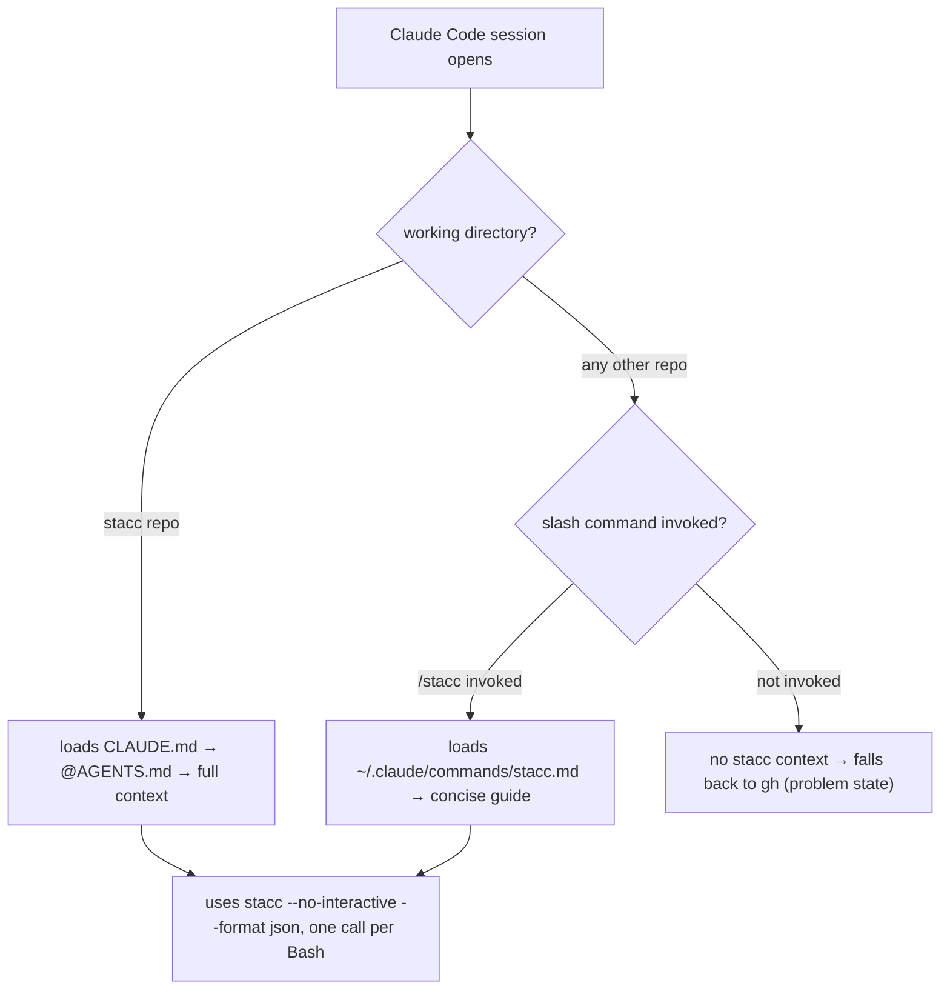
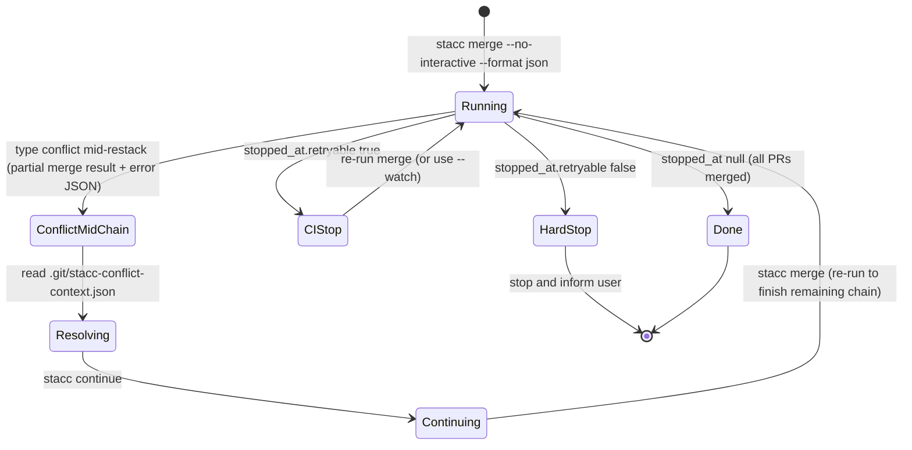

# feat: [STA-124] Claude agent guide for stacc

Claude currently issues compound bash pipelines -- `cd <repo> && stacc <cmd> --format json | python3 -c "..."` -- when operating stacked-PR workflows. These compound forms bypass the Claude Code permission auto-allow list and cause a permission prompt on every invocation. Additionally, Claude sometimes falls back to `gh` for operations stacc already handles, because the documented interface is silent on what it replaces.

The fix is documentation and a global skill file, not new CLI features. The `--format json` output is already single-line compact (nulls and empty arrays stripped by `print_compact`) and directly readable; `--format pretty` already provides human-readable output without post-processing. The gaps are: (1) no `CLAUDE.md` to auto-load `AGENTS.md` in the stacc repo, (2) `AGENTS.md` has no agent invocation guide, and (3) no user-invocable skill exists for foreign-repo sessions where Claude needs context on stacc capabilities.

---

## Problem Frame

Three problems compose the issue:

**Compound commands.** Claude chains `cd <path> && stacc <cmd> --format json 2>&1 | python3 -c "..."` in a single Bash call. This is unanalyzable by Claude Code's permission matcher, so it prompts on every call. The Python post-processing was unnecessary -- the JSON output is one compact line -- but Claude had no documentation telling it otherwise.

**gh fallback.** Claude reaches for `gh pr create`, `gh pr list`, `gh pr merge`, and similar `gh` compounds when stacc has native equivalents. This reintroduces both the permission-prompt problem and the brittleness of multi-step shell choreography.

**Context gap in foreign repos.** The motivating case (Claude working in `bindle`) shows Claude with no stacc context: no `AGENTS.md` load, no JSON schema reference, no stacc-vs-gh map. Claude invents compound pipelines because it has no other path to the information it needs.

---

## Scope

In scope: a `CLAUDE.md` bridge file for the stacc repo; a new agent guide section in `AGENTS.md`; a global Claude Code skill at `~/.claude/commands/stacc.md`. These are documentation and configuration deliverables only -- no Rust code changes.

Out of scope: adding a `-C <dir>` flag to stacc (like `git -C`, eliminating the need for `cd` entirely -- see Deferred); improving `--format pretty` output richness (adequate as-is for human review; flagged for future if gaps appear in practice); MCP server for stacc (closed decision, CLI-first documented in the graphite-swap-readiness requirements).

---

## Key Technical Decisions

- **KTD-1: Global skill, not repo-local.** The primary use case is Claude operating from a foreign repo (e.g., `bindle`). A skill in `stacc/.claude/commands/` would only load within the stacc repo. The skill goes to `~/.claude/commands/stacc.md` so `/stacc` is available everywhere.

- **KTD-2: `AGENTS.md` is the authoritative reference; skill is the quick-access surface.** `AGENTS.md` gets the full treatment (JSON schemas, conflict flow, command map). The skill file is concise -- enough for Claude to orient, with `AGENTS.md` as the deeper reference when Claude is working within the stacc repo.

- **KTD-3: `--format json` is the agent interface.** JSON is single-line, compact, and has predictable field paths. `--format pretty` is human-facing. The agent guide teaches `--format json` + direct stdout read, eliminating Python. The guide also documents that `--format pretty` is safe to use for navigation commands where Claude only needs to know "did it move?".

- **KTD-4: Error channel with `--format json`.** Success output and error JSON both go to stdout (not stderr). The agent always reads stdout. On `--format pretty`, errors go to stderr and stdout is empty on failure -- never use pretty for programmatic consumption.

- **KTD-5: Never fall back to `gh` if stacc is not in PATH.** Claude must stop and tell the user to install stacc. Silent fallback to `gh` would reintroduce compound pipelines.

- **KTD-6: Three-way merge stop state.** The merge output has three distinct terminal states -- clean finish, retryable CI stop (`stopped_at.retryable: true`), and conflict-during-restack -- with different resumption paths. Conflating the retryable stop with the conflict-mid-chain state causes Claude to re-run merge before continuing a rebase.

---

## High-Level Technical Design

### Context load path by session type



### Merge stop state machine



---

## Implementation Units

### U1. Create `CLAUDE.md` bridge in stacc repo

**Goal:** Claude Code auto-loads `AGENTS.md` when a session opens in the stacc repo.

**Requirements:** Enables the stacc-repo context load path in the diagram above.

**Dependencies:** None.

**Files:**
- `CLAUDE.md` (create)

**Approach:** Single-line file containing `@AGENTS.md`. Consistent with the user's global convention: "add a one-line CLAUDE.md that imports it (@AGENTS.md) instead of duplicating content."

**Test scenarios:**
- Open a new Claude Code session in the stacc repo; verify AGENTS.md content appears in context without a manual `/read AGENTS.md`.

**Verification:** Claude Code shows AGENTS.md context in a fresh stacc-repo session.

---

### U2. Update `AGENTS.md` with agent invocation guide

**Goal:** Teach Claude what stacc supports, how to invoke it without compound commands, which `gh` commands it replaces, and how to handle the non-obvious states.

**Requirements:** Addresses all three problem-frame items for the stacc-repo session case.

**Dependencies:** None (can land independently of U1 and U3).

**Files:**
- `AGENTS.md` (modify)

**Approach:** Add a new `## Using stacc as an agent` section after the existing build/test instructions. Do not modify the existing sections. The new section contains the following subsections in order:

**1. Invocation rule.**
Every command: `stacc <cmd> --no-interactive --format json`. One command per Bash call. Read stdout directly -- no Python, no `jq`, no pipeline post-processing. JSON output is one compact line. Nulls and empty arrays are stripped automatically; absent keys mean null/empty.

**2. Error channel.**
With `--format json`: success output and error JSON both go to stdout; stderr is silent. An empty stdout means the process exited before writing (panic or misuse). Never use `--format pretty` for programmatic consumption -- pretty errors go to stderr and stdout is empty on failure.

**3. stacc vs `gh` substitution table.**

| Want to... | Use stacc, not gh |
|---|---|
| Create or update PRs (current branch + downstack) | `stacc submit --no-interactive --format json` |
| List stack with PR status | `stacc log --no-interactive --format json` |
| Merge ready PRs (trunk-up, squash) | `stacc merge --no-interactive --format json` |
| View current branch's PR URL | `stacc pr --no-interactive --format json` |
| Per-branch detail (base, diffstat, PR body) | `stacc info --no-interactive --format json` |
| Navigate stack | `stacc up / down / top / bottom / checkout <branch> --no-interactive --format json` |
| Review + CI status across stack | `stacc log --no-interactive --format json` (see `change.checks` and `change.readiness` per branch) |
| Update PR title or body | `stacc submit --title "..." --description "..." --no-interactive --format json` (re-run; values persist) |
| PR check results for a single PR | No stacc equivalent; use `gh pr checks <number>` |

Note: `stacc submit` always pushes the current branch's full downstack (all ancestors to trunk) as well. This is idempotent -- pushing an unchanged branch is a no-op on the remote.

**4. JSON output shapes (key commands).**

`stacc merge`:
```
{"op":"merge","merged":[{"branch":"...","number":N,"sha":"...","out_of_band":false}],
 "stopped_at":null | {"kind":"...","branch":"...","number":N,"readiness":"...","rejection":{...},"retryable":bool},
 "trunk_protected":bool,
 "synced":{"dropped":[...],"reparented":[{"branch":"...","base":"..."}],"restacked":[...]},
 "cleaned":[...],"cleanup_skipped":[...],"schema_version":2}
```
`stopped_at.retryable` is nested under `stopped_at`, not top-level.

`stacc submit`:
```
{"submitted":[{"status":"created"|"updated","branch":"...","number":N,"url":"https://...","adopted":bool}],
 "skipped":[],"schema_version":2}
```

`stacc log` (short or bare):
```
{"trunk":"main","stack":[{"name":"...","base":"...","change":{...},"commit":{...}},...],
 "schema_version":2}
```
The `stack` array is a recursive tree: each node may have a `children` array of the same shape. Leaf nodes have no `children` key (stripped by `compact()`; do not expect `"children":[]`). `log long --format json` returns only `{"trunk":"...","form":"long","schema_version":N}` -- it does not return tree data. Use `log`, `log short`, or bare `log` for tree data.

`stacc sync`:
```
{"op":"sync","merged":[...],"pruned":[],"adopted":[],"reparented":[{"branch":"...","base":"..."}],
 "restacked":[...],"cleaned":[...],"cleanup_skipped":[],"detection_skipped":false,"likely_merged":[],
 "schema_version":2}
```

`stacc checkout / up / down / top / bottom`:
```
{"op":"checkout","branch":"...","moved":true|false,"schema_version":2}
```
`moved: false` means "already at destination", not an error. Do not retry.

Error JSON (any command, any error):
```
{"type":"usage|conflict|git|state|contention|not_in_progress|ambiguous|forge","message":"...","schema_version":2}
```
On `type: "ambiguous"`: the response also contains `"choices":[...]` listing valid branch names to pass to `stacc checkout`.

**5. Conflict resolution flow.**
- On `{"type":"conflict",...}`: resolve git conflicts manually in the working tree.
- Read `.git/stacc-conflict-context.json` for context. Schema: `{"branch":"...","base":"...","conflicted_files":["path",...],"base_pr":{"number":N,"title":"...","body":"..."}|null}`. `base_pr` is null when the base has no PR or GitHub is unreachable.
- Run `stacc continue --no-interactive --format json` to resume, or `stacc abort --no-interactive --format json` to undo the whole operation.
- Note: in a git worktree, `.git` is a file rather than a directory. Use `git rev-parse --git-dir` to find the actual git dir before reading the conflict context file.

**6. Merge stop states (three-way).**
- `stopped_at: null` → clean finish; all PRs merged.
- `stopped_at.retryable: true` → CI pending on next branch in chain; wait for CI, then re-run `stacc merge`. Or pass `--watch` on the original call to poll automatically.
- `stopped_at.retryable: false` → hard block (needs approval, merge conflict, protected branch, etc.); stop and inform the user.
- **Conflict during restack mid-chain (distinct from the above):** if a restack conflict occurs after some PRs have already merged, the JSON output contains both a partial `merged` array and an error `{"type":"conflict",...}`. After resolving the conflict and running `stacc continue`, re-run `stacc merge` to finish merging the remaining chain. Do not re-run merge before `stacc continue`.

**7. Edge cases.**
- `stacc checkout --no-interactive` without an explicit branch name returns `{"type":"usage",...}`, not an interactive prompt. Always pass a branch name or `--trunk`.
- `stacc top --no-interactive` at a stack fork returns `{"type":"ambiguous","choices":[...]}`. Pick from `choices` and run `stacc checkout <choice>`.
- `stacc log long --format json` returns only a stub; use `stacc log` or `stacc log short` for tree data.
- `st` is a built-in alias for `stacc`. Both work; use `stacc` in agent contexts for clarity.

**8. Binary not found.**
If `stacc` is not in PATH, stop immediately. Do not fall back to `gh` or attempt compound pipelines. Tell the user: "`stacc` is not installed. Install with `cargo install stacc` or download from the GitHub releases page."

**Patterns to follow:** Match existing `AGENTS.md` style (imperative prose, no filler, concrete commands). The existing build/test/lint section stays unchanged.

**Test scenarios:**
- Happy path: Claude, given `AGENTS.md`, issues `stacc submit --no-interactive --format json` (not `gh pr create`) when asked to submit a PR from a branch.
- Happy path: Claude reads JSON from `stacc merge --no-interactive --format json` stdout directly, without piping to Python or `jq`.
- Happy path: Claude walks a complete workflow -- checkout, modify, submit, merge -- using only single bare `stacc` commands per Bash call, no `&&`-chained compound scripts.
- Edge case: Claude receives `{"moved":false,"op":"up"}` and interprets it as "already at destination", not as an error requiring retry.
- Edge case: Claude receives `{"type":"ambiguous","choices":["feat/a","feat/b"]}` from `stacc top` and picks from `choices`, not from an external source.
- Edge case: `stacc log long --format json` returns a stub; Claude re-issues the command as `stacc log --format json` to get tree data.
- Error path: `stacc` not found in PATH; Claude emits install instructions and does not run `gh`.
- Integration: merge returns `stopped_at.retryable: true`; Claude waits and re-runs merge (does not try to `stacc continue`).
- Integration: merge returns conflict mid-chain; Claude reads `.git/stacc-conflict-context.json`, resolves, runs `stacc continue`, then re-runs `stacc merge` to finish the chain.

**Verification:** `AGENTS.md` contains all eight subsections with JSON field paths that match the current source in `crates/stacc/src/commands/operations.rs`, `log.rs`, and `commands.rs`.

---

### U3. Create global Claude Code skill: `~/.claude/commands/stacc.md`

**Goal:** User-invocable `/stacc` slash command available from any repo. Addresses the foreign-repo case (Claude in `bindle`) where `AGENTS.md` is not loaded.

**Requirements:** Enables the foreign-repo context path in the diagram above.

**Dependencies:** None (can land independently).

**Files:**
- `~/.claude/commands/stacc.md` (create; outside the stacc repo)

**Approach:** Concise skill file covering:
1. One-paragraph framing: stacc is the stacked-diff CLI; use it instead of `gh` for all stack operations.
2. The canonical invocation rule: `stacc <cmd> --no-interactive --format json`, one per Bash call, read stdout directly.
3. The stacc-vs-`gh` substitution table (mirror of U2, same rows).
4. The three-way merge stop state summary (clean / retryable / hard-block, plus conflict-mid-chain with resume sequence).
5. Conflict resolution quick-reference (read `.git/stacc-conflict-context.json`, then `stacc continue` or `abort`).
6. Binary-not-found policy: stop, do not fall back to `gh`.
7. Pointer: "Full JSON schemas and edge cases are in `AGENTS.md` in the stacc repo."

Keep the file under 120 lines. The `AGENTS.md` addition (U2) is the deep reference; the skill is the entry point.

**Patterns to follow:** Mirror the `linear-cli` skill style -- action-oriented, invocation-first, minimal prose around commands.

**Test scenarios:**
- Happy path: user invokes `/stacc` in a bindle-repo Claude Code session; Claude receives skill content and subsequently uses `stacc submit --no-interactive --format json` instead of `gh pr create`.
- Happy path: after `/stacc`, Claude correctly handles `stopped_at.retryable: true` (waits and re-runs merge, does not try to continue a rebase).
- Error path: `stacc` not found in PATH in a foreign-repo session; Claude reads the policy from the skill and stops without falling back to `gh`.

**Verification:** `/stacc` is invocable from a Claude Code session in a non-stacc repo; skill content covers all seven items above; file is under 120 lines.

---

## Scope Boundaries

### Deferred to Follow-Up Work

- **`stacc -C <dir>` flag:** like `git -C`, this would let Claude invoke stacc from any cwd without a `cd` call, fully eliminating the compound-command root cause. Requires a Rust change to route `--cwd` through to `Git::open()`. Deferred because docs + skill addresses the permission-prompt problem adequately for now.
- **`--format pretty` audit for key commands:** verify merge/submit/sync pretty output is self-descriptive without field extraction. Not needed for Claude (JSON is the agent interface) but worthwhile for human-review ergonomics.
- **`stacc auth status --format json` schema documentation:** needed if Claude must diagnose credential failures in automated contexts. Not a blocker for this issue.
- **`docs/solutions/` directory:** this plan is the first deliberate Claude-friendliness design decision documented in this repo. Capturing it in an `docs/solutions/` knowledge base would help future similar decisions. Deferred to a separate docs pass.

### True non-goals

- MCP server for stacc (closed decision per the graphite-swap-readiness requirements)
- Changes to Claude Code's permission matcher
- Changes to `gh` behavior

---

## Open Questions

**Q1: Repo-local copy of the skill.** Should a copy also live in `stacc/.claude/commands/stacc.md`? The global placement handles all repos; a repo-local copy is redundant once `CLAUDE.md` → `AGENTS.md` loads in stacc sessions. Start global-only; add local if users report a gap.

**Q2: Worktree conflict context path.** In a git worktree, `.git` is a file, not a directory; `.git/stacc-conflict-context.json` will fail silently. The U2 agent guide notes the limitation and documents `git rev-parse --git-dir` as the robust path. Worktree usage is otherwise out of scope for this issue.

---

## Risks & Dependencies

- **Risk: AGENTS.md JSON schemas drift from source.** The field paths documented in U2 must match `crates/stacc/src/commands/operations.rs`, `log.rs`, and `commands.rs` at time of writing. Any command output change in a future PR should update `AGENTS.md` as part of that PR's checklist.
- **Risk: Global skill path differs across machines.** `~/.claude/commands/` is the standard Claude Code user commands directory per the current setup, but a new contributor would need to know this path. U2 (`AGENTS.md`) handles the stacc-repo case independently; U3 is an enhancement for foreign-repo contexts and is additive.
- **U1, U2, U3 are independent.** No ordering required; all three can be landed in a single PR or split across branches.
