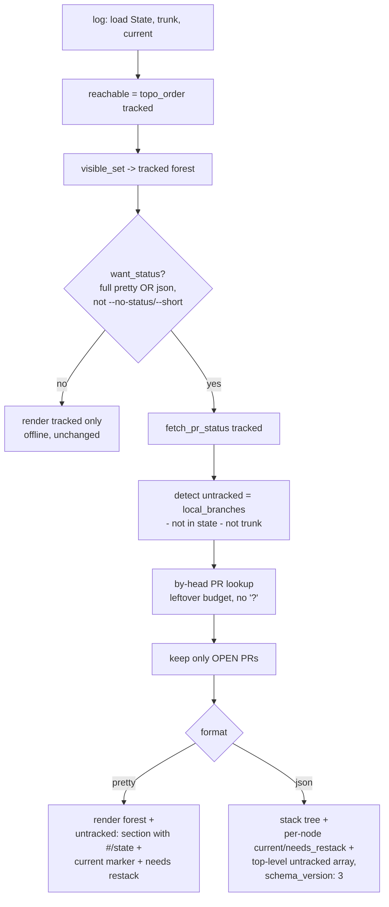

# feat: [STA-132] Surface untracked open PRs in `stacc log` + JSON parity

**Target repo:** stacc (this repo). All paths are relative to the stacc repo root.

---

## Summary

Make `stacc log` show every PR in flight without falling back to `gh pr list`, and bring `--json` to parity with the pretty view. Concretely: surface **untracked local branches that have an open PR** in the default log (and in `--json`), and add the per-node `current` and `needs_restack` signals that the pretty renderer already shows but JSON omits. Bump the JSON schema to 3 and update the agent-facing docs.

---

## Problem Frame

STA-132 was filed as "`stacc log` shows only the current stack, not sibling stacks." Investigation (see Debug, below) found that the headline premise is already satisfied: bare `stacc log` defaults to the **full forest of all trunk-reachable tracked branches** (rails, per-stack color, current marker, `needs restack`). The scoping-to-current-stack behavior only happens under `--stack`/`--steps`.

The branch the reporter saw missing (`jillian/sta-129-...` -> PR #122) was **untracked**: created with plain `git`/`gh` rather than `stacc create`/`track`, so it never entered the `refs/stacc/data` state store. `stacc log` renders only tracked branches (`ops::topo_order(&state.branches, ...)`), so an untracked branch is invisible unless `--show-untracked` is passed, and even then it shows as a bare name with no PR number or state, in the pretty path only. `--json` never emits untracked branches at all.

That is the real gap behind the issue's stated motivation: "with the repo now stacc-first, agents and humans should not fall back to `gh pr list` to answer 'what branches/PRs are in flight'." Today they still must, for any branch stacc is not tracking. A secondary gap: `--json` consumers cannot see which branch is current or which needs a restack, because those signals live only in the pretty renderer.

### Debug (root-cause confirmation)

- `crates/stacc/src/commands/log.rs:120` builds `reachable` from `state.branches` only (tracked branches).
- `crates/stacc/src/commands/log.rs:227-243` (`visible_set`): unscoped default returns every trunk-reachable branch, so the forest is already the default. Not a scoping bug.
- Untracked branches surface only via `--show-untracked` -> `print_untracked` (`crates/stacc/src/commands/log.rs:1017-1031`), as bare `◌ name` rows with no PR detail, and the call sits inside the `OutputFormat::Pretty` arm (`crates/stacc/src/commands/log.rs:213`), so JSON never includes them.
- Conclusion: working as designed; the bug ticket is really a feature gap. No defect to patch.

---

## Requirements

- **R1.** Default `stacc log` (full pretty form) surfaces untracked **local** branches that have an **open** PR, with the PR number and state, so `gh pr list` is not needed to see in-flight work.
- **R2.** `stacc log --json` emits the same untracked-with-open-PR branches (it currently emits none).
- **R3.** `stacc log --json` per-node carries a `current` marker matching the pretty `◉`/`(current)` signal.
- **R4.** `stacc log --json` per-node carries a `needs_restack` marker matching the pretty `needs restack` signal.
- **R5.** The offline contract is preserved: `--short` and `--no-status` perform **no** network calls for untracked-PR detection, exactly as today.
- **R6.** The added PR lookups stay within the existing `STATUS_BUDGET` (5s) wall-clock and never use `?`/`unwrap` on the fetch path (graceful degradation to no-status).
- **R7.** `SCHEMA_VERSION` is bumped 2 -> 3, its pinning assertion and all version-pinned test assertions updated in lockstep, and the JSON shape is documented in `AGENTS.md`.
- **R8.** `stacc log long --json` stub behavior is reconciled with the docs (documented as an intentional non-goal for this change; real tree data deferred).

---

## Key Technical Decisions

- **KTD1 — Display, not auto-track.** Untracked-with-open-PR branches are *shown*, never written into `refs/stacc/data`. Auto-tracking on PR detection is a state mutation with its own correctness and surprise concerns; it is out of scope (see Scope Boundaries). This keeps `stacc log` read-only, as it is today.

- **KTD2 — Scope: local untracked branches only.** Detection uses `git.local_branches()` (already the source for `print_untracked`) filtered to branches not in `state.branches` and not the trunk, then a by-head PR lookup. Open PRs whose branch is not checked out locally are **not** enumerated; that would require a repo-wide `list PRs` call and remote/local dedup, and is deferred (Open Questions). This matches the reporter's case (a local branch) and the branch-per-PR, fully-local stacc model.

- **KTD3 — Online forms only; reuse the existing budget + adoption pattern.** Untracked-PR detection runs only when `want_status` is already true (full pretty form or JSON, and not `--no-status`) — the same gate at `crates/stacc/src/commands/log.rs:152-153`. The lookup mirrors the existing by-head "adoption" pass in `fetch_pr_status` (`crates/stacc/src/commands/log.rs:881-898`): `pull_request_for_branch_within`, spending only leftover `budget_left()`, filtered to **open** PRs, never `?`. The short form stays offline by contract (R5).

- **KTD4 — JSON shape: additive `untracked` array + `current`/`needs_restack` keys; no rename, bump to 3.** `stack` is already a recursive forest tree, so it is **not** renamed (avoids gratuitous breakage). The new shape adds a top-level `untracked` array (siblings with no tracked base, so they cannot live inside the trunk-rooted tree) plus per-node `current: true` / `needs_restack: true`. Per stacc convention these booleans are emitted **only when true** and stripped otherwise by `print_compact`, consistent with "absent keys mean null/empty" (`AGENTS.md` section 1). `SCHEMA_VERSION` goes to 3 to signal the shape change.

- **KTD5 — `needs_restack` reuses an already-computed value.** `commit_json` (`crates/stacc/src/commands/log.rs:987-994`) already calls `git.ahead_behind(base, branch)` and discards the `behind` component; `behind > 0` is exactly the pretty path's restack condition (`crates/stacc/src/commands/log.rs:649`). Compute both from the single existing call — no extra git invocations.

- **KTD6 — Drift-guard test is updated, not deleted.** `log_json_is_not_changed_by_drift` (`crates/stacc/tests/log.rs:232-247`) asserts the JSON never contains `"restack"`/`"needs"` to catch pretty markers leaking into JSON. `needs_restack` is now an intentional JSON field, so the guard is retargeted to the *pretty-only* markers (rail glyphs, ANSI codes, section headers like `untracked:`), keeping the data/render separation it was protecting.

---

## High-Level Technical Design

Data flow for the default (full pretty) and `--json` forms after this change. The tracked forest is unchanged; the new path is the untracked-with-open-PR lane, gated on the existing online check.



JSON shape (v3), additive over v2:

```jsonc
{
  "trunk": "main",
  "stack": [
    {
      "name": "feat-a", "base": "main",
      "change": { "number": 123, "state": "open", "...": "..." },
      "commit": { "sha": "...", "subject": "...", "age": "..." },
      "current": true,          // NEW: only on the current branch
      "needs_restack": true,    // NEW: only when behind > 0
      "children": [ /* ...recursive... */ ]
    }
  ],
  "untracked": [                // NEW: local branches not in state, with an OPEN PR
    { "name": "sta-129-x", "change": { "number": 122, "state": "open", "url": "..." } }
  ],
  "schema_version": 3
}
```

*Directional guidance, not a literal spec: exact field ordering and which `change` sub-fields appear on untracked entries follow the existing `stack_json` conventions.*

---

## Implementation Units

### U1. JSON parity: add `current` and `needs_restack`, bump schema to 3

**Goal:** `--json` per-node carries `current` (matching the pretty `◉`/`(current)`) and `needs_restack` (matching pretty `needs restack`); schema bumped to 3 with all pins updated. Establishes the v3 baseline that U4 extends.

**Requirements:** R3, R4, R7.

**Dependencies:** none.

**Files:**
- `crates/stacc/src/commands/log.rs` (`stack_json` ~944, `commit_json` ~987; thread `current: &str` into `stack_json` and its recursive calls and the call site at ~185)
- `crates/stacc-forge/src/lib.rs` (`SCHEMA_VERSION` line 35 -> 3; pinning assertion at ~line 119 -> 3)
- `crates/stacc/tests/log.rs` (version-pinned assertions, drift-guard test, new parity assertions)

**Approach:**
- Thread the already-available `current` branch name into `stack_json`; emit `"current": true` only on the matching node (omit otherwise, so `print_compact` keeps it absent on the rest).
- In `stack_json`, compute `behind` from the same `git.ahead_behind(base, kid)` call that `commit_json` already makes (refactor so the `(ahead, behind)` pair is computed once and shared between the commit object and the new `needs_restack` flag — see KTD5). Emit `"needs_restack": true` only when `behind > 0`.
- Bump `SCHEMA_VERSION` and its pinning assertion together (the assertion is a deliberate drift guard, not dead code).
- Retarget `log_json_is_not_changed_by_drift` (KTD6): drop the `"restack"`/`"needs"` substring bans; instead assert that rail glyphs, ANSI escape sequences, and the `untracked:`/`unreachable:` section headers never appear in JSON.

**Patterns to follow:** existing `stack_json` field-emission style; `print_compact` absent-when-false convention (`crates/stacc/src/commands.rs` ~570).

**Test scenarios** (`crates/stacc/tests/log.rs`, using the `stacc()` helper which strips `COLUMNS`):
- Happy path: on a stack where the current branch is mid-stack, `--json` has `"current":true` on exactly that node and the key is absent on all others.
- Happy path: a branch whose recorded base advanced (`behind > 0`) carries `"needs_restack":true`; an up-to-date branch omits the key entirely.
- Edge: current branch == trunk -> no node carries `current` (trunk is the root, not a stack node) and JSON is still valid.
- Edge: a `deleted` branch carries neither `current` nor `needs_restack` (no git ref to measure) and still carries `"deleted":true`.
- Regression: `log_json_includes_commit_object_and_null_pr` (~`crates/stacc/tests/log.rs:300`) updated to assert `"schema_version":3`.
- Regression: the retargeted drift-guard test passes (no rail glyph / ANSI / section header in JSON) and fails if a pretty marker is reintroduced.
- `neutral_strings_match_the_forge_model_serde` (`crates/stacc/src/commands/log.rs:1044`) extended if any new serde-backed string is introduced (none expected for booleans, but verify).

**Verification:** `cargo test --workspace` green; `stacc log --json` on a multi-branch fixture shows `current`/`needs_restack` where the pretty form shows the marker/`needs restack`, and `schema_version` is 3.

---

### U2. Detect untracked local branches that have an open PR (shared helper)

**Goal:** a single read-only helper that returns local untracked branches paired with their open PR, respecting the offline contract and the status budget. Consumed by both the pretty (U3) and JSON (U4) renderers.

**Requirements:** R1, R2, R5, R6.

**Dependencies:** none (independent of U1).

**Files:**
- `crates/stacc/src/commands/log.rs` (new helper near `fetch_pr_status` ~825 and `print_untracked` ~1017)

**Approach:**
- Enumerate candidates with `git.local_branches()` filtered to `name != trunk && !branches.contains_key(name)` — the same filter `print_untracked` already uses (`crates/stacc/src/commands/log.rs:1017-1023`).
- Only run the network step when status is wanted (caller passes the existing `want_status` decision; the helper itself does no fetch when given an empty client). Build the client once via `build_client` (`crates/stacc/src/commands/log.rs:927`), reusing the same `Option` grace — `None` client yields an empty result, never an error.
- For each candidate, do a by-head lookup with `pull_request_for_branch_within` spending only `budget_left()`, mirroring the adoption loop (`crates/stacc/src/commands/log.rs:881-898`). Keep only results whose PR `state == Open`. Never use `?`/`unwrap` on the fetch path (R6).
- Return an ordered collection of `(branch_name, PrLive)` (or a small struct) so renderers can show number + state without re-fetching.

**Execution note:** Add the failing budget/offline tests first — this unit's correctness is mostly about *not* fetching in the wrong conditions, which is easiest to pin test-first.

**Patterns to follow:** `fetch_pr_status` budget loop and `build_client` `Option` handling; `print_untracked` candidate filter.

**Test scenarios:**
- Happy path: a local branch absent from state with an open PR is returned with its number and `open` state.
- Offline contract (R5): with `--no-status` (and in `--short` form), the helper performs no network call and returns empty — assert via a no-token / no-remote fixture that no PR data appears and the command still succeeds.
- Edge: a local untracked branch with a **closed/merged** PR is excluded (only open PRs surface).
- Edge: a local untracked branch with **no** PR is excluded (it remains a plain untracked row in the pretty `--show-untracked` path, unchanged).
- Edge: trunk and tracked branches are never returned (filter correctness).
- Budget (R6): when the status budget is exhausted by tracked fetches, untracked detection degrades to empty rather than blocking or erroring (simulate with a tight budget or many branches; assert no panic and graceful no-status).
- Grace: no GitHub token / non-GitHub remote -> empty result, no error (`build_client` returns `None`).

---

### U3. Surface untracked-with-open-PR branches in the default pretty log

**Goal:** the full pretty `stacc log` lists untracked branches that have an open PR, with PR number and state, by default — no flag required — so in-flight work is never invisible.

**Requirements:** R1, R5.

**Dependencies:** U2.

**Files:**
- `crates/stacc/src/commands/log.rs` (pretty render arm ~192-216; new rendering near `print_untracked` ~1017)

**Approach:**
- In the `OutputFormat::Pretty` arm, after the forest renders, call the U2 helper (only in the full form, where `want_status` is already true) and print an `untracked (open PR):` section listing each branch with its PR number and state, reusing `pr_line`/state formatting where it fits.
- Keep the existing `--show-untracked` behavior (bare `◌ name` rows for *all* untracked branches, including PR-less ones) intact and distinct; the new default section is specifically the open-PR subset. Avoid double-listing a branch under both when `--show-untracked` is also set (de-dup, or have `--show-untracked` show only the PR-less remainder).
- Short form stays offline and unchanged (no untracked-PR section).

**Patterns to follow:** `print_untracked` (`crates/stacc/src/commands/log.rs:1017-1031`), `pr_line` (`:691`), `rollup_line` (`:715`).

**Test scenarios** (use the `stacc()` helper):
- Happy path: default full `stacc log` shows the untracked branch with `#<n>` and `open` state in a labeled section.
- Happy path: no untracked-with-PR branches -> no section header printed (no empty `untracked (open PR):` heading).
- Offline (R5): `stacc log --short` and `stacc log --no-status` print no untracked-PR section and make no network call.
- Interaction with `--show-untracked`: a PR-less untracked branch still appears (under the existing untracked list); a with-PR untracked branch is not duplicated.
- Rendering stability: existing forest rows are byte-identical to before for a fixture with no untracked branches (the new code path is additive).

---

### U4. Emit untracked-with-open-PR branches in `--json`

**Goal:** `--json` includes the untracked-with-open-PR branches as a top-level `untracked` array under schema 3, so JSON consumers see the same in-flight set as the pretty view.

**Requirements:** R2, R7.

**Dependencies:** U1 (schema 3 baseline), U2 (detection helper).

**Files:**
- `crates/stacc/src/commands/log.rs` (JSON render arm ~183-191)
- `crates/stacc/tests/log.rs`

**Approach:**
- In the `OutputFormat::Json` arm, call the U2 helper and serialize each result as `{ "name", "change": { number, url, state, ... } }`, matching the `change` sub-object shape used inside `stack_json` (`crates/stacc/src/commands/log.rs:959-970`) as closely as the available `PrLive` allows.
- Add the array under a top-level `"untracked"` key alongside `"stack"`; rely on `print_compact` to strip it when empty (so existing consumers see no new key when there are no untracked PRs).
- Do not place untracked branches inside `stack` — they have no tracked base and would corrupt the trunk-rooted tree (KTD4).

**Patterns to follow:** `stack_json` `change` object; `print_compact` empty-array stripping.

**Test scenarios:**
- Happy path: with one untracked open-PR branch, `--json` has `untracked: [{name, change:{number, state:"open", ...}}]` and `schema_version: 3`.
- Empty: no untracked-with-PR branches -> `untracked` key is **absent** (stripped by `print_compact`), not `[]`.
- Offline (R5): `--no-status --json` emits no `untracked` key and makes no network call.
- Separation: the retargeted drift-guard test still passes (no pretty markers in JSON) with the new array present.
- Consistency: for a fixture with both a tracked stack and an untracked open-PR branch, the untracked branch appears only in `untracked`, never in `stack`.

---

### U5. Documentation: AGENTS.md JSON shapes, substitution table, and the `log long --json` stub

**Goal:** the agent-facing contract documents the v3 shape (new fields + `untracked` array), and the `stacc log long --json` stub is reconciled with the docs.

**Requirements:** R7, R8.

**Dependencies:** U1, U3, U4 (docs reflect the finalized shape).

**Files:**
- `AGENTS.md` (section 4 "JSON output shapes", the `stacc log` entry ~lines 138-146; section 7 edge-case note on `stacc log long --json`; section 3 substitution-table row for `stacc log --no-interactive --json`)

**Approach:**
- Update the `stacc log` JSON example to schema 3: show `current`/`needs_restack` as optional per-node booleans (present only when true), and the new top-level `untracked` array (absent when empty). Restate the absent-means-false/empty semantics for the new keys so agents use `.get(key).is_some()` rather than presence-of-`false`.
- Note that the default `stacc log` (and `--json`) now surfaces untracked **local** branches with open PRs, so `gh pr list` is not needed for in-flight visibility; update the substitution-table row accordingly.
- `stacc log long --json`: document the current stub as an intentional non-goal of this change (long form is a `git log --graph` human pass-through; structured commit-graph JSON is deferred). Keep section 7's note accurate.

**Test scenarios:** `Test expectation: none, documentation-only` (verified by review against the final code shape and by the U1/U4 JSON tests that pin the actual emitted shape).

**Verification:** `AGENTS.md` JSON example matches the bytes emitted by `stacc log --json` on a fixture with a tracked stack + an untracked open-PR branch; `schema_version` reads 3 in both.

---

## Scope Boundaries

In scope: surfacing local untracked branches that have an open PR (pretty default + `--json`), `current`/`needs_restack` JSON parity, schema bump to 3, and the related doc updates.

### Deferred to Follow-Up Work
- **Auto-tracking** untracked branches on PR detection (state mutation; separate concern — KTD1).
- **Repo-wide open-PR enumeration** for PRs whose branch is not checked out locally (requires a `list PRs` call + remote/local dedup; bigger fetch and budget profile — see Open Questions).
- **Real `stacc log long --json` tree data** (long form stays a documented stub here — R8).
- **A dedicated flag** to toggle untracked-PR surfacing off; the offline forms (`--short`/`--no-status`) already provide the no-fetch path, so a new flag is unnecessary for v1.

### Out of scope
- Changing the tracked-forest default (already the behavior).
- Changing `--stack`/`--steps` scoping semantics.
- Pretty rail glyphs / color palette redesign (git-spice's heavier box-char style is prior art, not a target).

---

## Open Questions

- **OQ1 (deferred default, not blocking).** Should "in flight" eventually include open PRs with **no local branch** (full `gh pr list` parity)? This plan scopes to local untracked branches (KTD2). If repo-wide parity is wanted later, it is an additive follow-up: a budgeted `list open PRs` call plus dedup against tracked + local-untracked sets, feeding the same `untracked` array.
- **OQ2 (cosmetic).** Pretty section label wording (`untracked (open PR):` vs folding into the existing `untracked:` header with PR detail). Settle during U3 against the existing header style; does not affect JSON or the contract.

---

## Risks & Dependencies

- **Status budget pressure (R6).** Surfacing untracked PRs adds by-head lookups under the shared 5s `STATUS_BUDGET`. Mitigation: untracked lookups spend only *leftover* budget after tracked fetches (mirroring the adoption loop), degrade to empty when exhausted, and never use `?`. Risk is "some untracked PRs not shown on a slow run," never an error or a hang.
- **Offline-contract regression (R5).** The short form is offline by contract; accidentally fetching there would be a real regression. Mitigation: gate strictly on the existing `want_status` (`crates/stacc/src/commands/log.rs:152-153`), and pin with explicit offline tests in U2/U3.
- **Schema-bump coordination (R7).** `SCHEMA_VERSION` has a compile-time pinning assertion and multiple version-pinned test assertions; missing one yields a confusing failure. Mitigation: U1 bumps the constant, the assertion, and the test assertions together; grep for `SCHEMA_VERSION, 2` and `"schema_version":2` before declaring done.
- **Drift-guard intent (KTD6).** Naively adding `needs_restack` trips `log_json_is_not_changed_by_drift`. Mitigation: retarget the guard to pretty-only markers rather than deleting it, preserving the data/render separation it protects.
- **Dependency:** the GitHub client path (`build_client`, `pull_request_for_branch_within`) is reused as-is; no new API surface required.

---

## Rollout Notes

`schema_version` 2 -> 3 is a deliberate, documented bump. The per-node additions and the `untracked` array are additive (absent when false/empty via `print_compact`), so a tolerant consumer that ignores unknown keys keeps working; the bump signals the shape change for consumers that pin on it. Land U1–U5 together so a released binary never emits a half-formed v3 (e.g., `current` present but `untracked` missing). `AGENTS.md` updates ship in the same change set (stacc convention: the doc is the agent-facing contract).

---

## Sources & Research

- Issue STA-132 (Linear, team STA).
- Code: `crates/stacc/src/commands/log.rs` (`log`, `visible_set`, `fetch_pr_status`, `stack_json`, `commit_json`, `print_untracked`, `build_client`), `crates/stacc-forge/src/lib.rs` (`SCHEMA_VERSION`), `crates/stacc/tests/log.rs` (drift-guard, version pins, `stacc()` helper), `AGENTS.md` sections 3/4/7.
- Prior art: git-spice `gs log` (`../git-spice`, `internal/ui/fliptree/tree.go`) — confirms the forest/rail model; default-current-stack-with-`--all` there is the inverse of stacc's already-forest default, so not a target for this change.
- Convention: `SCHEMA_VERSION` pinning assertion is a deliberate drift guard (STA-49 lineage); JSON must not leak pretty-only markers (drift-guard test); tests strip `COLUMNS` via the `stacc()` helper.
